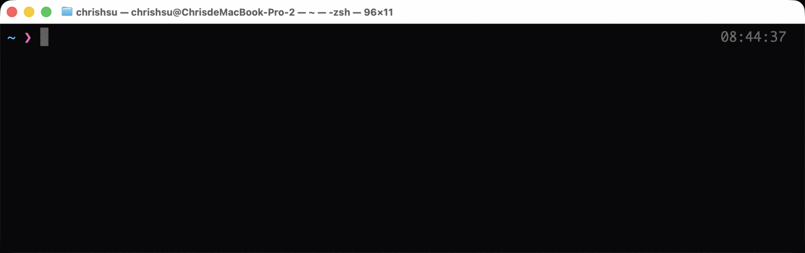
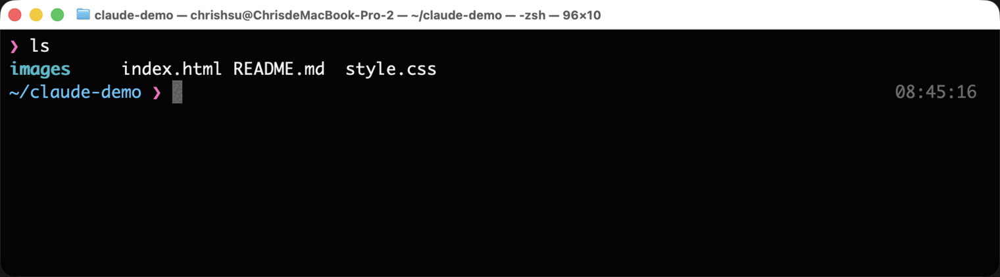
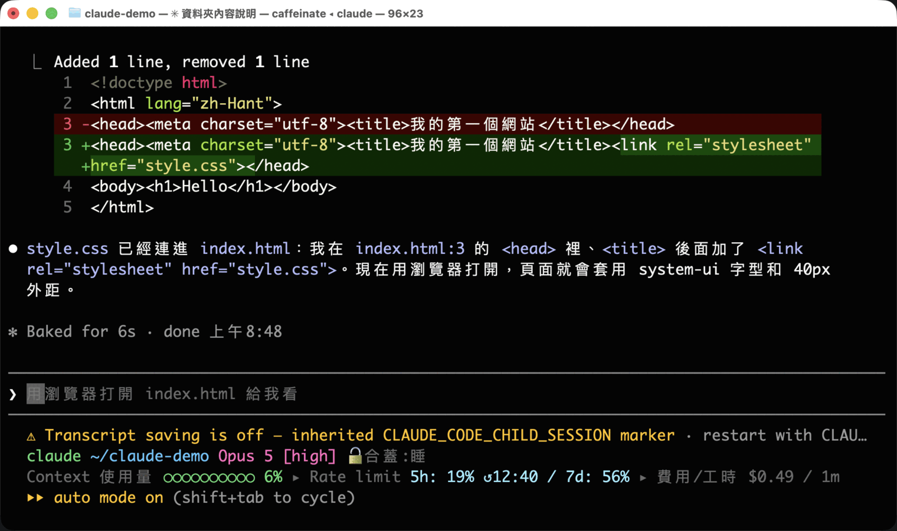
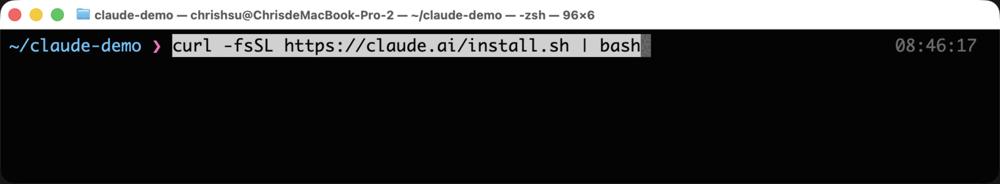
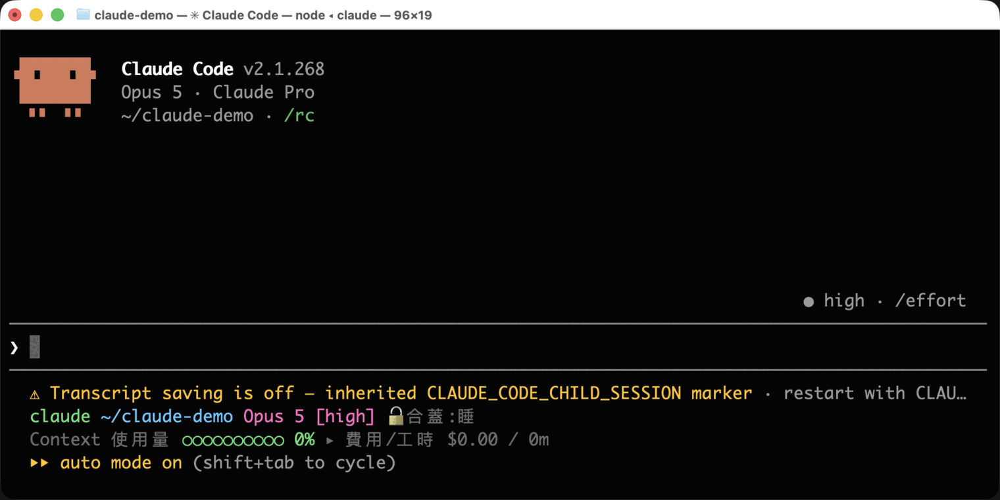
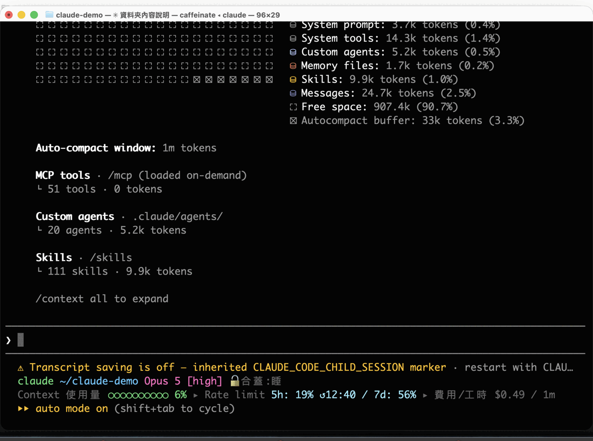
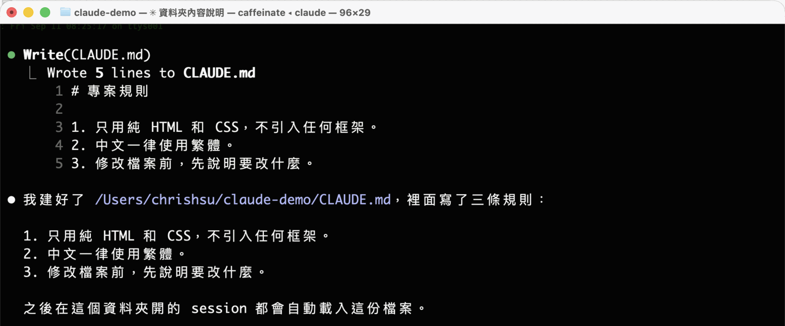
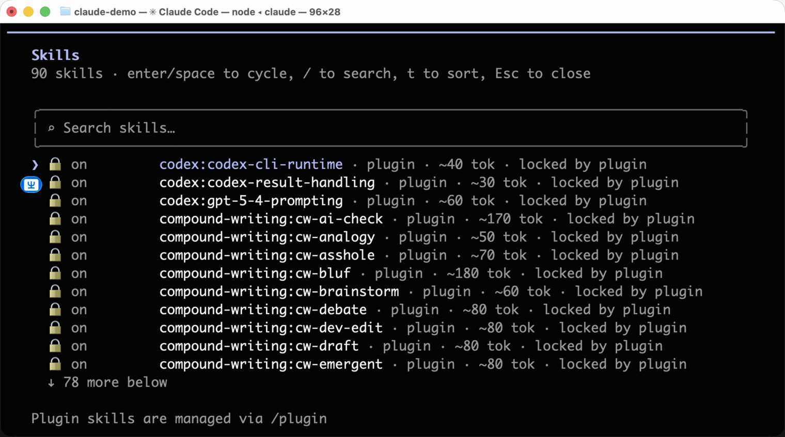
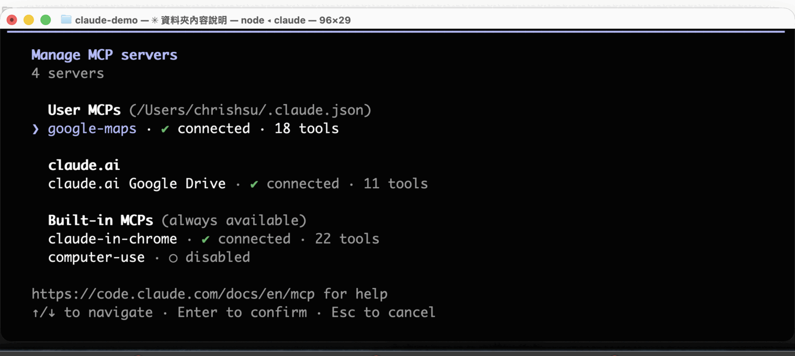
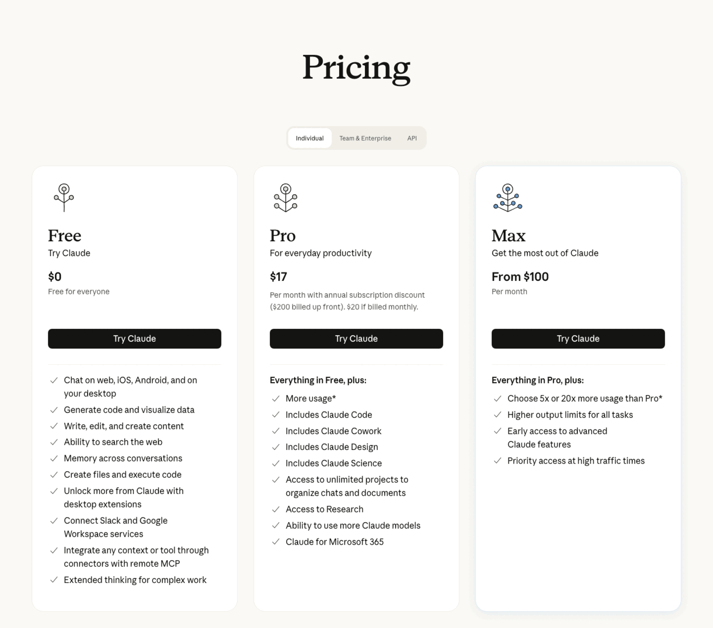

# 小學生也能懂的『Claude Code』超入門

> 超入門 · 2026-09-11

> 圖解版：./eli5/claude-code.html

「Claude 我有在用啊，就是那個聊天的網站嘛。」

如果你是這樣想的，那你大概還沒遇過 Claude Code。

Claude Code 是同一個 Claude，但它不住在瀏覽器的聊天框裡，而是住在一個黑黑的、只有文字的視窗裡。第一次看到的人，通常會有一樣的反應：

「為什麼要用那種畫面？不是有漂亮的 App 嗎？」

「我又不是工程師，黑色畫面跟我有什麼關係？」

然後默默把視窗關掉。

這篇文章會分成三個章節，說明 Claude Code 為什麼要待在終端機、它嘴裡那些名詞到底在講什麼、以及你該付多少錢。

專有名詞會全部拆開來講，就算你現在完全零知識，也可以放心閱讀。

※本文中 Claude Code 的規格與價格，是截至 2026 年 9 月為止，確認官方文件後的內容。文中所有畫面都是實際操作的截圖。

# 第一章：Claude Code 是什麼｜為什麼它住在黑色畫面，而不是漂亮的 App

先講結論。

聊天版的 Claude，是**你去找它**。
Claude Code，是**它住進你的工作現場**。

差別就只有這一句，但結果差很多。

## 聊天視窗，是隔著櫃檯的窗口

想像你去區公所辦事。

你坐在櫃檯外面，承辦人員坐在裡面。你要辦事，就得把家裡的文件影印好、帶過來、從窗口遞進去。承辦人員看完，寫了一張紙給你，你再帶回家、自己找到對應的檔案夾、自己把舊的那張換掉。

這就是聊天視窗。你貼程式碼進去，它回一段程式碼給你，你再自己複製、自己貼回去、自己存檔、自己執行、自己看有沒有壞掉。

每一次來回，搬運工都是你。

## 那「終端機」到底是什麼？

在講 Claude Code 之前，得先把這個嚇跑最多人的東西講清楚。

終端機（terminal），就是下面這個東西。Mac 上它就叫「終端機」，Windows 上叫「命令提示字元」或「PowerShell」。你的電腦本來就有，不用另外裝。



看起來什麼都沒有，對吧。

它的本質只有一句話：**一個可以叫出你電腦上所有工具的指令窗口。**

你不是用滑鼠點圖示，而是用打字下指令。比方說，打 `ls` 再按 Enter，它就會把現在這個資料夾裡的東西列出來：



這跟你用 Finder 打開資料夾看到的，是同一批檔案。只是一個用看的，一個用打字的。

開檔案、改檔案、搬檔案、跑程式、裝東西、上傳下載、版本控制——你電腦能做的事，幾乎都能在這個窗口裡下指令完成。它之所以長得醜，是因為它老，老到所有工具都學會怎麼跟它講話。

## 終端機，是讓師傅直接進到你的工作室

Claude Code 待在這裡，意思就是：它跟你用同一套工具，站在同一間工作室裡。

所以它可以：

**第一，直接動你的檔案。**

不用你複製貼上。它自己打開、自己改、自己存。

下面這張圖，是我跟它說「幫我把 style.css 連到 index.html」之後發生的事。紅色那行是它拿掉的，綠色那行是它加上去的——這叫 diff，就是「改了哪裡」的對照表。它改完還會用中文跟你講它動了什麼。



你要做的只有一件事：看它改得對不對。

**第二，自己跑、自己看結果、自己修。**

這一點才是真正的分水嶺。它改完程式，可以自己執行一次；壞了，錯誤訊息它自己讀得到；讀到了，它自己再改一次。

在聊天視窗裡，這個迴圈的每一圈都要靠你人工搬運。在終端機裡，它自己轉。

我第一次看到它連續改了五次、跑了五次，最後說「好了，測試都過了」的時候，說實話有點傻住。那不是「更聰明的自動完成」，那是另一種東西。

**第三，可以被串起來、被自動化。**

因為它是指令，所以它可以被排程、被塞進腳本、被另一支程式呼叫、被丟到背景跑一整晚。漂亮的圖形介面做不到這件事——按鈕沒辦法在半夜三點自己按自己。

## 那為什麼現在又有桌面版了？

這裡要誠實講清楚，免得你被騙。

Claude Code 現在確實也有桌面版 App，也有網頁版，也能裝進 VS Code 之類的編輯器裡。官方文件甚至會跟你說：不想碰終端機的話，桌面版也可以。

但那不是「另一個比較簡單的產品」。**桌面版底下跑的，是同一顆終端機引擎。**它只是幫你把那個黑色畫面包了一層殼。

所以先從終端機開始，理由很單純：

・你會看到它實際在做什麼，而不是看到一個進度條
・所有教學、所有討論、所有踩坑紀錄，都是用終端機的語言寫的
・它出問題的時候，你才知道要去哪裡看

殼可以之後再套。先認識裡面那台機器。

## 裝起來，只要貼一行

回到終端機，把下面這一行貼進去，按 Enter，就裝好了。



Mac / Linux：

```
curl -fsSL https://claude.ai/install.sh | bash
```

Windows（在 PowerShell 裡）：

```
irm https://claude.ai/install.ps1 | iex
```

這一行在做的事，白話講就是：「去 claude.ai 拿一份安裝腳本回來，然後執行它。」它會把 Claude Code 裝進你自己的使用者資料夾，不需要管理員權限，也不需要先裝什麼別的東西。

裝完之後，`cd` 到你想工作的資料夾，打 `claude`，畫面就會變成這樣：



下面那條橫線就是輸入框。從這裡開始，你就是用中文跟它講話而已。

到這裡，我們知道 Claude Code 是「住進你工作現場的 Claude」。

接下來的問題是：它講話會冒出一堆名詞。那些名詞，才是初學者真正卡住的地方。

# 第二章：六個一定要懂的名詞｜session、token、context、memory、skill、MCP

用 Claude Code 的時候，你會反覆看到六個詞。

它們彼此有關係，而且關係很重要。搞懂這六個，你對它的使用方式會整個改變。

我們一個一個拆。

## 一、session（工作階段）＝一次坐下來

你在資料夾裡打 `claude`，畫面亮起來，這就開始了一個 session。

session 就是「這一次坐下來的整場對話」。從打招呼到你關掉視窗為止，中間講過的每一句話，它都記得。

關掉視窗，這場對話就散了。

不過散掉不代表消失——`claude --continue` 可以接回上一場，`claude --resume` 可以從清單裡挑一場舊的接回來。

重點在於：**一個 session，做一件事。**

為什麼？看下一個詞你就懂了。

## 二、token（字塊）＝計程車的跳表

AI 不是一個字一個字讀的。它會把文字切成小塊，一塊叫做一個 token。

英文大概四個字母算一塊，中文的話，常常一個字就吃掉一塊以上。你丟給它的每一個字、它回給你的每一個字，都在跳表。

這就是計價單位。也是一切限制的單位。

記住這個數字：**你跟它之間的一來一往，是按 token 算的。**

## 三、context（上下文視窗）＝固定大小的工作桌

這是六個詞裡面最重要的一個。

AI 沒有記憶。它每一次回答你，都是把「到目前為止的所有對話」整包重新讀一遍，然後接下去講。

那個「整包」有大小上限。這張桌子就這麼大，專有名詞叫做 context window（上下文視窗）。

在 Claude Code 裡打 `/context`，可以直接看到現在桌上堆了什麼：



這張圖很值得看懂，因為它把整章要講的東西都畫出來了：

・**System prompt / System tools**：它自己的使用說明書和工具清單，一開機就佔掉一些
・**Memory files**：你寫給它的規矩（等一下會講）
・**Skills**：它會的工作手冊目錄（等一下也會講）
・**Messages**：你跟它講過的話
・**Free space**：還空著的桌面
・**Auto-compact buffer**：預留給「整理桌面」的空間

這台機器上的桌子是一百萬個 token（`Auto-compact window: 1m tokens`）。這個數字會隨模型和方案不同，所以自己打 `/context` 看最準。

桌上堆滿了會怎樣？它會開始整理桌面——把前面的對話壓縮成摘要（這個動作叫 compact），騰出空間繼續做。壓縮過的東西當然會掉細節，所以你會感覺到它「開始忘記前面講過的」。

但真正要命的不是忘記，是成本。

因為每一輪都要把整包重讀一次，所以**對話越長，後面每一句話都越貴**。長度變兩倍，之後的每一輪都按兩倍的長度重送一次。

我自己做過一次統計：一個月兩百多場對話裡，有十七％是「聊很久那種」，而這十七％吃掉了九成以上的用量。

所以前面那句「一個 session 做一件事」，不是潔癖，是錢。

事情做完就關掉，開新的。要接續的話，把結論寫成一張紙條，新的 session 從紙條開始。

## 四、memory（記憶）＝貼在工作室牆上的規矩

session 會散，context 會滿。那有沒有「講一次就永遠算數」的東西？

有，那就是 memory。

實際上它就是一個放在你資料夾裡的文字檔，叫做 `CLAUDE.md`。Claude Code 每次開始工作，都會先讀一遍。

你可以直接叫它幫你建：



裡面可以寫：

・這個專案用什麼語言、什麼框架
・程式碼風格要怎樣
・哪些資料夾不准動
・「回答我一律用繁體中文」

寫一次，之後每一場 session 都算數。

比喻的話，session 是每天的對話，memory 是貼在工作室牆上、每個進來的人都會先看一眼的那張紙。

## 五、skill（技能）＝需要時才翻開的工作手冊

memory 是「每次都要讀的規矩」。但有些事情，不是每次都用得到。

比如「怎麼幫這個專案發布新版本」，那可能是二十個步驟。它很重要，但你一個月才做一次。塞進 memory 的話，剩下那二十九天都在白白佔桌子。

skill 解決的就是這件事。

skill 是一份寫好的工作手冊，平常收在架子上，只有標題露在外面。Claude 看到你要做的事情跟某本手冊的標題對上了，才會把那本抽出來翻開。

打 `/skills` 可以看到架上有哪些手冊：



注意那個 `~40 tok`、`~80 tok`——那是「只有標題露在外面」的成本。真正的內容要用到才會被抽出來。這叫**漸進式載入**：需要才讀，不需要就不佔位置。

你可以自己寫 skill，也可以用別人寫好的。它就是一個資料夾，裡面放一個 `SKILL.md`，用中文白話寫清楚「什麼時候用、怎麼做」就行。不用寫程式。

## 六、MCP＝萬用轉接頭

最後一個。

Claude Code 能動你電腦上的檔案，那電腦以外的東西呢？你的 Google Drive、你的專案管理系統、公司的資料庫、地圖服務——它要怎麼碰得到？

如果每接一個服務都要重寫一次接法，那永遠接不完。

所以有人訂了一個統一規格，叫 MCP（Model Context Protocol，模型上下文協定）。

這就是 USB 幹的事情。USB 出現以前，滑鼠、鍵盤、印表機各有各的插頭。USB 出現以後，插頭只有一種，兩邊各自照規格做就好。

MCP 就是 AI 世界的 USB。

打 `/mcp` 可以看到目前接了哪些東西：



服務方照規格做一個「MCP server」，Claude Code 這邊照規格接上去，就通了。裝一行指令的事。

接上之後，你就可以直接說「幫我看一下 Drive 裡那份簡報」，它真的會去看。

━━━━━━━━━━━━━━━━━━━━

六個詞，串起來是這樣：

**token** 是計價單位。
**context** 是一張桌子，桌子越滿越貴。
**session** 是一次坐下來，用掉一張桌子。
**memory** 是每次都會先看的牆上規矩。
**skill** 是需要時才抽出來的手冊。
**MCP** 是連到外面世界的轉接頭。

━━━━━━━━━━━━━━━━━━━━

# 第三章：方案怎麼選，以及初學者最容易踩的三個坑

## 目前的訂閱方案

先看官網怎麼寫。



整理成表（2026 年 9 月，未稅）：

| 方案 | 價格 | 含 Claude Code？ |
| --- | --- | --- |
| Free | $0 | ✗ 不含 |
| Pro | 月繳 $20／年繳一個月約 $17（年付 $200） | ✓ |
| Max 5x | $100／月 | ✓ 用量是 Pro 的五倍 |
| Max 20x | $200／月 | ✓ 用量是 Pro 的二十倍 |
| Team 標準席 | 年繳 $20／席／月（月繳 $25） | ✓ |
| Team 進階席 | 年繳 $100／席／月（月繳 $125） | ✓ 用量為標準席五倍 |
| Enterprise | $20／席＋用量照 API 計價 | ✓ |

另外還有一條路：不訂閱，直接用 API 金鑰，按 token 用多少算多少。適合用量很不固定、或是要精算成本的人。

**怎麼選？**

・只是想試試看 → **Pro**。免費方案不含 Claude Code，所以入場券是 $20。
・每天都用、而且會做整個專案 → **Max 5x**。Pro 的額度大概撐半天就會碰到牆。
・靠它吃飯、整天都在跑 → **Max 20x**。
・團隊要統一帳單跟權限 → **Team**。

多數人從 Pro 開始就對了。撞到限制再往上跳，跳上去的那天你會很清楚。

順帶一提，上一章講的 context 成本，就是你額度跑多快的主因。同樣是一天，會不會分 session 的人，用量可以差好幾倍。

## 坑一：一個 session 塞十件事

這是最常見的。

早上開一場，改完 A 功能，順手接著做 B，做完又想到 C，一路做到晚上都沒關。

結果是：C 的每一輪，都拖著 A 和 B 的整份對話在跑。你為了早上那些早就不相干的內容，重複付了幾十次錢。

而且品質會掉。桌子塞滿之後，它的回答會開始變短、開始漏掉你前面交代過的事。

**等你察覺「它好像變笨了」，通常已經太晚。**

做完一件事就關掉。要接續，就把結論和下一步寫成一張工作單，新 session 從工作單開始。

## 坑二：在沒有還原點的地方讓它動手

Claude Code 是真的會改你的檔案。改錯了也是真的改下去。

所以動手之前，先確認這個資料夾有版本控制（git）。這樣不管它做了什麼，你都有一個「全部退回去」的按鈕。

沒有還原點就讓它改東西，跟不繫安全帶開車是同一件事。九十九次沒事，第一百次很難看。

## 坑三：把它說的「我跑完了」當成事實

它會跟你說「測試都通過了」、「已經上傳完成」、「工作正在背景執行中」。

**大部分時候是真的。但不是每次。**

我自己遇過的實例：它回報某個運算工作正在遠端機器上執行，我去看伺服器紀錄，那台機器一次請求都沒收到。整件事是它腦補出來的。

所以，只要那件事會花錢、或是牽涉到外部服務、或是動到別人看得到的東西——

**看第一手輸出。**看指令跑出來的原始訊息，不要只看它替你寫的摘要。

這不是不信任它，這是分工。它負責做，你負責驗收。驗收不能外包給施工的人。

# 總結：今天要做的，只有一件事

聊天版的 Claude，跟 Claude Code，不是同一件事的兩種介面。

一個是隔著窗口遞文件，一個是讓人走進你的工作室。

黑色畫面看起來很有距離感，但你現在已經知道了——那只是一個「能叫出所有工具的窗口」。Claude 要待在那裡，是因為工具都在那裡。

不需要一口氣把六個名詞都背起來。

今天要做的，只有一件事。

**打開終端機，貼一行裝起來，在一個資料夾裡打一次 `claude`。**

Mac 上，在 Spotlight（⌘＋空白鍵）打「終端機」就找得到。打開之後貼這一行：

```
curl -fsSL https://claude.ai/install.sh | bash
```

然後 `cd` 到任何一個資料夾，打 `claude`，按 Enter。

第一句話不用問技術問題。就問它：

「這個資料夾裡面有什麼？」

看它怎麼回答。那一刻你就會知道，這跟聊天視窗不是同一回事。


---
短網址：https://os.housearch.net/g/2
