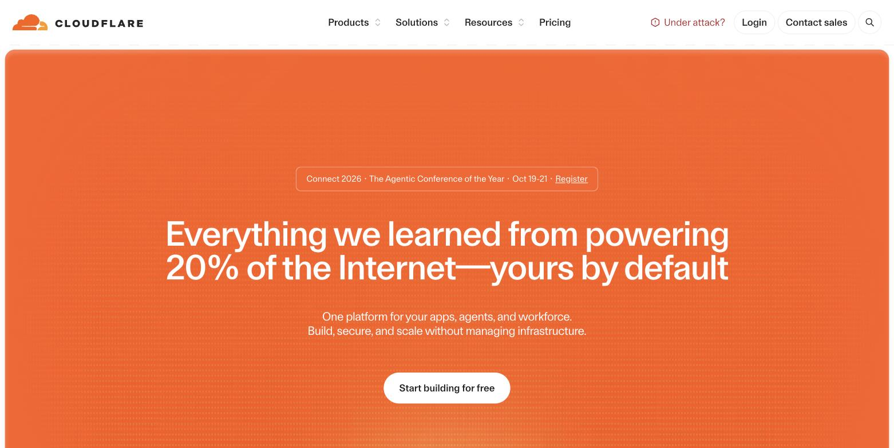
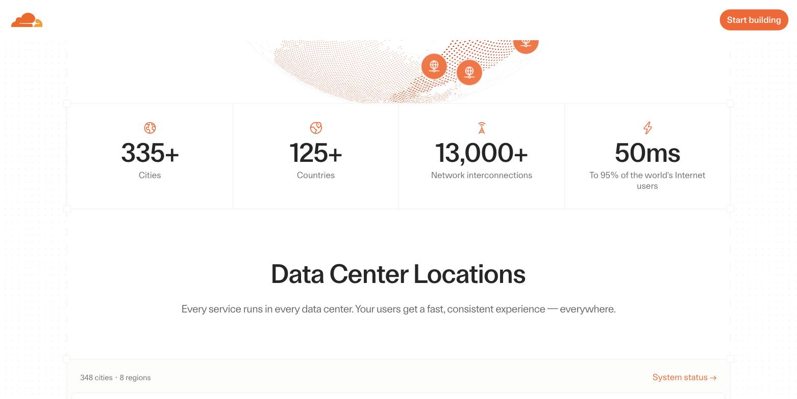
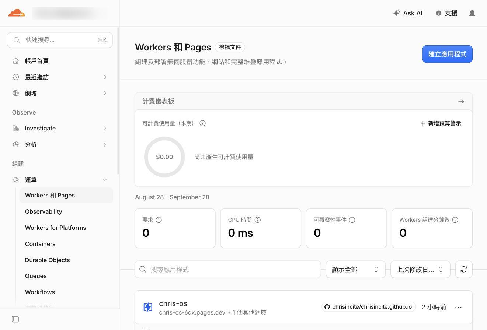
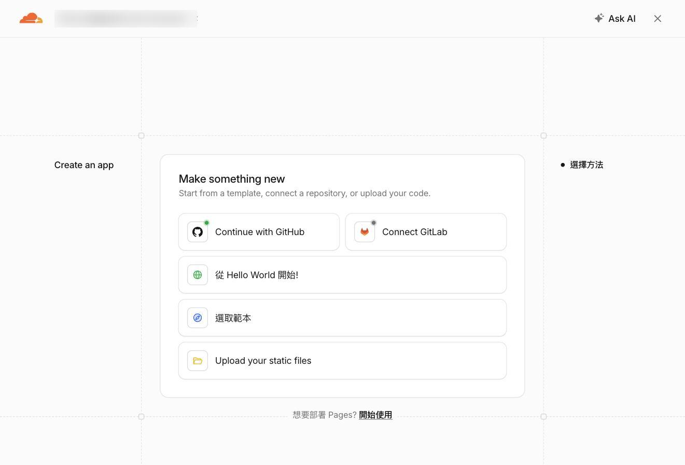
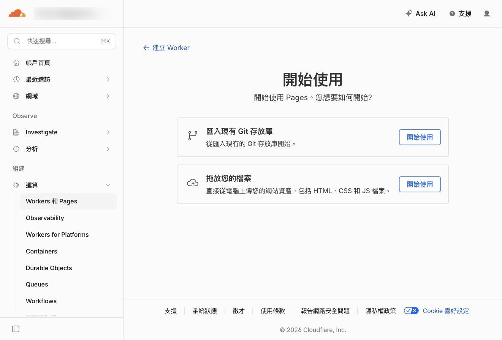
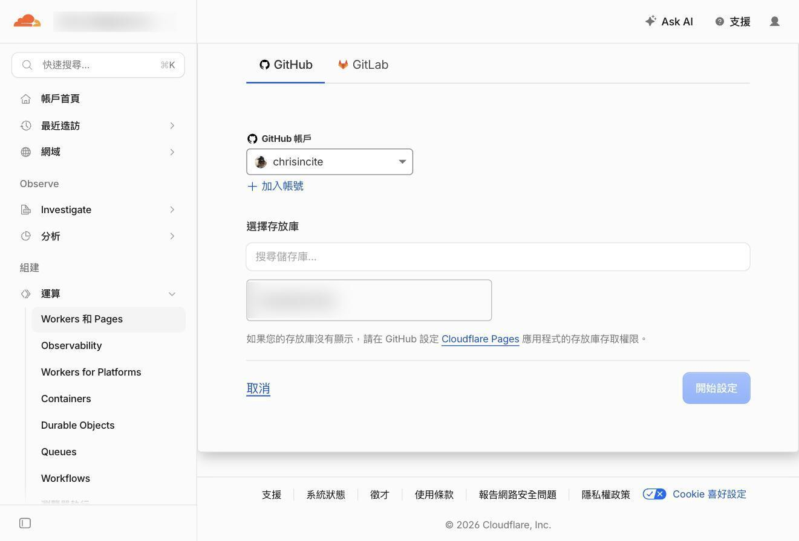
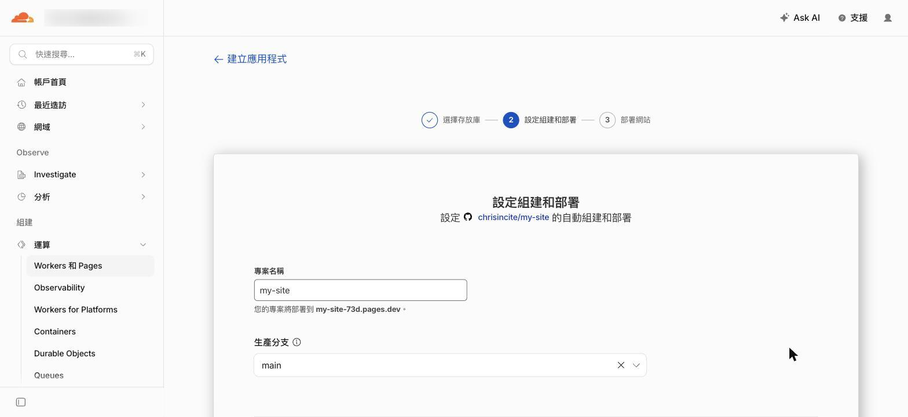
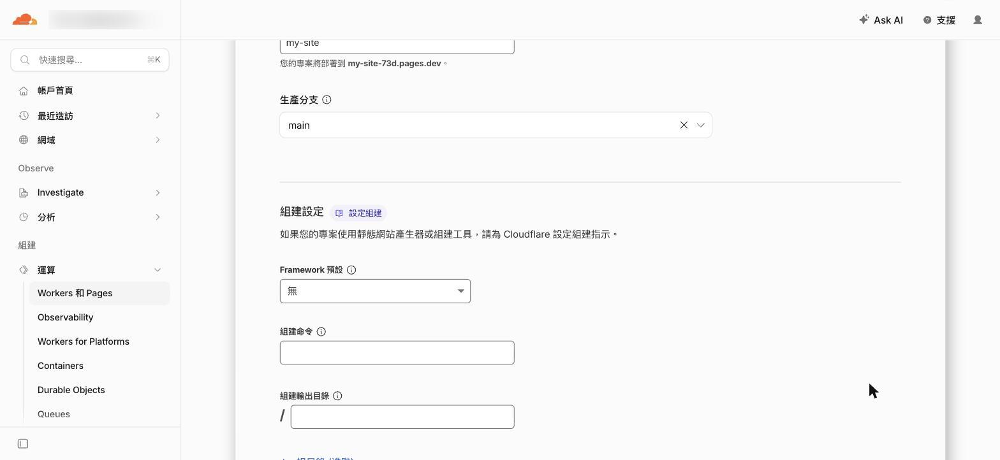
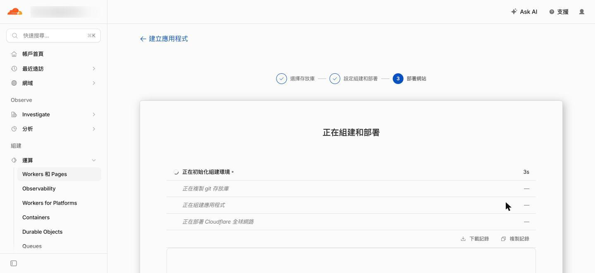
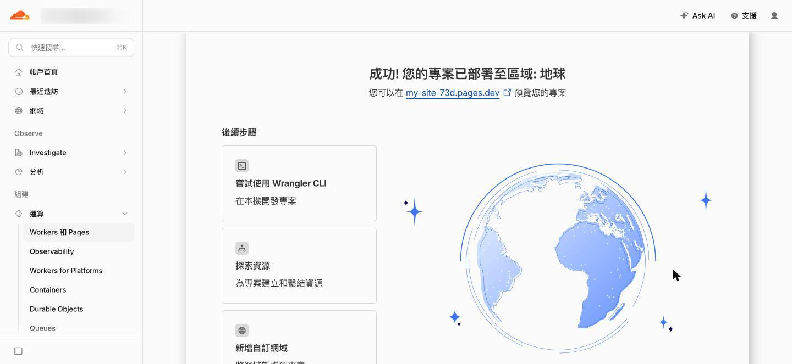

# 小學生也能懂的『Cloudflare』超入門

> 超入門 · 2026-09-11

> 圖解版：./eli5/cloudflare.html

我的桌面上有一個資料夾，叫做「我的作品集」。

裡面有一個 `index.html`，雙擊會打開，畫面其實做得還不錯。

我把整個資料夾壓成 zip 寄給朋友，想聽聽他的意見。他回我一張截圖：滿版的白，圖全破了，字擠成一團。

因為那些圖片的路徑，寫的是我電腦裡的 `/Users/chris/Desktop/我的作品集/img/`。

他的電腦上沒有那個地方。

那天我才想通一件事——**我做的不是一個網站，是一個只有我打得開的檔案。**

「架網站不是要租主機、每個月付錢嗎？」

「我連 DNS 是什麼都不知道，這種事哪輪得到我。」

「Cloudflare？那不是幫大公司擋駭客攻擊的嗎，跟我一頁自我介紹有什麼關係？」

抱著這樣的疑惑，默默把畫面關掉的人應該不少。

這篇文章分成六個章節。第一章說明 Cloudflare 到底是什麼、為什麼它敢免費；第二到第四章是實際的三段路——讓 Claude Code 做出網站的骨架、放進 GitHub 的私人倉庫、接到 Cloudflare Pages 拿到網址；第五章講四個一定會踩的坑；第六章談怎麼把這整條路交給 AI。

專有名詞會全部拆開來講。就算你現在完全零知識，也可以放心閱讀。

如果你還沒讀過同系列的〈小學生也能懂的『GitHub』超入門〉和〈小學生也能懂的『Claude Code』超入門〉，不讀也沒關係，該解釋的地方這裡都會再解釋一次。

※本文中 Cloudflare 的畫面與規格，是截至 2026 年 9 月為止，實際操作官方網站並確認官方文件後的內容。

# 第一章：Cloudflare 是什麼｜開在全世界三百多個城市的便利商店

先講結論。

Cloudflare 是一張鋪在全世界的網路。它站在你的網站「前面」，幫你把東西送到每個人手上，順便幫你擋掉不該進來的東西。

而 Cloudflare Pages，是這張網路上的一個服務：**你把做好的檔案交給它，它直接給你一個網址，全世界都連得到。**

不用租主機。不用設定伺服器。不用綁信用卡。


> 圖 1-1：這就是 Cloudflare 的門口（cloudflare.com）。那朵橘色的雲是它的標誌。右上角的 **Login** 是登入，中間那顆 **Start building for free** 就是免費開始。

## 想像一家開在全世界的便利商店

你寫了一本小冊子，想給全世界的人看。

**傳統的做法，是租一間店面。** 你把冊子放在店裡，全世界的人都得走到你這一間店來拿。

住在隔壁的人，三分鐘就拿到了。

住在地球另一邊的人，要飛十四個小時。

而且如果有一天一萬個人同時擠進來，那間小店會直接被塞爆，門都打不開——這就是網站「掛掉」。

**Cloudflare 的做法，是在全世界三百多個城市各開一家分店，每一家都放一份你的冊子。**

東京的人去東京那家拿。聖保羅的人去聖保羅那家拿。台北的人走到街角就有。

所以快。

也所以擠不爆——一萬個人湧進來，會被分散到三百多個城市，沒有任何一家會被擠垮。


> 圖 1-2：官方的全球網路頁面。大字寫著 **335+ Cities**（三百三十五個以上的城市），但往下捲一點，實際的據點清單標題寫的是 **348 cities**。行銷數字取整取得保守，實際清單才是準的——兩個都是官方寫的，你看到哪一個都不用懷疑。

這套「把同一份東西放到全世界各地，誰來就從最近的地方給他」的機制，專有名詞叫做「CDN（內容傳遞網路，Content Delivery Network）」。

名字很難，做的事情就是開分店而已。

## 那 Cloudflare Pages 又是什麼

上面那個比喻裡，還缺一塊。

你的「原稿」放在哪裡？分店的影本要從哪裡印？

傳統上，原稿要放在你自己租的那間店（主機）裡。分店只是幫你轉送。

**Cloudflare Pages 做的事情是：連原稿倉庫都幫你準備好。**

你把做好的檔案交給它，它直接收下，印成三百多份鋪到全世界，然後給你一個網址。

專有名詞叫做「靜態網站託管（static site hosting）」。

「靜態」的意思是：你交出去的檔案長什麼樣，別人看到的就是什麼樣。它不會在你背後偷偷算什麼、查什麼資料庫。

一頁自我介紹、一份作品集、一個活動公告、一份公開的筆記——這些全部都是靜態網站。

## 為什麼它敢免費？

這是我一開始最不相信的地方。

免費的東西通常有陷阱：流量超過就收錢、跑一陣子就逼你升級、或是在你的頁面塞廣告。

Cloudflare Pages 的官方定價文件上，這句話是白紙黑字寫著的：

> Requests to static assets are free and unlimited.
> （對靜態檔案的請求，免費，且沒有上限。）

沒有流量上限。沒有廣告。免費方案不需要綁信用卡。

為什麼做得到？

因為那三百多家分店，它本來就已經開好了——那是它做企業生意用的網路。多印一份你的自我介紹放進去，對它來說幾乎是零成本。

它真正要收錢的，是「每次都要現場重算」的東西：資料庫、登入、後端程式。那些才耗它的機器。

你放一頁自我介紹，它連眉頭都不會皺一下。

## 今天要走的三段路

知道它是什麼之後，來看整條路長什麼樣。

從「什麼都沒有」到「一個真的網址」，中間是三段：

| 段 | 工具 | 它負責什麼 | 一句話 |
|---|---|---|---|
| 第一段 | Claude Code | 做出網站的檔案 | 工匠 |
| 第二段 | GitHub | 保管每一次修改 | 保管室 |
| 第三段 | Cloudflare Pages | 送到全世界 | 連鎖店 |

三個都是免費的。

而且接起來之後會變成這樣：**你以後只要改東西、存檔，網站就自己更新了。** 不用再登入任何後台、不用再上傳任何檔案。

到這裡，我們已經知道 Cloudflare 是一張鋪在全世界的網路，而 Pages 是它上面「幫你把網站發出去」的那個服務。

接下來，就從第一段路開始——先把網站做出來。

# 第二章：讓 Claude Code 做出網站的骨架｜你負責講，它負責打字

Claude Code 是一個住在終端機（黑色畫面）裡的 AI 助手。

你用中文跟它講話，它直接在你的電腦上建檔案、改檔案。

這一章不需要你會寫任何一行 HTML。你只要會描述你想要什麼。

## 動作一：開一個空資料夾

在你的「文件」底下開一個新資料夾，取名 `my-site`。

名字用英文小寫、不要有空格。這個名字後面會出現在好幾個地方，中文和空格會在某些環節製造麻煩。

## 動作二：在那個資料夾裡打開 Claude Code

打開「終端機」（Terminal），輸入這兩行：

```bash
cd ~/Documents/my-site
claude
```

第一行的意思是「走到那個資料夾裡」。

第二行是叫它起床。

如果你還沒裝過 Claude Code，同系列的〈Claude Code 超入門〉那篇有一行安裝指令。

## 動作三：把你想要的東西講出來

這是整篇文章裡唯一需要你動腦的地方。

不要講「幫我做一個網站」——太模糊，它會自己亂猜。

把「有哪幾塊」講出來就好：

```
幫我做一個個人網站，純 HTML + CSS，不要用任何框架。

需要這幾塊：
- 首頁：我的名字、一句自我介紹、一張大圖的位置
- 關於我：三段文字
- 作品：六個格子，每格一張圖加一行說明
- 聯絡：email 和兩個社群連結

風格：白底黑字、乾淨、留白多一點。手機上也要能看。
圖片先放佔位用的灰色方塊，我之後自己換。
```

為什麼特別強調「純 HTML + CSS，不要用任何框架」？

因為框架（React、Next.js 這類）會多出一個「建置（build）」的步驟——要先編譯過才能變成網頁。第一次上線的人，能少一個環節就少一個出錯的地方。

**先讓最單純的版本跑通，之後再加東西。** 這是這篇文章從頭到尾的原則。

## 動作四：在自己的電腦上先看一眼

它做完之後，資料夾裡大概會有這些檔案：

```
my-site/
├── index.html      ← 首頁
├── about.html
├── work.html
├── style.css       ← 外觀
└── img/
```

`index.html` 這個名字是有意義的。

**它是「門口那扇門」。** 任何人連到你的網址、後面什麼都不加，看到的就是這一頁。這是全世界網頁伺服器的共同默契，名字不能改。

想在電腦上先看看長什麼樣，跟 Claude Code 說：

```
幫我在本機開一個伺服器，讓我用瀏覽器看看
```

它會跑起一個本機網址（通常長得像 `http://localhost:8000`），你在瀏覽器打開就看得到。

不滿意就直接講：「首頁的字太小了」「把作品改成四個格子」「配色改成米白」。

改到你滿意為止，再往下走。

## 但它現在還不是網站

這一點很重要。

你現在瀏覽器上那個 `localhost:8000`，只有你自己連得到。

`localhost` 的意思就是「這台電腦本身」。你把這個網址傳給朋友，他打開會看到他自己電腦上的東西（多半是什麼都沒有）。

就跟我開頭寄 zip 給朋友的那次一樣——**檔案在你手上，不等於網站存在。**

要變成網站，還缺一個「全世界都連得到的地方」。

到這裡，我們已經有一個做好的資料夾了。

接下來，要先把它放進一個安全的保管室。

# 第三章：放進 GitHub 的私人倉庫｜保管室，也是輸送帶

這一步很多人會問：「我直接把資料夾丟給 Cloudflare 不就好了？為什麼要多繞 GitHub 一圈？」

可以直接丟。Cloudflare Pages 確實支援把資料夾拖進去上傳。

但繞這一圈，你會多拿到兩件事：

**第一，每一次修改都有記錄。** 改壞了可以退回去。三個月後也還知道當初改了什麼。

**第二，也是關鍵的——以後不用再手動上傳。** GitHub 和 Cloudflare 接起來之後，你在電腦上存一次檔，網站就自己更新了。

GitHub 在這裡有兩個身分：它是保管室，也是一條輸送帶。

## 為什麼要用「私人」倉庫

GitHub 上的倉庫（repository，一般叫 repo）分兩種：公開的（public）和私人的（private）。

兩種都免費，數量沒有上限。

**Cloudflare Pages 兩種都支援。** 官方文件寫得很清楚：`Both private and public repositories are supported.`

那為什麼建議用私人的？

因為倉庫裡除了網頁檔案，通常還會有一些你不想給人看的東西：草稿、還沒公開的作品、寫到一半的頁面、備忘筆記。

**倉庫私密，不影響網站公開。** 這兩件事是分開的。

這也是整篇文章最容易被誤會的一個觀念，第五章的坑一會再講一次：私人倉庫保護的是「原始檔案」，不是「網站內容」。

## 動作一：讓 Claude Code 幫你建倉庫

直接跟它說：

```
幫我把這個資料夾變成 git 倉庫，
在 GitHub 上建一個私人倉庫叫 my-site，然後推上去。
```

它會做這幾件事：把資料夾變成 git 倉庫、建一個 `.gitignore`（列出哪些檔案不要上傳）、做第一次存檔、在 GitHub 上開一個私人倉庫、把東西推上去。

如果它回你「需要先登入 GitHub」，照它給的指令做一次就好，之後不用再登入。

## 動作二：自己點滑鼠也可以

不想碰指令，就用 GitHub 官方的圖形介面軟體 **GitHub Desktop**。

流程是：`File` → `Add Local Repository` → 選你的資料夾 → 它會問要不要建立倉庫 → `Publish repository` → **記得把 `Keep this code private` 勾起來**。

那個勾勾就是公開和私人的差別，預設是勾起來的，不要取消。

## 動作三：確認東西真的上去了

打開 github.com，登入，看看有沒有那個倉庫。

點進去，應該看得到 `index.html`、`style.css` 這些檔案，倉庫名稱旁邊會有一個灰色的 **Private** 標籤。

有看到，這一段就完成了。

到這裡，你的網站檔案已經有一份在雲端了，而且有完整的修改記錄。

接下來是最後一段路——把這個倉庫接到 Cloudflare，讓它變成一個真的網址。

# 第四章：接上 Cloudflare Pages｜六個步驟，拿到你的網址

這一章是整篇的重點。

全程點滑鼠，不需要打任何指令。

先說一句實話：**Cloudflare 的後台改版很勤，官方文件常常落後於畫面。** 我寫這一章的時候，官方文件教的路徑已經跟實際畫面對不上了。

所以下面每一步都附了截圖。以畫面為準，不要以任何人的文字為準——包括我的。

## 步驟一：註冊 Cloudflare 帳號

打開 <https://dash.cloudflare.com/sign-up>。

它只問兩件事：**email** 和**密碼**。

沒有信用卡欄位。沒有方案選擇。免費方案是預設的，你什麼都不用選。

註冊完會收到一封驗證信，點一下裡面的連結。

## 步驟二：找到 Pages 的入口（它藏得有點深）

登入之後，左邊的選單找 **運算（Compute）**，點開，第一項就是 **Workers 和 Pages**。

如果你的介面是英文，那是 **Compute** → **Workers & Pages**。


> 圖 4-1：左邊選單「組建」區塊底下的 **運算**，展開後第一項 **Workers 和 Pages**。右上角那顆藍色的 **建立應用程式** 是下一步要按的。順帶一提，畫面中間那個 $0.00 是本期費用——這篇教你做的事，它會一直是 0。

你可能會愣一下：「我要的是 Pages，Workers 又是什麼？」

**Workers 是 Cloudflare 另一個產品**，用來跑程式的。跟你今天要做的事沒有關係。

它們被放在一起，是因為底層是同一套系統。Cloudflare 這幾年在把兩者合併，所以到處都會看到 Workers 這個字。

你只要知道：**我要的是 Pages。**

## 步驟三：在「建立應用程式」裡找到那行小字

按右上角的 **建立應用程式**。

然後你會看到一個叫 **Make something new** 的畫面，上面全部都是 Workers 的選項。

**不要按那些。**


> 圖 4-2：這一頁給你四個大按鈕，全部都是 Workers 的路。你要的在最底下那行灰色小字：**想要部署 Pages? 開始使用**。這是整個流程最容易走錯的一步——版面設計得像是在勸你別走這條路。

按那行小字的 **開始使用**。

## 步驟四：選「匯入現有 Git 存放庫」

進來之後有兩條路：


> 圖 4-3：上面那條是接 GitHub（我們要走的）；下面那條 **拖放您的檔案** 是直接從電腦上傳資料夾，連 GitHub 都不用。如果你只是想趕快看到網站活著，下面那條三分鐘就能完成——但每次改都要重拖一次。

按上面那條的 **開始使用**。

接下來的畫面會列出你 GitHub 上的倉庫，選 `my-site`，按 **開始設定**。

**如果你的倉庫沒有出現在清單裡，先別急著懷疑人生。**


> 圖 4-4：清單裡只有一個倉庫，剛建好的 `my-site` 不在上面。答案就寫在清單底下那行小字：**「如果您的存放庫沒有顯示，請在 GitHub 設定 Cloudflare Pages 應用程式的存放庫存取權限。」** 這是授權範圍的問題，不是壞掉——第五章的注意事項四會講怎麼解。

## 步驟五：那三格設定，什麼都不用改

選好倉庫之後，進到「設定組建和部署」。

先看最上面：


> 圖 4-5：**專案名稱**底下那行字很重要——「您的專案將部署到 **my-site-73d.pages.dev**」。我明明填的是 `my-site`，它卻自己加了 `-73d`。因為 `my-site` 這個名字全世界只有一個，早就被別人用掉了。想要漂亮的網址，就把專案名稱取得獨特一點。**生產分支**保持 `main` 不用動。

再往下捲，是整篇文章最多人填錯的地方：


> 圖 4-6：**Framework 預設＝無、組建命令＝空、組建輸出目錄＝空。** 三格都不要動。注意「組建輸出目錄」那格左邊印著一個 `/`——那是欄位自己帶的固定前綴，不是要你填的東西，輸入框留白就代表「檔案在倉庫最外層」。很多教學（包括官方文件的舊版本）會說這格要填 `/`，那會讓你多打一個斜線。

純 HTML 網站，這三格的預設值就是正確答案。

什麼都不用改。

## 步驟六：按下去，然後等一分鐘

捲到最底，按 **儲存並部署**。


> 圖 4-7：它會跑四個階段——初始化組建環境、複製 git 存放庫、組建應用程式、部署 Cloudflare 全球網路。最後那一行就是第一章講的「鋪到三百多個城市」，你正在看它發生。

大約一分鐘之後：


> 圖 4-8：「**成功! 您的專案已部署至區域: 地球**」。這句話讀起來有點浮誇，但它是字面意思——你的網站現在在全世界每一個據點都有一份。上面那個 `.pages.dev` 網址就是你的網站。

點那個網址。


> 圖 4-9：這就是剛才那個資料夾，現在活在一個全世界都連得到的網址上。傳給朋友，他看到的會跟你一模一樣——不會再有破圖了。

而且它已經自動上了 HTTPS（網址前面那個鎖頭）。

這件事在十年前要花錢買憑證、還要自己設定，現在是預設的，你什麼都不用做。

## 之後呢？你只要存檔就好

這是接上 GitHub 最大的好處。

以後你想改網站，流程是這樣：

```
改檔案 → 存檔推上 GitHub → 網站自己更新
```

中間沒有你的事。不用登入 Cloudflare，不用上傳任何東西。

Cloudflare 會一直盯著你那個倉庫，看到有新東西就自動重做一次。

跟 Claude Code 講一句「幫我把這次的修改推上去」，一分鐘後你的網站就是新的了。

免費方案每個月可以自動重做 **500 次**。

一天改十六次都還用不完。

到這裡，三段路走完了。

接下來講四個一定會踩到的坑——尤其是第一個，那是觀念問題，不是操作問題。

# 第五章：初學者該注意的四個重點｜這些陷阱務必避開

## 注意事項一：私人倉庫，不等於私密網站

這是最重要的一個。

**症狀。** 你把倉庫設成 private，覺得「這樣就沒人看得到了」。於是在裡面放了還沒公開的作品、寫到一半的頁面、只想給客戶看的報價單。

結果那些東西全部出現在 `my-site.pages.dev` 上，任何人都打得開。

**機制。** 私人倉庫保護的是「原始檔案的存取權」——別人不能進你的 GitHub 倉庫翻東西。

但 Cloudflare Pages 做的事情，就是把那些檔案「發佈到全世界」。

發佈出去的東西，本來就是給全世界看的。這兩件事不衝突，只是很多人以為 private 會一路傳染到網站上。

更容易忽略的是**預覽網址**。

Cloudflare 官方文件寫得很直接：`By default, these deployment URLs are public.`（預設情況下，這些部署網址是公開的。）

意思是：你在 GitHub 上開一條新的分支來試東西，Cloudflare 也會幫那條分支生一個網址，長得像 `373f31e2.my-site.pages.dev`。

**那個網址沒有密碼。** 網址很難猜，但「難猜」不是「安全」。

**正確做法。**

不想給人看的東西，不要放進這個倉庫。就這麼簡單。

草稿、報價單、客戶的照片——另外開一個倉庫放，那個倉庫不要接 Cloudflare。

真的需要保護預覽網址，Cloudflare 有一個叫 **Access** 的功能可以把預覽鎖起來（在專案設定裡開），但這是進階題，第一次上線不必碰。

記住那條界線就好：**進到這個倉庫的東西，等於公開。**

## 注意事項二：那三格亂填，網站會上線，但打開是一片空白

**症狀。** 部署顯示成功，綠色勾勾，一切正常。

你興奮地點開網址——`404 Not Found`。

或是更怪的：看到一排檔案清單，像在瀏覽別人的硬碟。

**機制。** 問題出在 **組建輸出目錄（Build output directory）** 那一格。

那一格的意思是：「我的網頁檔案，放在倉庫的哪個位置？」

Cloudflare 只會把「那個位置裡面的東西」拿去發佈。

你的 `index.html` 就在倉庫最外層，所以那一格應該是**空的**（欄位左邊那個 `/` 是它自己印的前綴，代表最外層）。

如果你填了 `dist` 或 `public`——那是有用框架的網站才有的資料夾——Cloudflare 會去找一個叫 `dist` 的資料夾。找不到，或者找到一個空的，於是發佈了一片空白。

**它不會報錯。** 因為對它來說，「發佈一個空資料夾」也是一次成功的發佈。

同理，**Framework 預設**選錯（明明沒用框架卻選了 React）也會出事：它會去跑一個不存在的建置指令，然後失敗。

**正確做法。**

純 HTML 網站：三格全部保持預設（無、空、空）。

如果你之後真的用了框架，去 **Framework 預設** 的下拉選單裡選你的框架名稱，那兩格它會自動填好——不要自己猜。

改完設定之後，要去 **部署** 那一頁按一次**重試部署**，它才會用新設定重跑一次。光改設定不會自動生效。

## 注意事項三：靜態網站沒有「後台」，你寫進去的密碼等於貼在公佈欄

**症狀。** 你想做一個聯絡表單，或是想接一個 API 抓資料。

AI 幫你寫好了，裡面有一行：

```javascript
const apiKey = "sk-xxxxxxxxxxxxxxxx";
```

你推上去，網站正常運作，很開心。

三天後，你收到一封帳單，或是那把金鑰被停用了。

**機制。** 靜態網站上的每一個檔案，都是「發給訪客的」。

包括你的 JavaScript。

訪客的瀏覽器要執行它，就必須先拿到它。任何人按右鍵「檢視原始碼」，那串金鑰就在那裡。

而且網路上有機器人二十四小時在掃描公開的網頁和倉庫，專門撿這種東西。以分鐘為單位就會被撿走。

**正確做法。**

**寫進網頁檔案裡的東西，一律當成公開的。** 沒有例外。

需要用到金鑰的功能，要有一個「訪客拿不到的地方」去執行它——那就是 Cloudflare Workers 或 Pages Functions 的用途，也是這篇文章刻意先不碰的部分。

第一個網站，先不要做需要金鑰的功能。

聯絡方式就放 email 連結。表單就用 Google 表單嵌進去。

等你真的需要了，再回來學那一塊。

## 注意事項四：授權時選「只給特定倉庫」，之後每開一個新站都要回去補勾

**症狀。** 你在 Cloudflare 選倉庫的那一步，清單裡就是沒有你剛建好的那個倉庫。

搜尋也搜不到。重新整理也沒用。你開始懷疑是不是 push 失敗了。

**機制。** 第一次把 Cloudflare 接上 GitHub 的時候，GitHub 會問你要給多少權限：

- **All repositories**（全部倉庫）
- **Only select repositories**（只給指定的幾個）

安全的做法是選第二個——Cloudflare 只需要看它要部署的那一個，沒有理由給它看你全部的東西。

但代價就是這個：**那份清單是寫死的。** 之後新建的倉庫不在名單上，Cloudflare 就真的看不見它。

這不是壞掉，是權限照你說的做。

**正確做法。**

畫面上其實就寫了答案（圖 4-4 那行小字）。照著做：

1. 打開 <https://github.com/settings/installations>
2. 找到 **Cloudflare Workers and Pages**，按 **Configure**
3. GitHub 可能會要你重新驗證一次身分（passkey 或密碼）——這是它保護帳號設定的機制，正常
4. 在 **Repository access** 區塊，把新倉庫加進 `Only select repositories` 的清單，按 **Save**
5. 回 Cloudflare 那一頁重新整理，倉庫就出現了

如果你懶得每次都來一趟，也可以直接選 All repositories。

那是一個取捨：**方便，但 Cloudflare 從此看得到你 GitHub 上的每一個倉庫。**

我的建議是照樣選「只給指定的」，把補勾這一分鐘當成開新站的固定成本。權限這種事，麻煩一點通常是對的。

# 第六章：用 AI 完成整條路｜三個平台，交給同一個人

這條路有一個很特別的地方：**三段都是 Claude Code 做得到的。**

它可以幫你寫網頁、可以幫你操作 GitHub，也可以透過 Cloudflare 的命令列工具幫你部署。

換句話說，你可以從頭到尾只講話。

## 事前準備只有兩件事

**第一，在你的網站資料夾裡打開 Claude Code。**

```bash
cd ~/Documents/my-site
claude
```

**第二，讓它知道你的 Cloudflare 帳號。**

只有當你想讓它「直接部署」時才需要這一步。如果你已經照第四章接好 GitHub，其實不必——它只要幫你推上 GitHub，網站就會自己更新了。

**這條路是我推薦的。** 它更安全：AI 只碰得到你的倉庫，碰不到你的 Cloudflare 帳號。

真的需要讓它直接部署，跟它說：

```
幫我裝 wrangler 並登入 Cloudflare
```

`wrangler` 是 Cloudflare 官方的命令列工具。登入會跳出瀏覽器讓你按「允許」——那一下必須你自己按。

## 三個最好用的句型

**句型一：改完直接上線。**

```
把首頁的自我介紹改成這段：（貼上新的文字），
確認本機看起來沒問題之後，推上 GitHub
```

它會改檔案、開本機伺服器讓你看一眼、然後推上去。一分鐘後網站就是新的。

**句型二：出事了，幫我看。**

```
我的 Cloudflare Pages 部署成功了，但打開網址是 404。
幫我看看 build 設定跟檔案位置對不對
```

這個句型很有用，因為第五章那個坑，它一眼就能看出來——它看得到你的檔案結構。

**句型三：退回去。**

```
剛才那次修改把版面弄壞了，幫我退回上一個版本，然後推上去
```

這是接 GitHub 的紅利。每一次存檔都是一個可以回去的點，講一句話就能退。

## 但請守住這四條界線

**一、讓它先說再做。**

不確定它要幹嘛的時候，加一句「先跟我說你打算怎麼做，我同意了再動手」。

**二、對外的動作，要你自己點頭。**

推上 GitHub、部署到線上——這些是「全世界都會看到」的動作。讓它做可以，但你要知道它在做。

**三、不可逆的動作一律先問。**

刪除倉庫、刪除 Pages 專案、換掉專案名稱（網址會跟著換，舊網址直接失效）——這幾件事沒有還原按鈕。

**四、寫出去的東西，自己看過一眼。**

它寫的文案、它填的個人資料、它放的連結，都會出現在你的網站上，掛你的名字。

上線前，用瀏覽器從頭到尾捲一遍。這一分鐘省不得。

## 一個小提醒：先讓它做「讀」的事

第一週，只讓它做讀的事：看檔案、解釋設定、找出為什麼是 404。

第二週，開始讓它做可以回復的事：改內容、推上 GitHub（推錯了可以退回去）。

看得懂它在做什麼了，再交出不可逆的動作。

# 總結：今天要做的，只有一件事

網站不是一種技術，是一個位置。

你需要的不是「學會架站」，是把手上已經做好的東西，放到一個全世界都走得到的地方——而那個地方，現在是免費的。

Claude Code 幫你做出來，GitHub 幫你保管，Cloudflare 幫你發出去。三段路，一個下午。

你不需要一口氣把全部記起來。

今天要做的，只有一件事。

**「開一個空資料夾，打開 Claude Code，跟它說：幫我做一個個人網站的骨架。」**

剩下的兩段路，等你手上有東西了再走也不遲。

那個壓成 zip 寄出去、朋友打開是一片破圖的資料夾，你再也不用寄了。

你會有一個網址。

---

## 附錄：一頁速查表

**三段路**

| 段 | 做什麼 | 結果 |
|---|---|---|
| 1 | 在空資料夾打開 Claude Code，描述你要的網站 | 一個有 `index.html` 的資料夾 |
| 2 | 推上 GitHub 私人倉庫 | 雲端有一份，有修改記錄 |
| 3 | 運算 → Workers 和 Pages → 建立應用程式 → 最底下那行「想要部署 Pages?」 | 一個 `.pages.dev` 網址 |

**純 HTML 網站的設定（最常填錯的地方）**

| 欄位 | 填什麼 |
|---|---|
| Framework 預設 | 無（None） |
| 組建命令 | 留空 |
| 組建輸出目錄 | **留空**（左邊那個 `/` 是欄位自帶的，不用打） |
| 生產分支 | `main` |

**三個絕對不要**

1. 不要把不想公開的東西放進這個倉庫——私人倉庫不等於私密網站
2. 不要把金鑰、密碼寫進網頁檔案——所有檔案都是公開的
3. 不要自己填組建輸出目錄——純 HTML 網站三格全部保持預設

**找不到倉庫的時候**

去 <https://github.com/settings/installations> → Cloudflare Workers and Pages → Configure → Repository access → 把新倉庫加進去 → Save。

**免費方案的數字**

- 流量、訪客數：**無上限**（官方原文：static assets are free and unlimited）
- 每月自動部署次數：500 次
- 單一檔案大小上限：25 MiB
- 檔案總數上限：20,000 個
- 自訂網域：100 個
- 不需要信用卡

**常用網址**

- 註冊：<https://dash.cloudflare.com/sign-up>
- 後台：<https://dash.cloudflare.com>
- 官方文件：<https://developers.cloudflare.com/pages/>
- 免費方案限制：<https://developers.cloudflare.com/pages/platform/limits/>

**懶人路線（已經接好 GitHub 之後）**

跟 Claude Code 說一句：

```
改完幫我推上 GitHub
```

一分鐘後，網站自己更新。


---
短網址：https://os.housearch.net/g/4
