# 小學生也能懂的『GitHub』超入門

> 超入門 · 2026-09-11

> 圖解版：./eli5/github.html

我一直覺得 GitHub 是「工程師才會去的地方」，直到自己被一個資料夾搞到崩潰，才知道早該用它。

事情是這樣的：那個資料夾裡躺著「提案書.docx」、「提案書_修改版.docx」、「提案書_最終版.docx」、「提案書_最終版_這次真的.docx」。改到第七個檔名的時候，我已經分不出哪一版是對的了。

GitHub 這個名字，你是不是也在哪裡看過一次？

但它到底是做什麼用的，其實不太清楚吧。

「那不是寫程式的人才會用的東西嗎？」

「我又不會打指令，是不是就沒我的份？」

抱著這樣的疑惑，默默把畫面關掉的人應該不少。

這篇文章分成五個章節。前三章說明 GitHub 是什麼、怎麼用、該注意什麼；第四章帶你一步一步申請那把「讓程式代替你登入」的鑰匙；第五章談一件這兩年才成立的事——讓 AI 代替你去操作它。

專有名詞會全部拆開來講，每一個要按的按鈕都會附上截圖。就算你現在完全零知識，也可以放心閱讀。

※本文中 GitHub 的畫面與規格，是截至 2026 年 9 月為止，實際操作官方網站並確認官方文件後的內容。

# 第一章：GitHub 是什麼｜幫你的作品「按存檔」的雲端保管室

「GitHub 最近很常聽到，但它到底是做什麼的？」

這個問題，我被問過非常多次。

看過那隻黑白色貓咪章魚標誌的人應該很多。

但能說出它到底做了什麼的人，意外地很少。

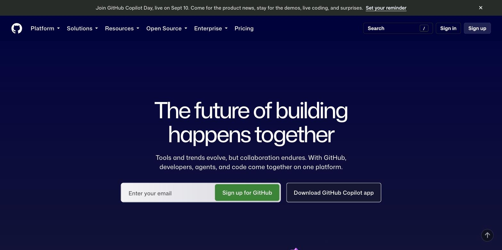
> 圖 1-1：這就是 GitHub 的門口（github.com）。左上角那隻貓咪章魚叫 Octocat，是它的吉祥物。右上角的 **Sign up** 就是註冊。

先講結論。

GitHub，是一間幫你把作品的「每一次存檔」都完整保管下來的雲端保管室。

它不是拿來寫程式的工具。
也不是只有程式可以放。
它是一個地方，把你做東西的「過程」整條記錄下來，而不是只留下最後那一版。

## 想像你在打一款很難的電玩

打大魔王之前，你會做什麼？

你會先按存檔。

然後才敢衝進去。打輸了，就讀取剛才那個存檔重來一次，不用從第一關開始。

GitHub 做的事情，就是把「按存檔」這件事，搬到你做作品的過程裡。

每按一次存檔，就留下一個時間點。作品被改壞了，就退回上一個存檔點。
專有名詞叫做「commit（提交）」。

而且這個存檔點跟電玩不一樣的是，你可以在旁邊寫一行字：「這次調整了首頁的字體大小」。

三個月後回頭看，你會非常感謝當初寫下那行字的自己。

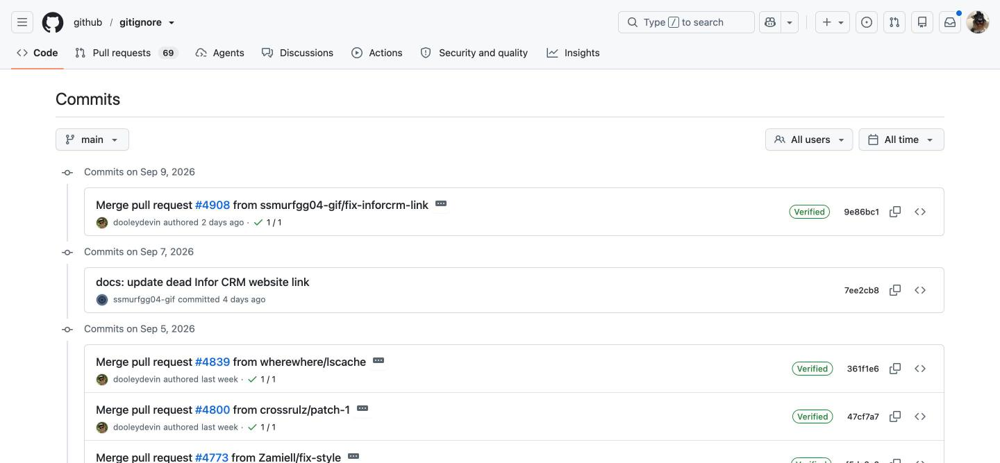
> 圖 1-2：一整排的存檔點，最新的在最上面。每一條左邊是那次存檔的說明文字（例如「docs: update dead Infor CRM website link」），下面是誰存的、什麼時候存的。右邊那串 `7ee2cb8` 是這個存檔點的身分證號碼。

## 那個放存檔的箱子，叫做倉庫

一個作品，配一個箱子。

網站一個箱子，論文一個箱子，食譜筆記一個箱子。箱子裡放檔案，也放這個箱子從出生到現在的所有存檔點。

專有名詞叫做「repository（倉庫）」，一般人都直接叫它 repo。

你電腦裡有一個箱子，GitHub 的雲端上也有一個一模一樣的箱子。兩邊會互相同步。

從電腦把存檔送上雲端，叫「push（推上去）」。
從雲端把別人的更新拿回電腦，叫「pull（拉下來）」。

推上去、拉下來。就這兩個字，是你以後最常聽到的兩個動作。

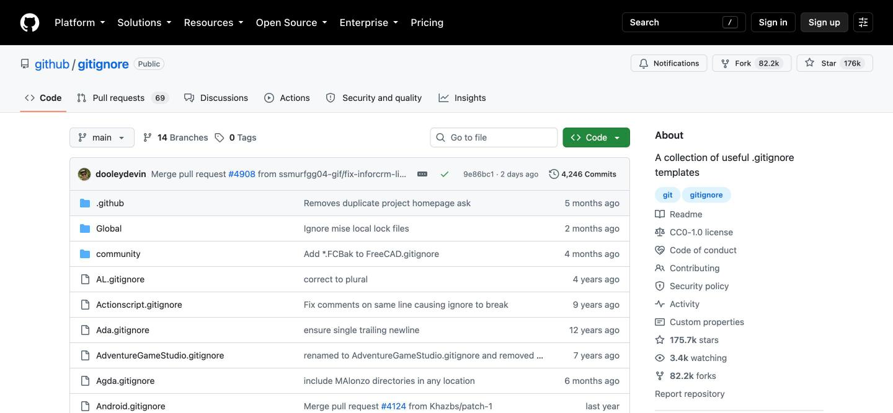
> 圖 1-3：倉庫的樣子。中間是檔案清單，每個檔案右邊會顯示「它最後一次被改是什麼時候、那次改了什麼」。右上角的 **4,246 Commits** 就是「這個箱子到今天為止總共存過 4,246 次檔」。

## 為什麼要多此一舉放到雲端？

三個理由。

第一，電腦壞掉也不會死。
筆電被咖啡潑到、硬碟突然打不開——這些事情不會提前通知你。東西在雲端有一份，你損失的只是一台電腦，不是三個月的心血。

第二，可以多人一起做同一件事。
兩個人改同一份東西，最怕的是互相蓋掉對方。GitHub 會幫你比對「你改了哪幾行、他改了哪幾行」，能自動合的就自動合，合不了的會停下來問你。

第三，可以安全地亂搞。
想試一個很大膽的改法，又怕改壞？那就先「影印一份」出來，在影印本上盡情亂搞。成功了就合併回正本，失敗了整份丟掉，正本一根寒毛都沒動到。

專有名詞叫做「branch（分支）」，合併回去叫「merge（合併）」。

我剛開始寫東西的時候，是靠複製整個資料夾來做備份的。改一次，複製一份，資料夾名稱後面加一個日期。

結果就是硬碟裡塞了四十幾個長得幾乎一樣的資料夾，而我完全想不起來 0712 那一版跟 0715 那一版差在哪裡。

「留下版本」和「留下版本之間的差異」，是兩件完全不同的事。這件事我是繞了一大圈之後才懂的。

而且這些功能，個人用全部免費。公開的箱子免費，不公開的箱子也免費，數量沒有上限。

到這裡，我們已經知道 GitHub 是幫你保管每一次存檔的雲端保管室。

接下來，就來看實際上該怎麼開始。

# 第二章：GitHub 的基本用法｜四個動作就能開始

你可能會覺得「一定要會打指令吧」。

不一定。GitHub 有官方的圖形介面軟體，全程點滑鼠就能完成。

基本流程，就只有四個動作。我們一個一個、照著圖做。

## 動作一：申請免費帳號

打開 https://github.com/signup 。

它會一個一個問你：

**① Enter your email（輸入你的信箱）**
填好按 Continue。

**② Create a password（設定密碼）**
至少 15 個字，或是「8 個字以上且含有數字與小寫字母」。建議直接用密碼管理器產生一組亂碼。

**③ Enter a username（取一個名字）**
這就是你在 GitHub 上的名字，會出現在你所有作品的網址裡（`github.com/你的名字`）。
全世界不能重複，而且以後改名很麻煩，請認真取。建議用英文小寫加連字號，例如 `chris-hsu`。

**④ 過一次「我不是機器人」的驗證**
GitHub 的註冊頁會要你滑一下滑塊、或點幾張圖。這一步只能人工操作。

**⑤ 收信，輸入 8 位數驗證碼**
GitHub 會寄一封信給你，把裡面的數字填進去。

完成。你已經有帳號了。

## 動作二：打開兩階段驗證（2FA）

這一步不能跳過。

從右上角**頭像 → Settings → 左邊選單的「Password and authentication」**，往下捲，就會看到這一區。

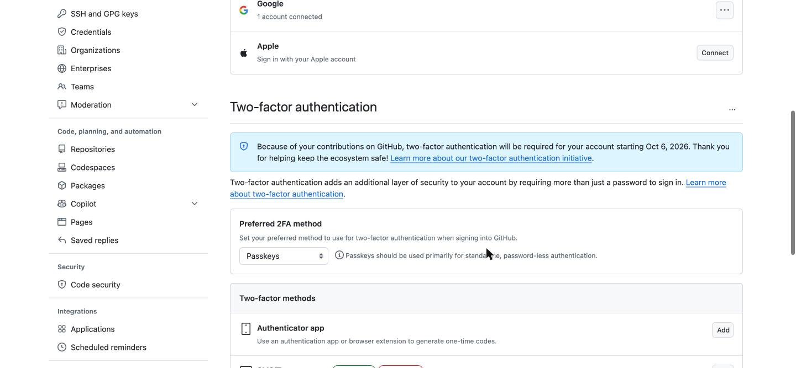
> 圖 2-1：藍色那條提示寫得很清楚——**因為你在 GitHub 上有貢獻紀錄，2026 年 10 月 6 日起這個帳號將強制要求兩階段驗證**。下面的 **Two-factor methods** 就是設定的地方，右邊的 **Add** 是新增。

理由也很正當：你的帳號裡以後會放著你所有的作品。

可以選的方式有幾種：

・**Authenticator app（手機驗證 App，推薦）**：用 Google Authenticator、1Password 這類 App 掃一下畫面上的 QR Code，之後每次登入輸入 App 上的六位數字。
・**Passkeys（通行金鑰）**：用手機或電腦的指紋、臉部辨識登入，連密碼都不用打。
・**SMS（簡訊）**：收簡訊驗證碼。最方便，但安全性最低。

設定完成後，畫面會給你一組 **recovery codes（救援碼）**，共 16 組。請按「Download」存下來，印出來放抽屜也可以。

手機掉了的時候，那是你唯一進得去帳號的辦法。

## 動作三：開一個倉庫

回到 GitHub 首頁，按右上角的 **＋** 號，選 **New repository**。

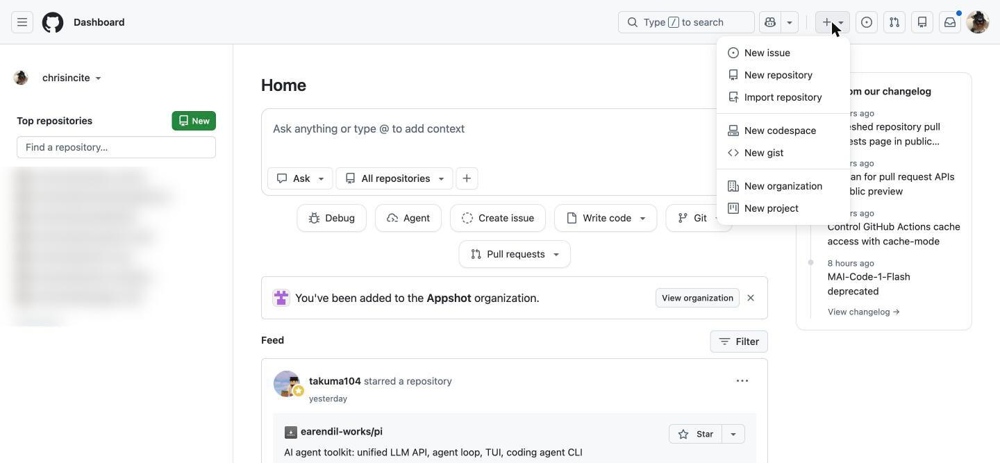
> 圖 2-2：右上角這個 ＋ 號，是你以後開新箱子的固定入口。（左邊的倉庫清單已打碼。）

接著會看到建立表單，分成 **1 General** 和 **2 Configuration** 兩段：

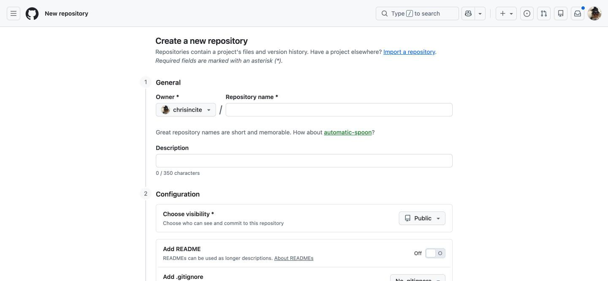
> 圖 2-3：上半段只有三格要填。Owner 就是你自己，不用動。

**① Repository name（箱子的名字）＊必填**
英文小寫、用連字號連接，例如 `my-first-site`。
下面那行 `How about automatic-spoon?` 是 GitHub 隨機幫你想的名字，不想取名可以直接點它。

**② Description（說明，可留空）**
一句話說明這個箱子裝什麼，上限 350 字。

**③ Choose visibility（誰看得到）＊最重要的一個決定**

這是一個下拉選單，預設是 **Public**。點開來會看到兩個選項：

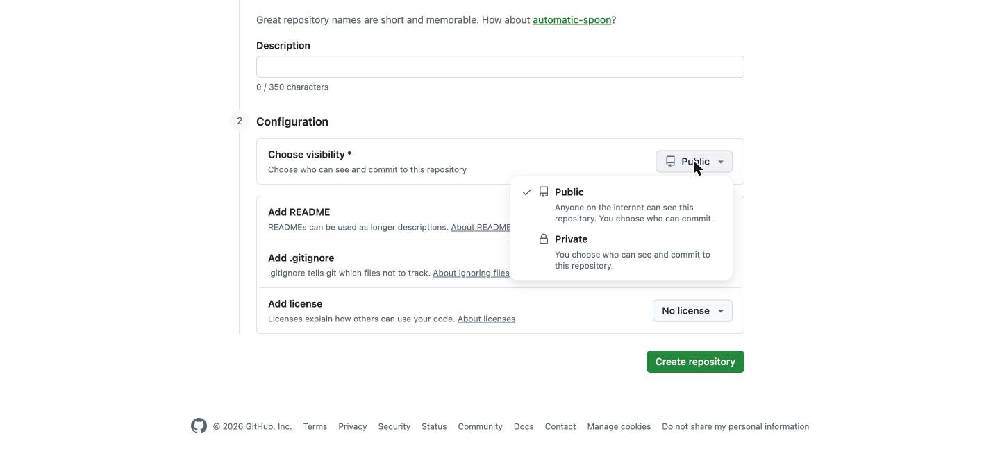
> 圖 2-4：GitHub 自己的說明就很清楚——Public 是「網路上任何人都看得到這個倉庫」，Private 是「由你決定誰看得到」。

・**Public（公開）**＝ 全世界都看得到裡面的內容
・**Private（私人）**＝ 只有你和你邀請的人看得到

不確定的話，**先選 Private**。之後隨時可以改成公開；但反過來，公開過的東西要收回來，已經來不及了。

**④ 把「Add README」的開關打開**

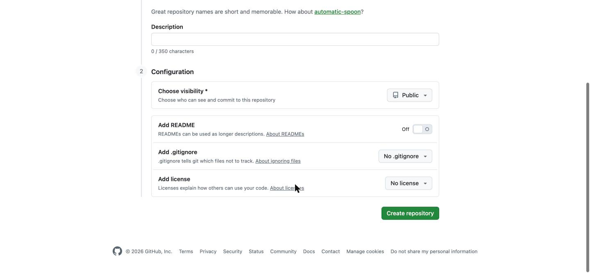
> 圖 2-5：下半段三項都是選配。**Add README** 預設是 Off（灰色），建議把它切成 On。

README 是箱子的封面說明。打開它，GitHub 會幫你先放一個檔案進去，箱子就不會是空的——這對後面的步驟比較順。

下面還有兩項，第一次可以先不管：
・**Add .gitignore**：先幫你放一份「哪些檔案不要管」的清單（第三章會講）
・**Add license**：授權條款。只有公開倉庫才需要考慮

按下綠色的 **Create repository**，箱子就建好了。

## 動作四：把箱子複製到電腦，然後開始存檔

到這裡為止都在網頁上。接下來要把箱子搬一份到自己的電腦。

先挑一個工具，三選一：

・**GitHub Desktop**：官方免費軟體，全圖形介面，完全不用打指令。新手建議先用這個。下載：https://desktop.github.com
・**VS Code**：如果你已經在用它，左邊那排圖示裡就內建了，不用另外裝。
・**指令列（git 指令）**：最通用，以後跟 AI 合作時也最順。怕的話先跳過，第五章會回來救你。

不管用哪一個，起點都是倉庫頁面上那顆**綠色的 Code 按鈕**：

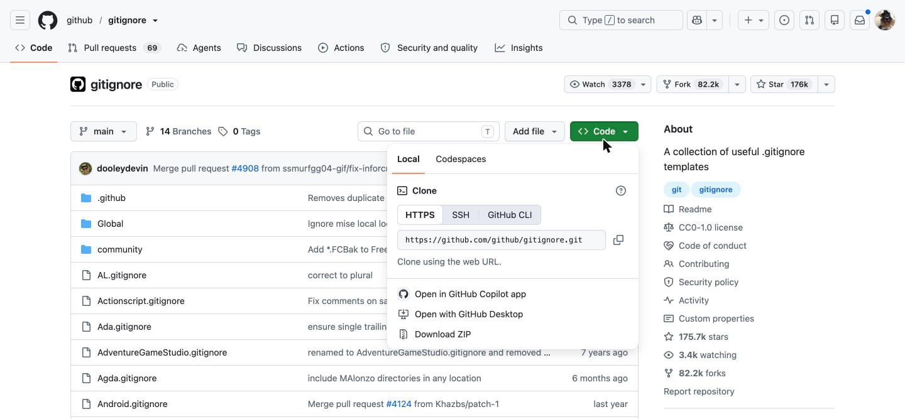
> 圖 2-6：點開 Code 按鈕，**Local** 分頁下的 Clone 就是「複製一份到我的電腦」。HTTPS 那串網址按右邊的圖示可以直接複製。最下面還有一個 **Open with GitHub Desktop**，裝了 GitHub Desktop 的話點它最快。

**① Clone（複製到電腦）**
用 GitHub Desktop 的話，選 `File → Clone repository`，清單裡會出現你剛剛建的箱子。選它，指定要放在電腦的哪個資料夾，按 Clone。

你的電腦裡就多出一個資料夾了。以後把檔案丟進這個資料夾，就等於放進箱子裡。

**② 改點東西**
隨便改一個檔案，或丟一個新檔案進去。

**③ 存檔（commit）**
切回 GitHub Desktop，左邊會列出「你改了哪些檔案」。

這裡其實同時做了兩件事：

・**add（挑選）**：從改過的檔案裡，挑出要存進這個存檔點的那幾個。就像整理行李——這次出門要帶的，先擺到床上。**打勾就是挑選。**
・**commit（存檔）**：在左下角填一行說明文字，按下藍色的 `Commit to main`。

說明文字怎麼寫？寫給三個月後的自己看：
・好：「修正聯絡頁的錯字」、「加上第三章的內容」
・不好：「更新」、「修改」、「aaa」

**④ 推上去（push）**
存完檔，右上角會出現 `Push origin`。按下去，存檔點就送到雲端的箱子了。重新整理網頁就看得到。

挑選 → 存檔 → 推上去。
打勾、打字、按兩顆按鈕，結束。

反過來，如果有人動過雲端的箱子（或是你換了另一台電腦），開工前先按 **Fetch origin / Pull origin**，把最新的狀態拿回本機。

**先拉、再改、再推。** 這個順序請先背下來，下一章會告訴你不照做會發生什麼事。

# 第三章：初學者該注意的三個重點｜這些陷阱務必避開

GitHub 雖然非常方便，但也有需要注意的地方。

不了解機制就一路按下去，會發生意想不到的麻煩。

以下三個，是我看過最多人踩到的。

## 注意事項一：密碼和金鑰，絕對不能推上去

這是後果最嚴重的一個。

很多服務會發給你一串「API 金鑰」，那是你的帳號鑰匙。如果你把它寫在檔案裡，又把那個檔案 push 到公開的倉庫——

網路上有機器人二十四小時在掃描公開倉庫裡的金鑰。以分鐘為單位就會被撿走。

更麻煩的是：**存檔點是刪不掉的。**

你今天把金鑰推上去，明天才發現，然後急忙把那一行刪掉再推一次——沒有用。昨天那個存檔點還好好地躺在歷史紀錄裡，任何人都翻得到。

正確做法有兩層：

**第一層：放一個 `.gitignore` 檔案**

在倉庫資料夾裡建一個檔名叫 `.gitignore` 的純文字檔（注意開頭那個點），把「絕對不要被 GitHub 碰到」的檔案寫進去。

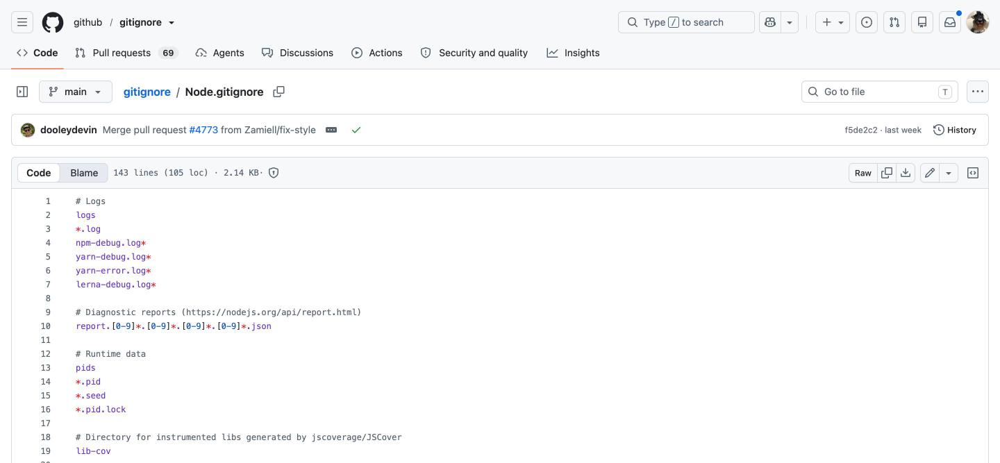
> 圖 3-1：一行一個檔名或規則，`#` 開頭的是註解。`*.log` 的意思是「所有結尾是 .log 的檔案都不要管」。GitHub 官方在 **github.com/github/gitignore** 準備了上百種現成版本，直接抄。

給新手的最小版本，大概長這樣：

```
.env
secrets.json
*.key
node_modules/
```

寫進去的檔案，GitHub 會當作看不見。

**第二層：萬一真的推上去了**

第一件事**不是**刪檔案，而是**立刻到發金鑰的那個服務去把它作廢，換一把新的**。

已經外流的鑰匙，唯一的處理方式是換鎖。

## 注意事項二：推之前先拉，不然會被擋下來

第二個是每天都會遇到的狀況。

情境是這樣：你在自己電腦上改完，按下 push，結果跳出一段紅字說 `rejected`，推不上去。

新手看到這個通常會慌，以為東西壞了。

沒有壞。它只是在說：雲端上的箱子，已經比你手上這個新了。有人在你之前先推了東西上去。

```
 ! [rejected]        main -> main (fetch first)
error: failed to push some refs to 'https://github.com/...'
hint: Updates were rejected because the remote contains work that you do not have locally.
```

如果放任你直接推，對方那次的更新就會被你蓋掉。GitHub 擋下你，是在保護那個人。

做法很單純：先 pull 把對方的更新拉回來，跟你的合併，再 push。

大部分的時候它會自動合完，你完全不用做事。只有在「你跟他改到同一個檔案的同一行」時，它才會停下來，在檔案裡用一串符號標出兩邊的版本：

```
<<<<<<< HEAD
這是你寫的那一行
=======
這是對方寫的那一行
>>>>>>> origin/main
```

那叫「conflict（衝突）」。看起來很嚇人，但它的本質只是一個選擇題：留你的、留他的，或是兩個都留。選好之後，把那三行符號刪掉就結束了。

還有一個延伸提醒：如果你在網路上看到有人教你用 `git push --force`，先不要用。那個指令的意思是「不管雲端上有什麼，用我的蓋過去」——它真的會照做，別人的存檔點會直接消失。

## 注意事項三：GitHub 不是雲端硬碟

第三點，是關於「什麼東西適合放進去」。

GitHub 擅長的是文字。程式碼、文稿、設定檔——這類檔案它能精準地比對出「你改了哪一個字」，所以三百個存檔點也才佔一點點空間。

但如果你放的是影片、高解析度的設計原始檔、幾百張照片，狀況就完全不同了。

這類檔案改一個小地方，對它來說就是「整個檔案都變了」。於是每存一次檔，就多囤一份完整的檔案。

十次存檔之後，一個 200MB 的影片，在你的箱子裡佔了 2GB。而且因為存檔點刪不掉，這 2GB 會永遠跟著這個箱子，連複製一次都要等很久。

實務上的界線：**單一檔案超過 50MB 會收到警告，超過 100MB 會直接被拒絕。**

・**適合放**：文字檔、程式碼、markdown 文件、小圖示
・**不適合放**：影片、大量照片原始檔、幾百 MB 的素材、可以重新產生出來的東西

大檔案請放雲端硬碟或專門的空間，在倉庫裡留一個連結就好。

到這裡，我們已經掌握了初學者該避開的三個陷阱。

接下來這一章，是為了讓 AI 幫你做事而準備的。

# 第四章：申請 Access Token｜給程式用的專屬鑰匙

## 為什麼需要這個東西？

你用瀏覽器登入 GitHub，是輸入密碼加上手機驗證碼。

但如果是一個程式要幫你做事——例如 AI 助理要幫你 push——它沒辦法去你手機上看驗證碼。

所以 GitHub 從 2021 年開始，就**不再接受用登入密碼來操作 git 了**。程式必須改用另一種東西：

**Personal Access Token（個人存取權杖，簡稱 PAT）**

你可以把它想成「旅館的房卡」：

・不是你家大門鑰匙（那是你的密碼）
・只能開指定的幾扇門（權限可以限縮）
・會自動過期（可以設定天數）
・掉了就作廢重發，你家大門不受影響

這是一個非常合理的設計。而你，需要親手發一張這種房卡。

## 兩種 token，先搞清楚差別

GitHub 現在有兩種：

| | Fine-grained token（細粒度） | Classic token（傳統） |
|---|---|---|
| 能指定哪幾個倉庫 | 可以，最多 50 個 | 不行，一發就是全部 |
| 權限細分 | 很細，一項一項加 | 很粗 |
| 有效期 | 7／30／60／90 天、自訂、不過期 | 同左 |
| 官方推薦 | ✅ 推薦 | 舊系統相容用 |

**請用 Fine-grained token。** 以下的步驟都以它為準。

## 但在動手之前：其實你可能不需要自己申請

如果你要做的事情就只是「讓 AI 幫我 commit 和 push」，有一條更輕鬆的路：

**安裝 GitHub 官方的指令列工具 `gh`，然後執行一次授權。**

```bash
# macOS
brew install gh

# Windows
winget install --id GitHub.cli
```

裝好之後，在終端機輸入：

```bash
gh auth login
```

它會問你幾個問題，一路按 Enter 選預設值：

```
? What account do you want to log into?  GitHub.com
? What is your preferred protocol for Git operations?  HTTPS
? Authenticate Git with your GitHub credentials?  Yes
? How would you like to authenticate?  Login with a web browser

! First copy your one-time code: A1B2-C3D4
Press Enter to open github.com in your browser...
```

它給你一組八碼的英數字，瀏覽器會自動打開，你把那組碼填進去：

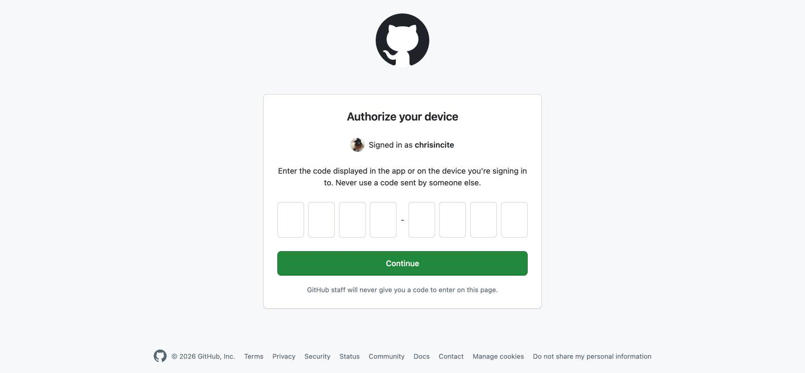
> 圖 4-1：八個格子，填入終端機給你的那組碼，按 **Continue**。注意畫面下方那句話——**GitHub 的工作人員永遠不會給你一組碼叫你填在這裡**。有人這樣要求你，那是詐騙。

**這條路的好處：token 由 `gh` 自己保管，你從頭到尾不會看到那串字，也就不可能不小心把它貼到哪裡去。**

對新手來說，這是我最推薦的做法。

那什麼時候才需要自己手動申請 token？
・你要在別人的伺服器、雲端主機上跑自動化
・你要用第三方工具（不是 GitHub 官方的）去存取你的倉庫
・你想把權限限縮到「只有這一個倉庫、只能讀不能寫」

以下就是手動申請的完整步驟。

## 步驟一：進到 Settings

點右上角你的頭像，選單中段有 **Settings**。

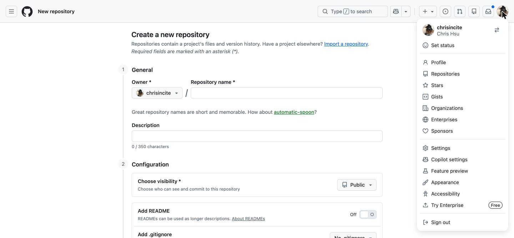
> 圖 4-2：注意不要點成倉庫自己的 Settings（那個在倉庫頁面上方的分頁列）。要點的是**頭像**底下這個。

## 步驟二：拉到最下面，進 Developer settings

Settings 的左邊是一整排選單。一路拉到**最底下**，最後一項就是 **Developer settings**。

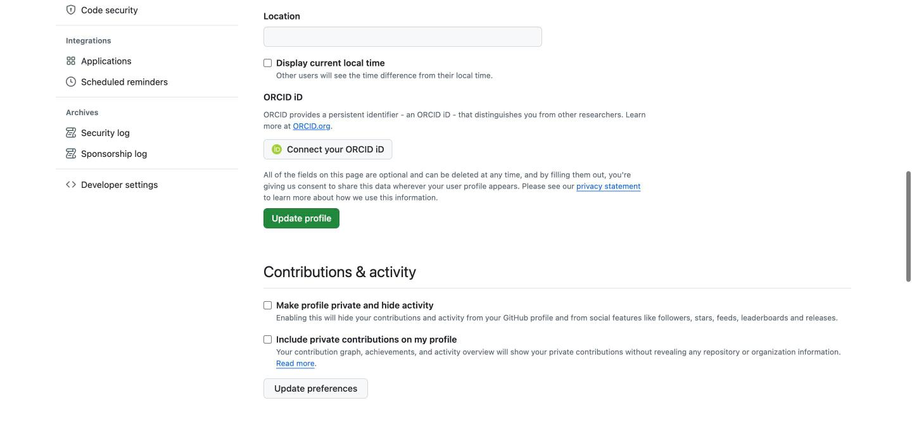
> 圖 4-3：這一項藏得很深，很多人是在這裡卡住的。它在左邊選單的**最後面**，Archives 那一區的下方，前面有一個 `<>` 圖示。

或者，直接把這個網址記起來，省掉前兩步：

**https://github.com/settings/tokens**

## 步驟三：選 Fine-grained tokens，按 Generate new token

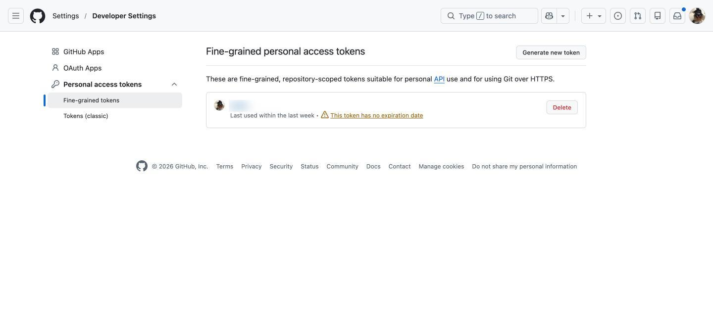
> 圖 4-4：左邊 **Personal access tokens** 展開後選 **Fine-grained tokens**，右上角按 **Generate new token**。順帶一提，圖中那個黃色驚嘆號寫著 **This token has no expiration date**（這張卡不會過期）——那是一個警告，不是稱讚。

這時它可能會要你再輸入一次密碼，或是手機驗證碼。正常，這是在確認是你本人。

## 步驟四：填寫這張房卡的規格

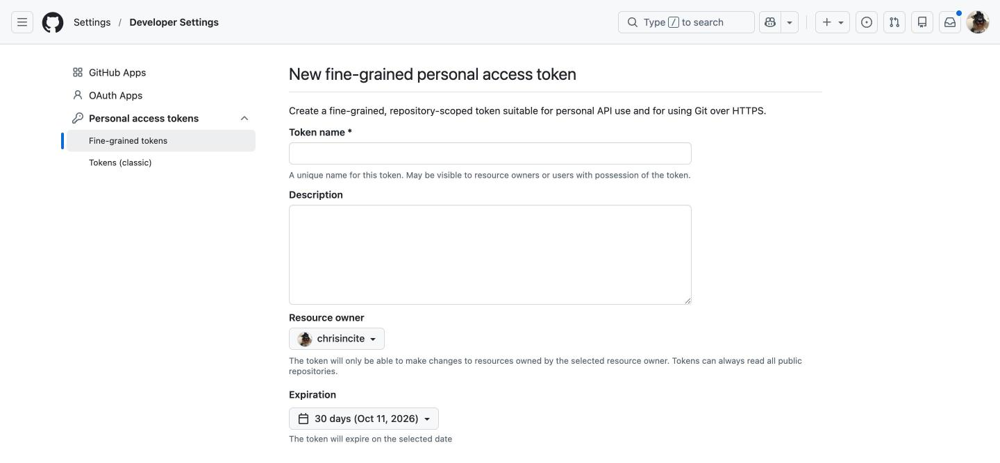
> 圖 4-5：由上而下四格：Token name、Description、Resource owner、Expiration。

**① Token name（名字）＊必填**
給它一個你看得懂的名字，例如 `claude-code-mbp`。

這個名字的用途是：三個月後你看到一排 token，要能立刻知道哪一張是給誰用的、哪一張可以安全地刪掉。請不要叫它 `test`。

**② Description（說明，可留空）**
寫清楚這張卡是要拿來做什麼的。

**③ Resource owner（這張卡能碰誰的東西）**
如果是你個人的倉庫，就選你自己的帳號（預設值）。如果要碰組織的倉庫，選那個組織——那可能需要組織管理員批准。

**④ Expiration（有效期）**
預設是 30 天。點開來有六個選項：

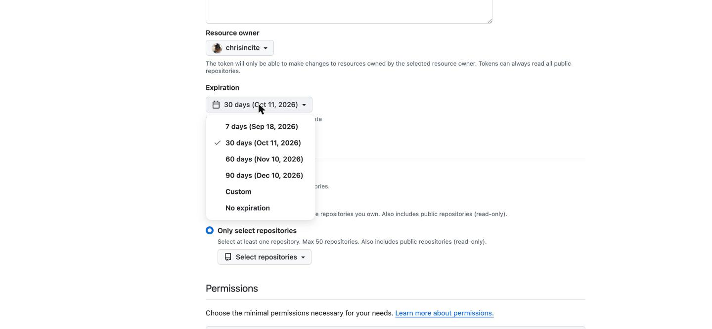
> 圖 4-6：7 天、30 天、60 天、90 天、Custom（自訂日期），還有最下面的 **No expiration（永不過期）**。

**建議選 90 天，不要選 No expiration。**

會過期不是缺點，那是安全機制——就算哪天外流了，傷害也有個終點。

## 步驟五：選擇這張卡能開哪幾扇門

往下捲，是 **Repository access**，三個選項：

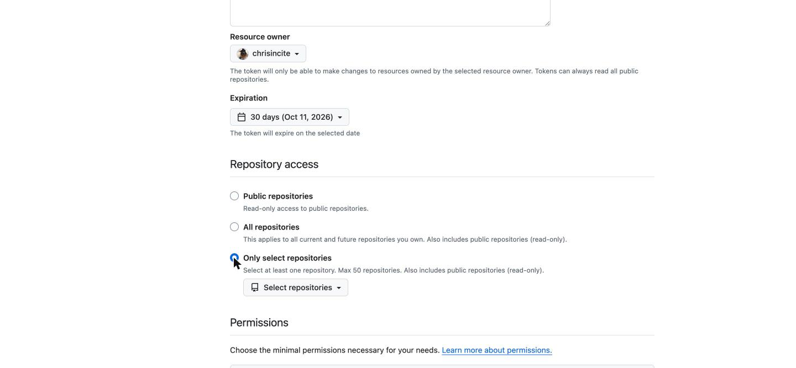
> 圖 4-7：請選最下面那個 **Only select repositories**。選了之後，下方會冒出一顆 **Select repositories** 的按鈕，點開勾選你要用到的倉庫（最多 50 個）。

・**Public repositories**：只能唯讀存取公開倉庫
・**All repositories**：你現在和以後所有的倉庫都能碰 ← 權限太大，不建議
・**Only select repositories**：只能碰你指定的那幾個 ← **選這個**

這就是 fine-grained token 最大的價值：**萬一這張卡掉了，損失範圍就只有你勾的那幾個箱子。**

⚠️ 順序很重要：**一定要先選好 Repository access，下一步的「倉庫權限」才會出現。** 如果停在預設的 Public repositories，Permissions 區塊只會有 Account 一個分頁，你會找不到 Contents 在哪裡。

## 步驟六：選擇權限（這步最容易做錯）

繼續往下，是 **Permissions**。它現在不是一長串清單了，而是一顆 **Add permissions** 按鈕。

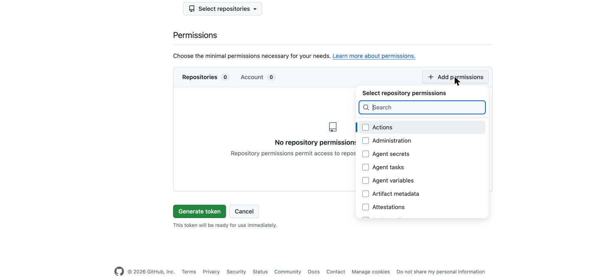
> 圖 4-8：注意左上角有 **Repositories** 和 **Account** 兩個分頁，要留在 Repositories 這邊。點右邊的 **＋ Add permissions**，會跳出一個可以搜尋的清單。

清單很長（Actions、Administration、Attestations……）。不用一個一個看，直接在搜尋框打字：

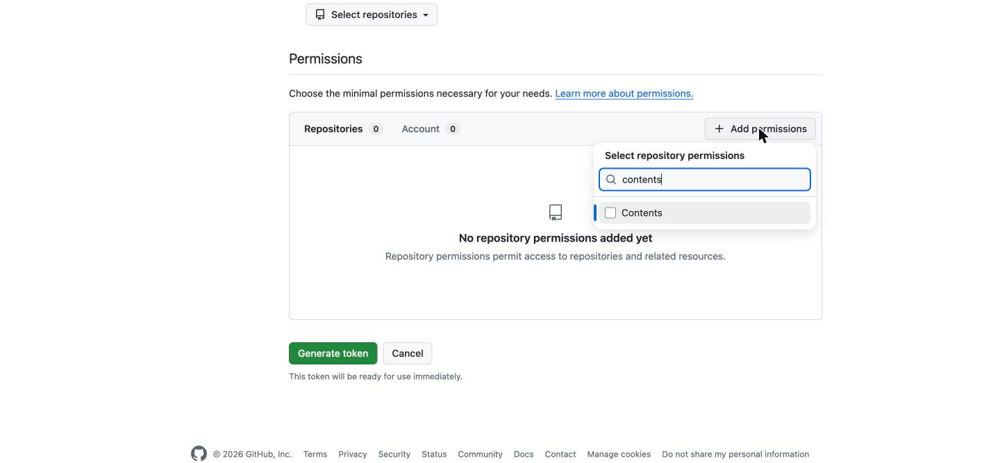
> 圖 4-9：打 `contents`，清單就只剩下 **Contents** 一項。把左邊的方框勾起來。

勾完之後按 Esc 關掉清單，你會看到 Contents 被加進來了，而且 **Metadata 被自動加上並標示 Required**（那是 GitHub 強制的，不用管它）。

這時 Contents 右邊預設是 **Access: Read-only**（唯讀），要把它改掉：

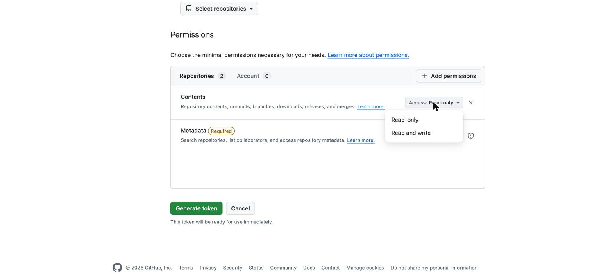
> 圖 4-10：點開 Contents 右邊的 **Access: Read-only**，選 **Read and write**。這一步沒做的話，你只能下載、不能上傳。

・**Contents：Read and write** ← clone、pull、commit、push 需要的權限。改這一項就好。
・**Metadata：Read-only** ← 自動帶入，不用動。

其他的視需要再加：

| 你想做的事 | 要加的權限 |
|---|---|
| 推送程式碼（最常見） | Contents: Read and write |
| 開／回覆 issue | Issues: Read and write |
| 開 Pull Request | Pull requests: Read and write |
| 改倉庫設定 | Administration: Read and write（非必要不要給） |

**原則：能不給的就不給。** 這張卡以後要交給一個程式使用，你給它的每一個權限，都是它出錯時能造成的傷害範圍。

## 步驟七：產生，然後立刻複製

拉到最下面，按綠色的 **Generate token**。

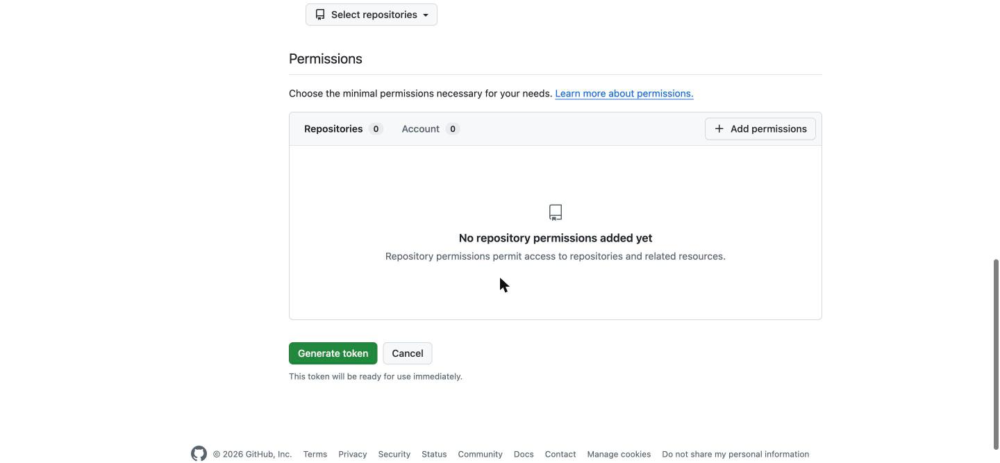
> 圖 4-11：按鈕下面那行小字寫著 **This token will be ready for use immediately**——按下去就生效了。

畫面會跳出一串以 `github_pat_` 開頭的長字串，旁邊有一個複製圖示。

### 這是整個流程最重要的一句話

**這串字只會顯示一次。**

不是「藏在某個地方要找一下」，是真的不再顯示。忘了複製就只能重來一次，重發一張新的。

複製之後要放哪裡？

・**最好**：貼進密碼管理器（1Password、Bitwarden 這類）
・**可以**：讓 `gh` 或 GitHub Desktop 幫你保管
・**絕對不行**：貼在記事本、聊天室、程式碼檔案裡，或是任何會被 push 上去的地方

### 怎麼用它？

拿它當密碼用。當你 `git push` 時，它問你：

```
Username for 'https://github.com': 你的帳號名稱
Password for 'https://...':        貼上 token（不是你的登入密碼）
```

貼上去的時候畫面不會有任何反應（不會顯示星號），那是正常的。貼完直接按 Enter。

如果不想每次都貼一遍，讓系統幫你記住：

```bash
# macOS（存進鑰匙圈）
git config --global credential.helper osxkeychain

# Windows
git config --global credential.helper manager
```

設定過之後，第一次輸入完就會被記住。

## 步驟八：不用了就作廢

回到 https://github.com/settings/tokens （就是圖 4-4 那一頁），每一張卡右邊都有紅色的 **Delete**。

那一頁也會顯示每張卡「上次使用是什麼時候」。養成習慣：每隔一陣子回來看一眼，把不記得用途的、很久沒用的，全部刪掉。

刪掉不會弄壞任何東西——真的還在用的地方，它會跳出來要你重新登入，到時候再發一張新的就好。

# 第五章：用 AI 完成 GitHub 操作｜把指令換成一句話

前面四章讀完，你大概還是會有一個感覺：

「我知道它很好用了，但我還是記不住那些步驟。」

這個煩惱，在這兩年變得不太一樣了。

因為現在你可以不用記。你只要會描述你想做什麼。

## AI 做得到的，比你以為的多

現在的 AI 助理——Claude Code、GitHub Copilot、Cursor 這一類——不只是幫你「寫出指令讓你複製貼上」，它們可以直接在你的電腦上執行。

### 事前準備只有兩件事

**① 讓 AI 能存取 GitHub**

就是第四章做的事。用 `gh auth login` 最省事——授權完成後，AI 執行的 git 指令就會自動帶著你的身分，你不需要把 token 貼給 AI 看。

確認一下有沒有成功：

```bash
gh auth status
```

看到 `✓ Logged in to github.com account 你的名字` 就對了。

**② 確認 AI 工具能跑指令**

Claude Code 本身就在終端機裡跑，預設就能執行 git。第一次要執行指令時它會問你要不要允許。

### 然後你就可以這樣講話了

你說：

> 「幫我看一下現在有哪些檔案改過了。」

它會去跑 `git status`，然後用人話告訴你：你改了三個檔案，其中兩個是文稿，一個是設定檔。

你說：

> 「把這次改的內容存檔，寫一個合適的說明。」

它會先讀一遍你到底改了什麼，然後寫出「修正第三章的錯字並補上圖片說明」這種具體的存檔說明——比你自己隨手打的「更新」有用一百倍。

你說：

> 「推上去。」

它就 push 了。

那個「先拉再推」的規矩、被拒絕之後該怎麼處理、衝突該怎麼看——這些你不用記，它會處理，而且會回頭跟你報告它做了什麼。

## 三個最好用的句型

你不需要學指令，但值得學這三種問法。

**① 「現在是什麼狀況？」**

開工前先問這一句。它會告訴你：你在哪一個分支上、有哪些改動還沒存檔、雲端上有沒有你還沒拉下來的東西。

比起自己開軟體東看西看，快得多。

**② 「幫我把這次的改動存檔並推上去，說明寫清楚一點。」**

這是你最常用的一句。一句話走完 add、commit、push 三個步驟。

**③ 「我把不該放的東西推上去了，怎麼辦？」**

這種時候最不該做的，是自己上網隨便找一個指令貼上去執行。

直接把狀況講清楚問它：什麼東西、什麼時候推的、這個倉庫是公開還是私人的。它會先判斷嚴重程度，再給你對應的處理順序——而且通常第一句就會是「先去把那把金鑰作廢」。

## 但請守住這四條界線

AI 執行 git 指令的能力很強，強到有點危險。以下四點，是我認為每個人都該先講好的規矩。

**第一，讓它先說，再做。**

尤其是牽涉到「刪除」、「重寫歷史」、「強制」這類動作。請它先用一句話講出它要執行什麼、會造成什麼結果，你同意了再做。

多花十秒鐘，換掉一次無法挽回。

**第二，push 是對外的動作，要你自己點頭。**

改檔案可以放手讓它做，因為改壞了可以退回去。但 push 一旦送出去，東西就進到別人看得到的地方了。公開倉庫更是如此。

把「推上去」保留成一個需要你同意的動作。

**第三，`--force` 和刪分支，一律先問。**

這兩件事的共通點是：做完之後，別人的東西可能永遠消失，而且不會有任何警告。

任何 AI 要做這兩件事之前，都應該先問你。如果它沒問就做了，那是規矩沒講清楚，請你回去把規矩寫下來。

**第四，寫進去的東西，你要自己看過一眼。**

AI 寫的存檔說明通常很準確，但它不見得知道你這次改動背後的理由。

尤其是給別人看的內容——說明文字、公開的文件——按下推上去之前，自己讀一遍。

你是那個要負責任的人，AI 不是。

## 一個小提醒：先讓它做「讀」的事

如果你完全沒試過，建議這樣起步：

**第一週，只讓 AI 做「看」的動作。** 問狀況、問這個檔案改了什麼、問這兩個版本差在哪。零風險，而且你會很快習慣它的節奏。

**第二週，開始讓它做存檔。** 存檔是可以退回去的，錯了不痛。

**等到你看得懂它在做什麼了，再把 push 交給它。**

順序倒過來的人，通常都會在第三天遇到一次心跳加速的意外。

# 總結：今天要做的，只有一件事

把東西做出來，和把做東西的「過程」留下來，是兩種不同的能力。

因為 AI 的出現，做東西的門檻已經大幅降低。你一個下午就能做出以前要做一個月的成果。

但正因為產出變快了，「哪一版是對的」這個問題才變得更嚴重。而這個問題，GitHub 已經解了十幾年。

你不需要一口氣把所有指令都記起來。老實說，你可能永遠不需要記。

今天要做的，只有一件事。

**「打開 GitHub 官方網站，申請一個免費帳號，開一個 Private 的倉庫。」**

就這樣而已。

裡面放什麼都可以。一份你正在寫的文件、一個待辦清單、一篇還沒寫完的文章。

然後按一次存檔。

你會發現，那個「提案書_最終版_這次真的.docx」的世界，你再也不用回去了。

---

## 附錄：一頁速查表

**每天的循環**
```
開工前：pull（拉下來）
改東西
存檔前：add（挑選要存的檔案）
存檔：  commit（＋一行說明）
結束：  push（推上去）
```

**三個絕對不要**
1. 不要把密碼、金鑰、`.env` 推上去
2. 不要在沒搞清楚狀況時用 `git push --force`
3. 不要把影片、大量照片放進倉庫

**Token 六要點**
1. 用 Fine-grained token，不要用 Classic
2. 有效期選 90 天，不要選 No expiration
3. 倉庫範圍選 **Only select repositories**（而且要先選它，權限清單才出得來）
4. 權限只加一項：Contents → 改成 **Read and write**
5. 產生後**只會顯示一次**，立刻複製到密碼管理器
6. 不用了就回去 Delete

**懶人路線**：`brew install gh` → `gh auth login` → 選 Login with a web browser。token 交給它保管，你一眼都不用看。

**常用網址**
・申請帳號：https://github.com/signup
・兩階段驗證：https://github.com/settings/security
・開新倉庫：https://github.com/new
・申請 token：https://github.com/settings/tokens
・GitHub Desktop：https://desktop.github.com
・現成的 .gitignore：https://github.com/github/gitignore


---
短網址：https://os.housearch.net/g/1
