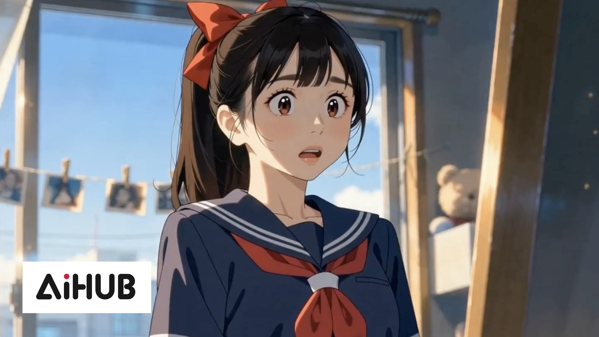

# Chris 筆記｜AiHUB的生成式AI工具「CW Canvas」對應ByteDance「Seedance 2.5」。可用IP權利證明解除濾鏡的「日本首創」工具，公開封閉β版候補名單

> 讀書筆記 · 2026-08-15 · Chris Hsu
> 原文連結：https://prtimes.jp/main/html/rd/p/000000054.000123123.html
> 本頁 HTML：https://chrisincite.github.io/notes/20260814-cw-canvas-seedance25.html
> 短連結：https://os.housearch.net/n/2

我一直關注AiHUB株式会社的動態，沒想到他們的這則新聞，真的讓我看到什麼叫做反應迅速。

按照目前影音模型的架構設計，他們要規避著作權侵害的方法，就是盡量避開與名人或者著名商標有關的圖片及影音內容生成。但是本身是權利人主體，也就沒辦法利用他們的機制來生成自己的影音內容，所以AiHUB株式会社這家公司非常聰明看到了中間的這個機會，站出來當所謂的權利人登記註冊機構。

然後再跟seedance這樣的公司合作直接把API建構到自己的網站，這樣這些公司也就能夠利用seedance來生產自家的內容。我認為AiHUB株式会社應該是想中介AV業者或者漫畫出版社等著作權人去生產自己的影片，這是他們商業佈局的一部分。

## 摘要 / Summary

AiHUB株式会社宣布，旗下瀏覽器端生成式AI工具「CW Canvas」將對應ByteDance／BytePlus最新模型「Seedance 2.5」，同時推出「高階」生成功能——在官方授權下，使用已完成權利處理的專用資產（特定角色、人物等）進行具一致性的生成，並能解除生成模型原本的濾鏡限制，號稱是日本首創以IP權利證明解除濾鏡功能的工具。封閉β測試的候補名單登記自今日開放。

CW Canvas讓使用者無需專業知識，僅靠瀏覽器操作即可運用BytePlus ModelArk提供的模型，從文字、圖片、影片進行生成，並透過畫布功能配合實際製作流程。一般而言，相關模型會過濾隨機習得的權利內容，即使是權利人本人也無法輸出特定權利內容；而「高階」生成則是以BytePlus的上位等級使用權與權利人授權為前提，僅限通過驗證的法人使用者，讓角色臉部、服裝、世界觀能在不同鏡頭或作品間保持一致，適合IP作品、系列製作與藝人影像製作。功能預定於2026年9月上旬起陸續發送通知並提供生成功能，10月提供Canvas功能。

## 重點 / Keypoint

> 在相關模型中，具備會過濾隨機習得之權利內容的生成功能，因此即使是權利人本人，也無法輸出特定的權利內容。

> 由於能讓角色的臉部、服裝、世界觀在不同鏡頭或作品之間保持一致，因此更接近於「為該IP量身打造的生成環境」（＝可作為專用模型使用）這樣的概念。

> 此「高階」生成，是以BytePlus的上位等級使用權（Advanced Creation Rights）以及權利人的授權（授權許可）為前提所運作的。
