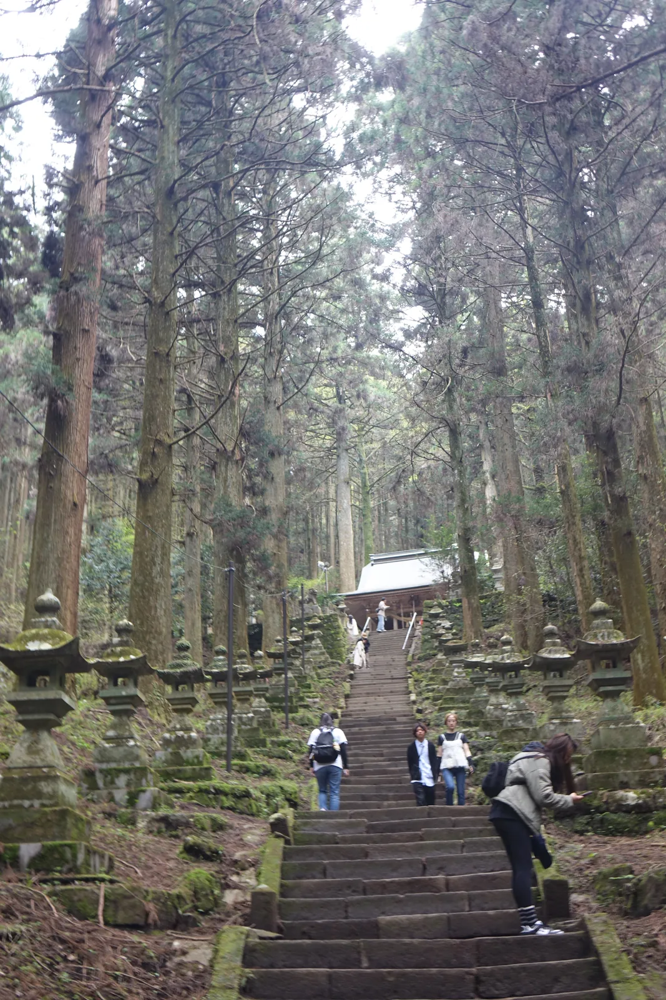
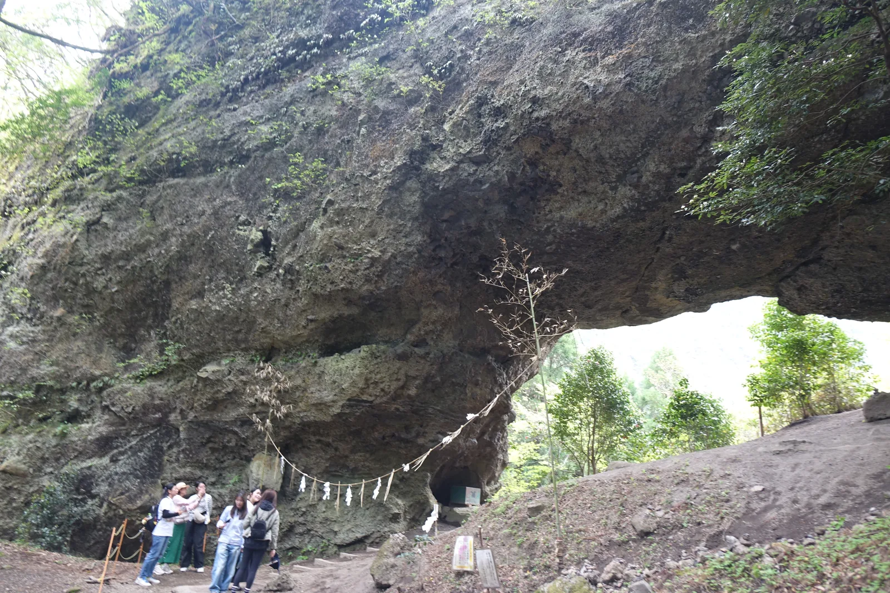
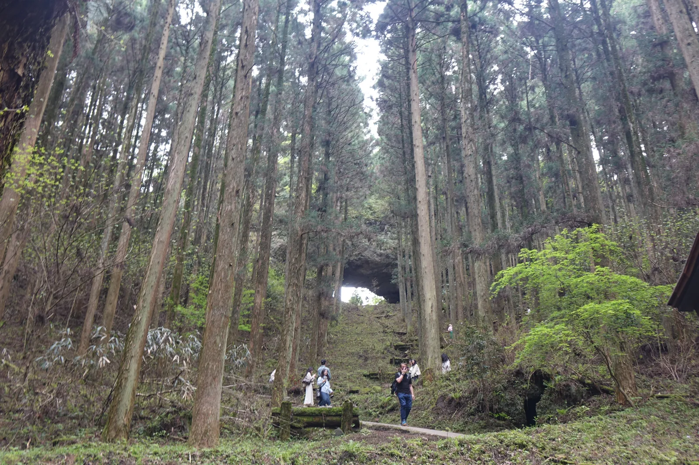
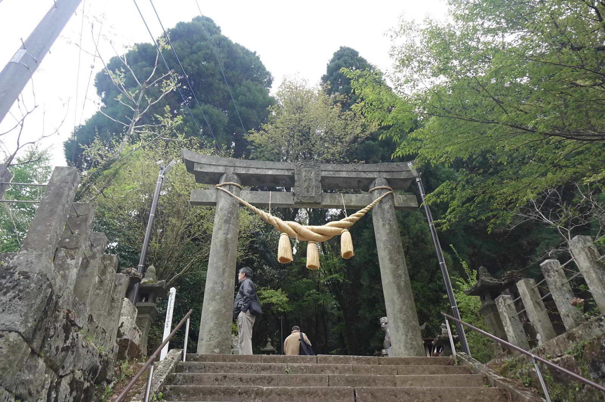
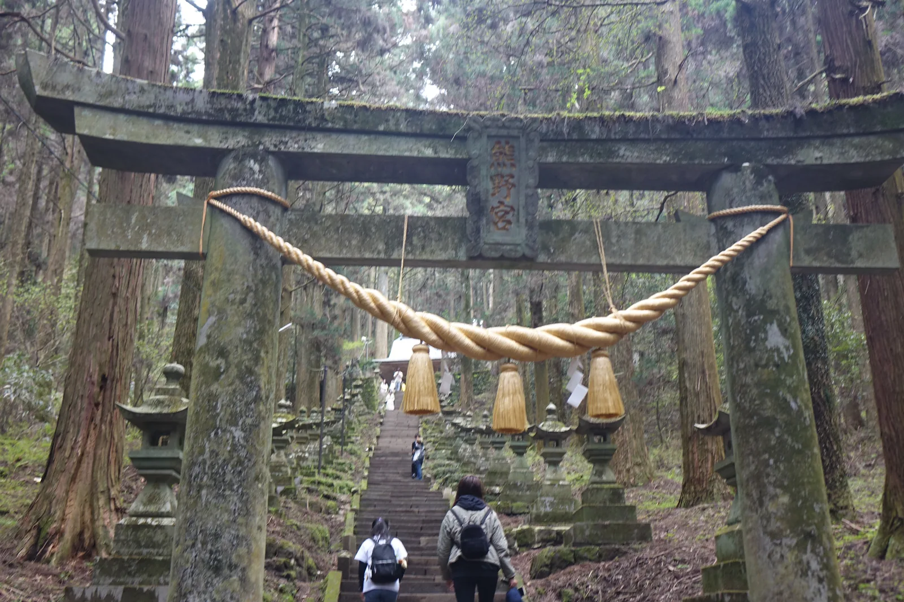
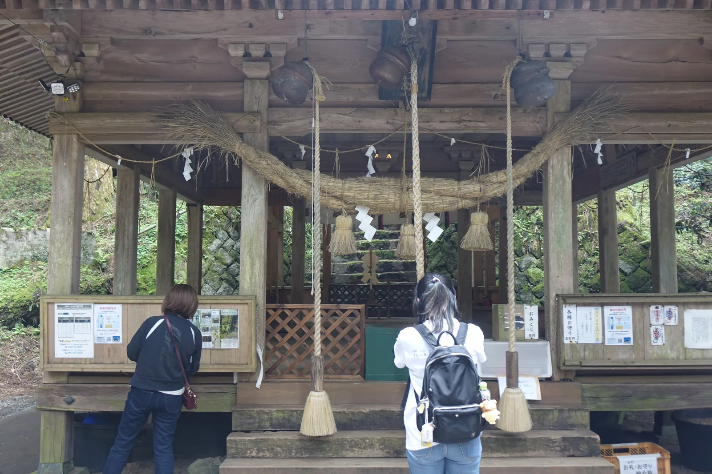
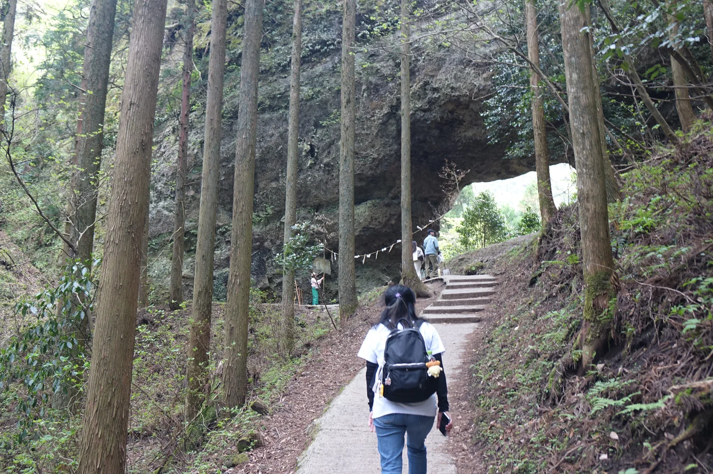
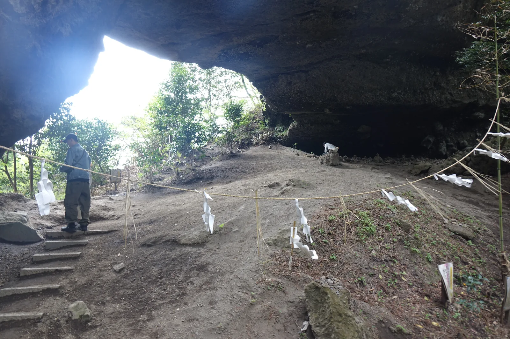
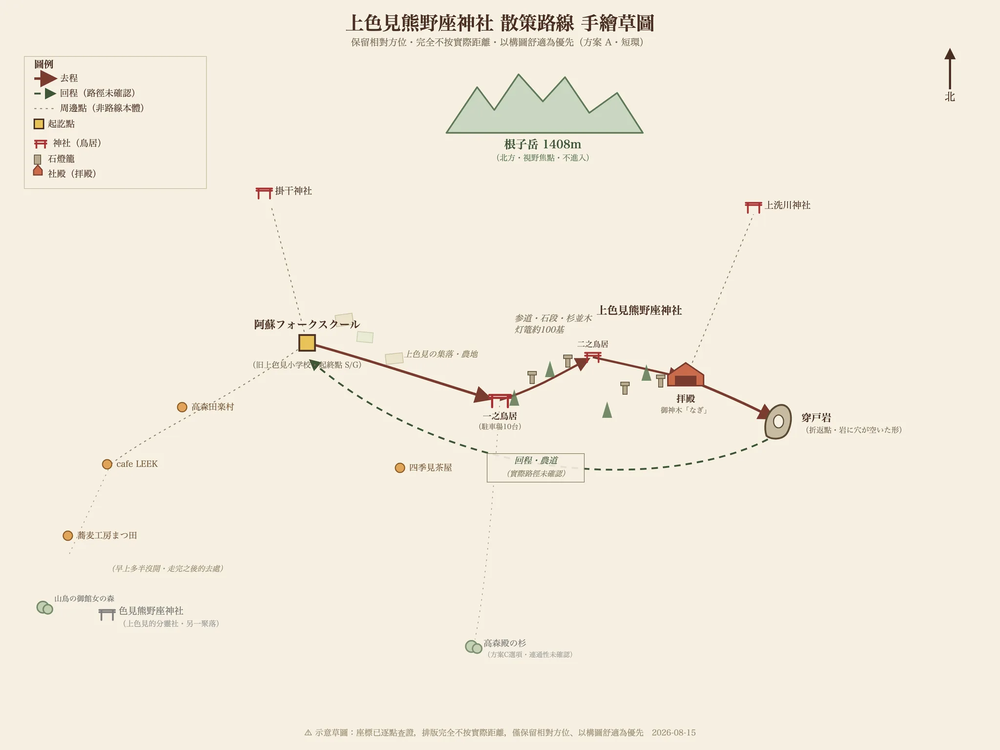

# 上色見熊野座神社

> 神社寺廟散策 · 熊本縣・阿蘇郡高森町上色見 · 2025-04
> 日文名：上色見熊野座神社（かみしきみくまのざじんじゃ）
> 祭神：伊邪那岐命・伊邪那美命・石君大將軍
> 社格：舊村社・南鄉谷總鎮守
> 座標：32.853848, 131.158438
> 本頁 HTML：https://chrisincite.github.io/shrine/15-kamishikimi-kumanoimasu-jinja.html

早上出門，從一所廢校開始走。

上色見是熊本往宮崎路上的一個小地區，夾在阿蘇外輪山的南麓與往高千穗的道路之間。
官方在這裡畫了一條約 6 公里的散步路線，起點是舊上色見小學校的木造校舍——
學校廢了，房子留著。從那裡走出去，先經過集落的家並與農地，
右手邊一直是根子岳鋸齒狀的稜線；接著路轉進森林，杉木高起來，
兩側開始出現石燈籠，將近一百基，一路排到看不見盡頭的地方。

石段的終點是一座沒有牆的拜殿。但那還不是這趟路的終點——
再往上，石段換成土坡與林間的窄路，一塊巨大的岩壁被穿了一個洞。

石燈籠、鳥居、拜殿——整條路都是為了把人送到這塊石頭下面。
而那塊石頭，比它們任何一個都老。

*從石段中段往上看。兩側是苔痕遍布的石燈籠，杉木一路頂到畫面外，盡頭才是拜殿的屋頂。這條參道的密度不是幾百年堆出來的——多數燈籠是昭和三十年以後，當地的後藤漬物一年一基奉納累積的。*

## 岩體信仰先於祭神之認定

這座神社的創建年代不詳，只知道創祀相當早。上色見的大村一帶發現過不少四、五世紀的古墳，
所以一般認為，早在有社殿、有祭神名字之前，這裡的人就已經在拜那塊岩了。
被拜的不是神像也不是建築，是那個洞本身——一塊尊貴的磐、一個稀有的岩穴。

那塊岩叫**穿戶岩**（Ugeto-iwa，被踢穿一個大洞的岩壁），縱橫都超過十公尺。它怎麼來的，
當地的說法跟阿蘇最有名的一則神話綁在一起。

*穿戶岩。整片岩壁被貫穿，右側透出的天光就是洞的另一頭；岩腳橫拉著掛紙垂的注連繩，界線只用一條繩子畫出來，前面沒有社殿。站在下面的人是這塊岩的比例尺。*

阿蘇大神健磐龍命（Takeiwatatsu-no-mikoto）是射箭的高手，喜歡從阿蘇山頂往外放箭。
他的從者鬼八（Kihachi）負責撿箭，
撿到第九十九支已經煩透了，第一百支索性用腳趾夾著扔了回去。
健磐龍命大怒——一個家臣竟敢把主人的箭踢回來——追殺鬼八。
阿蘇四面環山，鬼八怎麼跑都跑不出去，想翻過上色見這一側的外輪山時被岩壁擋住，
於是他一腳把岩壁踢穿，從洞裡逃了出去。那個洞就是穿戶岩。

鬼八沒有停在這裡。他在冬野也留下一個穿戶；後來被追上時，朝著健磐龍命連放了八個屁才脫身，
那個地方就叫矢部。最後他在**高千穗**被抓到，斬首。
首級升天成了怨靈，每年一到暑熱時就降霜害莊稼。健磐龍命去求它別再降霜，
怨靈說：「天冷的時候斷掉的脖子會痛得受不了。你讓我暖和，我就不作亂。」
於是阿蘇宮附近建了霜宮（Shimomiya，供奉鬼八之靈的神社），年年焚火供暖，霜害才停。

上色見、冬野、矢部、高千穗、阿蘇霜宮——一則逃亡的故事把阿蘇繞了一整圈。
這樣看，穿戶岩是那條路線的第一個洞；往南四十分鐘車程，
[高千穗神社](17-takachiho-jinja.md) 與 [天岩戶神社](16-amanoiwato-jinja.md) 所在的高千穗，是最後一站。
那一天從這裡開到那裡，走的其實是同一則神話。

熊野的神是後來才進來的。鎌倉時代末到室町時代初期，熊野信仰擴散到九州，
修驗者把原有的山嶽信仰和岩石信仰結合起來，
把紀伊熊野三山的伊弉諾命、伊弉冉命（Izanagi・Izanami）兩位大神請到這裡祀奉，
這座神社才成為「熊野座」（祀奉熊野之神的神社）、成為熊野權現。也就是說，
**先有岩，才有熊野；先有阿蘇的鬼八，才有紀州來的神。**

兩者接合的地方在一則傳承裡：石君大將軍（Iwagimi-taishōgun）是健磐龍命的荒魂（aramitama，神的剛猛面向），
有兩位神出現在石君大將軍的兜（頭盔）之中，那兩位就是熊野大神，
於是人們從紀州熊野把伊弉諾命與伊弉冉命遷來奉祀，這就是這座神社的創祀。
建社殿的時候，有兩隻大鳥叼著要獻神的榊枝（sakaki，供神用的常綠樹枝），停在阿蘇山東麓的這個洞窟上，
社殿便建在了那裡。此後這裡被稱作熊野穿戶岩社、穿戶岩權現、熊野宮，
據載是**南鄉谷（Nangō-dani，阿蘇南側的谷地）的總鎮守**。

高森町官方記載的祭神是伊邪那岐命、伊邪那美命、石君大將軍三柱——
阿蘇的荒魂和紀州來的兩位神並列在同一份名單上，那段接合的歷史就寫在祭神欄裡。

## 立地非屬偶然

決定它位置的不是神社，是那塊岩。

先有一塊被穿了洞的岩壁，被當成稀有之物拜了很久，人才把路鋪上去、把社殿蓋在它腳下。
這不是先選了一塊好地、再營造氣氛的神社。
現在的神殿座落在**月形山（Tsukigata-yama）的八合目**，而穿戶岩在神殿上方——
整個配置是沿著山坡往上疊的，人在爬升的過程中一路走向那塊岩。

*社殿與岩的高低關係。杉木筆直站滿整片斜坡，人沿著坡上苔痕覆蓋的舊階梯往上走，而那個洞就開在坡頂的岩壁上——社殿在下、岩在上，這座神社是照著這個順序排的。*

位置本身也有道理。上色見夾在阿蘇五岳之一的**根子岳**（Neko-dake，1408 公尺，山頂鋸齒狀的那座）山麓
與往高千穗的路之間。這條路是熊本與宮崎之間的通道，
而穿戶岩的傳說裡，鬼八正是沿著這個方向往高千穗逃的——
神話走的路線和人走的路線是同一條。神社設在這條路旁邊，不是巧合。

參道從路邊的低處起步，一路往山裡爬。杉林把兩側封起來，
天光只從樹冠之間漏下來。走到拜殿時已經看不到來時的路，
再往上石段就沒了，換成土坡與沿著山腹整出來的窄路，然後岩壁才出現。
**這段路的高低差和轉折，是這座神社最重要的建築元素。**

## 參道形制及其空間效果

參道兩側排著將近一百基**石燈籠**，苔痕遍布，看起來像積累了幾百年。
實際上只有最早的一對加一基來自元治元年（1864）與慶應三年（1867），
其餘絕大多數是昭和三十年（1955）以後才陸續立起來的。
這條燈籠列的密度是戰後幾十年堆出來的，不是幾百年。

密集並列的燈籠把視線壓成一條隧道。人走在中間，
左右餘光全是重複的石造量體，注意力只剩下前方那條往上的石段。
這是很有效的手法——**用重複來取消側向的選擇，讓路只剩一個方向。**

**兩座鳥居**把長參道切成兩段，兩座都是石造的明神鳥居（myōjin torii，最常見的鳥居形式），
都橫掛著注連繩（shimenawa，標示神域的稻草繩）。
入口那座立在縣道邊的石段上，中段那座藏在杉林深處，注連繩粗得多，
額束上的扁額刻著「熊野宮」。中間隔著一段石段，所以走的人會經歷「進來了 → 再進來一次」
兩次心理上的過門。鳥居的建立年代則說法不一：現有記載裡「明治三十年」與元治元年（1864）並存，
兩者相差三十餘年。

*一之鳥居。石造，橫著一條注連繩，兩側的石燈籠從這裡就開始排。從路邊看不出後面還有三百公尺的爬升；停車場只有十台的空間。*

*二之鳥居。同樣是石造，笠木上長滿了苔，大注連繩垂著三束藁與紙垂（shide，鋸齒狀的白紙垂飾）。額束的扁額刻著「熊野宮」——這座神社的舊稱之一，就掛在半路上。*

**拜殿**是四方吹き放ち（shihō-fukihanachi）——四面沒有牆的開放式構造，只有柱子撐著屋頂。
大注連繩橫過正面，三條鈴緒（suzuo，搖鈴用的粗繩）垂下來，配三個吊鐘。
站在拜殿裡，杉林和石段都還在視野中，
建築沒有把外面關掉，只是給了一個頂。它像一個框，不像一個房間。

*拜殿正面。四面沒有牆，只有柱子撐起屋頂，穿過柱間就看得見後方的石垣與杉林。大注連繩橫過正面，三條鈴緒垂下，上方吊著三個鐘。左側是掲示板，右側掛著「おみくじ」「各種お守り」木牌的就是授与所。*

拜殿後方有石段繼續往上。**神殿是総欅造り**（sō-keyaki-zukuri）——全部用櫸木。
現在的神殿建於**享保七年（1722）**，昭和五十四年（1979）改修過。
在這之前的建物在**天正年間（1573〜1593）毀於兵火**。

*社殿之後的最後一段。石段沒有了，路收窄成沿著山腹整出來的一條小徑；杉木擋在左邊，而穿戶岩的洞已經出現在右前方，注連繩拉在洞口下面，天光從洞裡透出來。*

**穿戶岩**是這座神社真正的終點，也是它跟一般神社最不一樣的地方。
那是一片岩壁上被貫穿的大洞，掛著注連繩，前面沒有社殿。
拜的對象就是岩本身——這是**無社殿的磐座信仰**，比拜殿和神殿都更古老的那一層。
一路爬上來的人最後會站在洞下面，抬頭看一塊有洞的石頭。

*走進洞裡往外看。岩頂整片壓在頭上，開口的另一側是亮得發白的天空與樹。地面拉著注連繩與紙垂圍出一圈——沒有拜所、沒有本殿，被圍起來的就是這塊岩本身。*

## 南鄉谷的總鎮守

舊社格是**村社**（舊社格制度的等級之一），另有記載稱它為**南鄉谷的總鎮守**——
南鄉谷是阿蘇南側的谷地一帶，範圍遠大於上色見一個地區。
一座村社等級的神社被稱為一整個谷的總鎮守，這兩件事之間的落差，
大概反映了穿戶岩在地方上的份量原本就超出行政層級。

同一個色見地區還有一座**色見熊野座神社**。它的祭神同樣是伊弉諾尊與伊邪那美尊，
並且合祀了**從上色見分靈過來的石君大將軍**。
兩座神社的關係——本社與分靈——把這一帶的信仰網絡連了起來。
附近另有祀健磐龍命的上洗川神社（又稱妙見社、水神社）、
被列為「神様のハネムーンルート」（神明的蜜月路線）之一的掛干神社，以及色見六地藏（六尊地藏石像）。
一個地區裡散著這麼多小神社，本身就是這裡的人和神距離很近的證據。

參道上那近百基燈籠，昭和三十年以後的部分幾乎都出自同一個來源：
當地的後藤漬物，一年奉納一基。一家醬菜廠，幾十年下來把一條參道排滿了。
**這是這座神社與地方之間最具體的物證**——不是傳說，不是文獻，是一年一基堆出來的東西。

近年這裡多了一層新的意義。熊本縣出身的漫畫家緑川ゆき（Midorikawa Yuki），
其作品改編的動畫電影《**蛍火の杜へ**》（Hotarubi no Mori e，通行中譯《螢火之森》）
以這裡為舞台，之後這座神社便以「像是誤入異世界」的氛圍在社群網站上流傳開來。

這段話寫在高森町自己的觀光頁面上。一座村社等級的神社成了「異世界的入口」，
而地方選擇把這個說法當成介紹自己的方式——地方怎麼看待這股熱度，這件事本身就是答案。

## 祭儀與授与品

▲ 例祭
・**7月18日**・**9月3日**

▲ ご利益・授与品
・**合格・必勝**——穿戶岩是「巨大的岩山被一個大洞貫穿」，
　被解釋為再困難的目標都必定能達成的象徵，因而以合格與必勝聞名。
・御神木「**なぎ**」（nagi，梛樹）——「なぎ」與「凪」（風平浪靜）同音。
　梛的葉子沒有葉脈，縱向容易撕開、橫向卻很難扯斷，
　所以自古男女會互相帶著梛葉祈求「緣分不會斷」，母親也會讓出嫁的女兒帶著。
　由此延伸，也通向商賣繁盛。

授与品在拜殿右側的授与所（發放御守與御朱印的窗口）領取，現地掛著「おみくじ」與「各種お守り」的木牌。
具體品項與初穗料（hatsuhoryō，授与品的初獻金）未在官方資料上確認，以現場公告為準。

▲ 這一帶的吃食
・**高森田樂**（Takamori dengaku，炭火燒烤的味噌田樂）——高森的鄉土料理，
　色見地區有高森田樂保存會與高森田樂村。
・**阿蘇豆腐**——用阿蘇的湧水做的豆腐，色見地區有五十年以上歷史的豆腐屋直營店。

## 晨間路線之擬定及其限制

這一帶有一條**官方已經做好的散步路線**：阿蘇地域振興デザインセンター（Aso Regional Design Center，阿蘇地域振興設計中心）
（Aso Regional Design Center，阿蘇地域振興設計中心）規劃的
「**フットパス 上色見コース**」（Footpath Kamishikimi Course，上色見散步路線），
全長約 6 公里，起點是阿蘇フォークスクール（Aso Folk School）。
フットパス 是源自英國的概念，指的是能一邊欣賞地方原本風貌、一邊步行的小徑。
官方對這條路的描述是：走過根子岳山麓的農園地帶與森林地帶，變化豐富；
視野開闊處，正面就是根子岳。

起點本身就值得走一趟——**阿蘇フォークスクール就是舊上色見小學校的木造校舍**，
廢校之後由 NPO 接手保存下來。從一所廢棄的小學出發，穿過集落與農地，
走進杉林，最後站在一塊有洞的岩壁下面。這條路的層次不是設計出來的，
是這個地區本來的樣子。

*散策路線示意圖（短環）。實線是去程、虛線是回程的農道，灰色細線牽出的是路線周邊、不一定走到的點。排版只保留相對方位，不按實際距離。*

▲ 建議走法（早上出發，約 1.5 小時的短環）

1. 舊上色見小學校（阿蘇フォークスクール）出發
2. 集落的家並與農地，右手邊是根子岳
3. 色見熊野座神社——先看分靈的那一座
4. 上色見熊野座神社 一之鳥居 → 杉林與石燈籠列的參道 → 二之鳥居 → 拜殿
5. 拜殿後方的山道 → **穿戶岩**（折返點）
6. 回程走另一條農道，繞成環路回到起點

▲ 走長一點
官方 6 公里的完整路線把農園與森林都納進來。若還想再加，
**高森殿の杉**（Takamori-dono no Sugi，「高森殿的杉樹」）在神社的南南西 3.69 公里處，
是長在放牧地中的巨杉群，
最後一段會走在牧野裡，風景和前半完全不同。全程約 5〜6 公里。
⚠️ 兩點之間的步行連通性尚未實地確認，出發前要在地圖上看一次。

▲ 為什麼是早上
杉林的縱深在斜射光下最明顯，而參道是南北向往上爬的，早上光線從側面進來。
另外這裡近年訪客不少，早上人最少。

▲ 路況
參道是石段。過了社殿石段就沒有了，換成土坡上以木材土留的階梯，
接著是一段沿山腹整出來的窄路，最後幾階才又是水泥的。
土的路段下坡比上坡容易滑，鞋子不要太光滑。神社有停車場，約 10 台。

▲ 接下來往哪走
往南約 40 分鐘車程是 [高千穗神社](17-takachiho-jinja.md) 與 [天岩戶神社](16-amanoiwato-jinja.md)——
鬼八傳說的終點。往北回 [阿蘇神社](14-aso-jinja.md)，是健磐龍命自己的神社。
