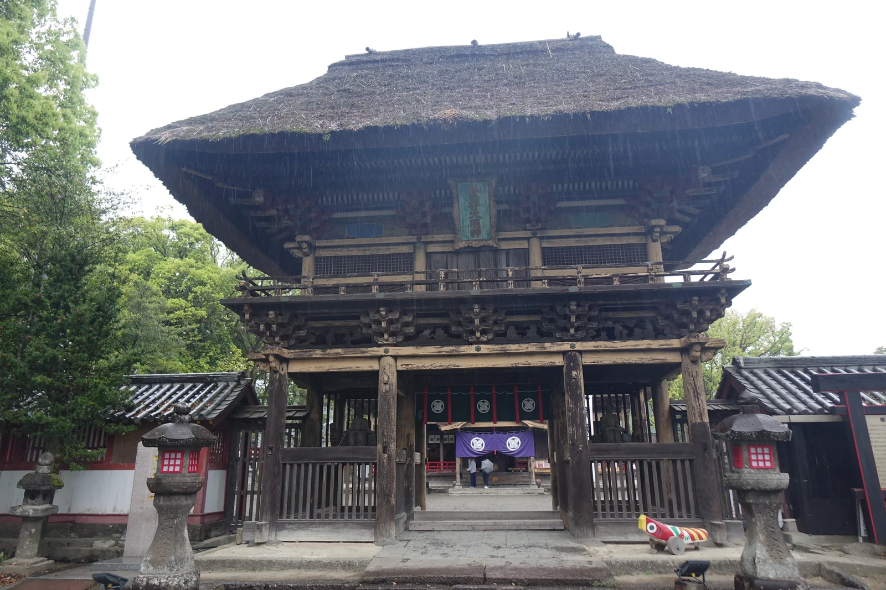
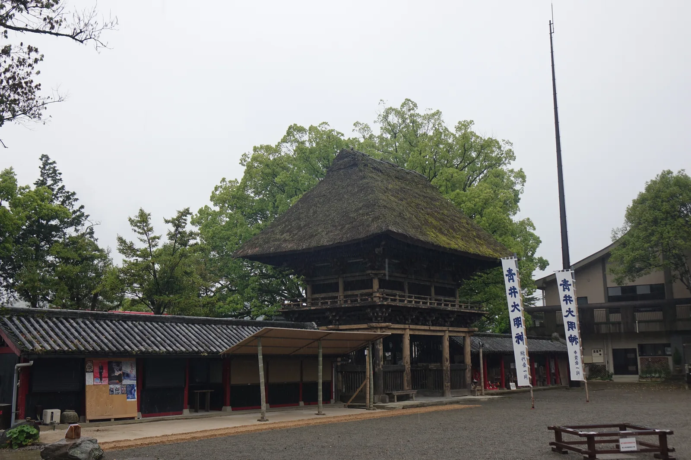
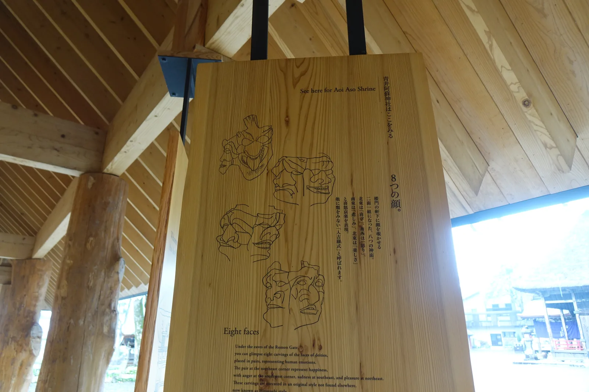
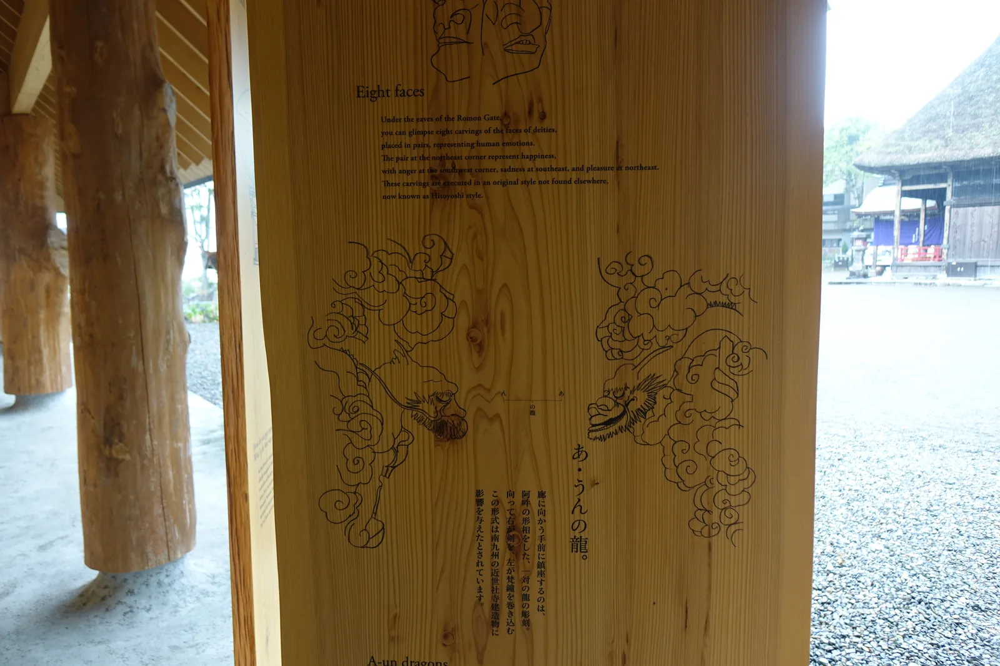
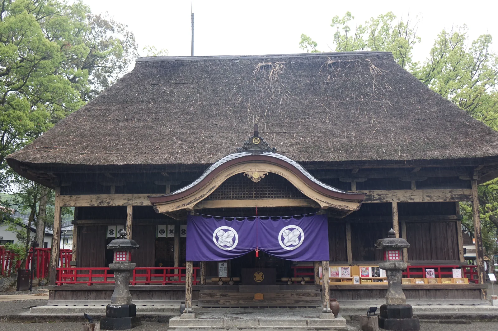
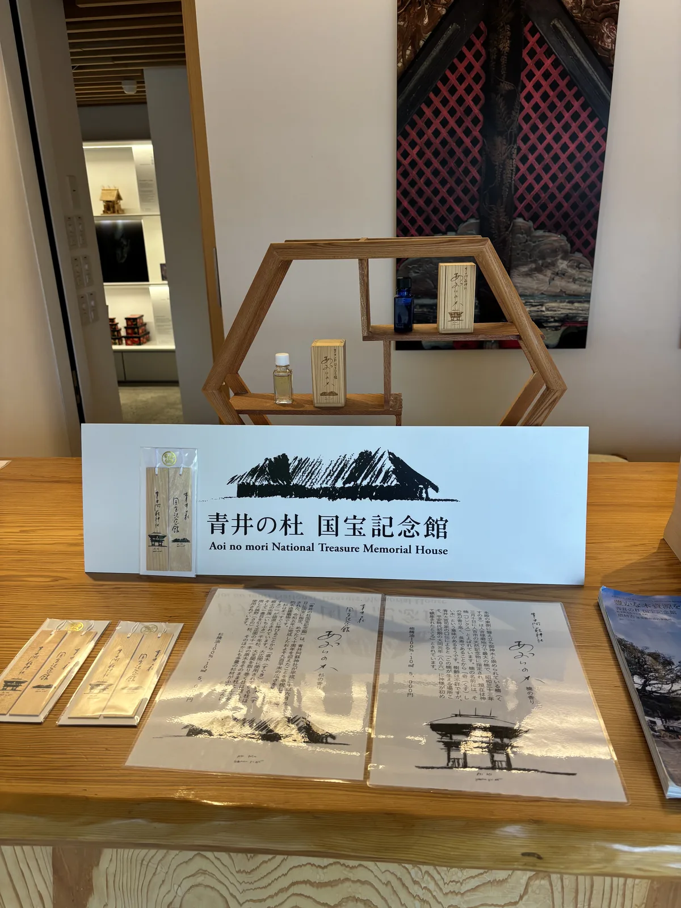
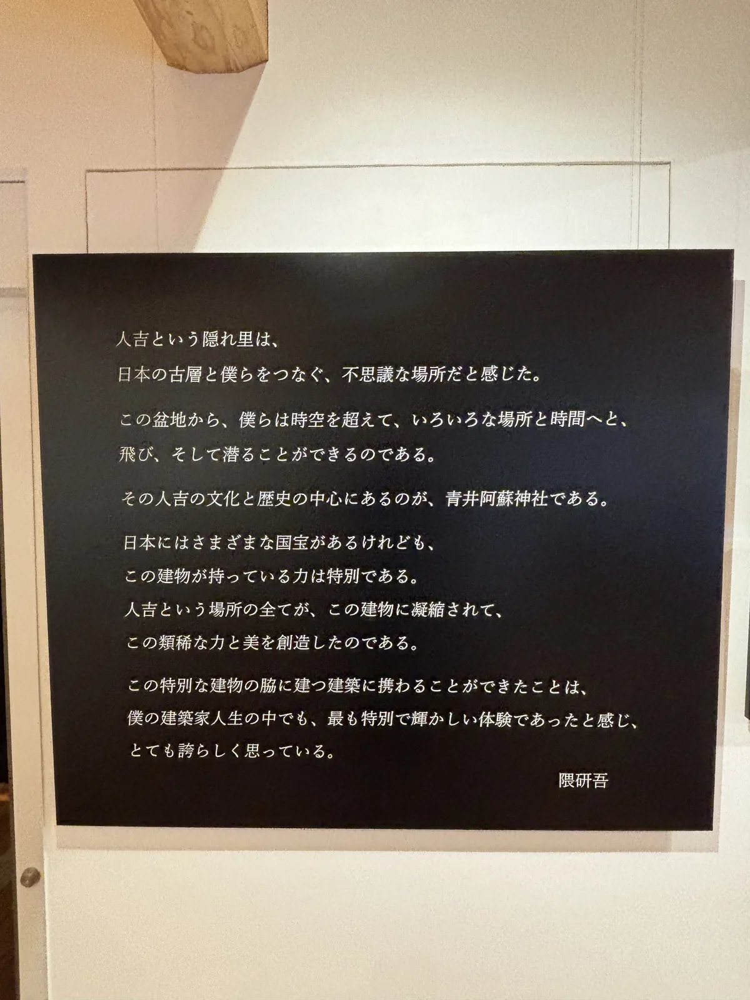
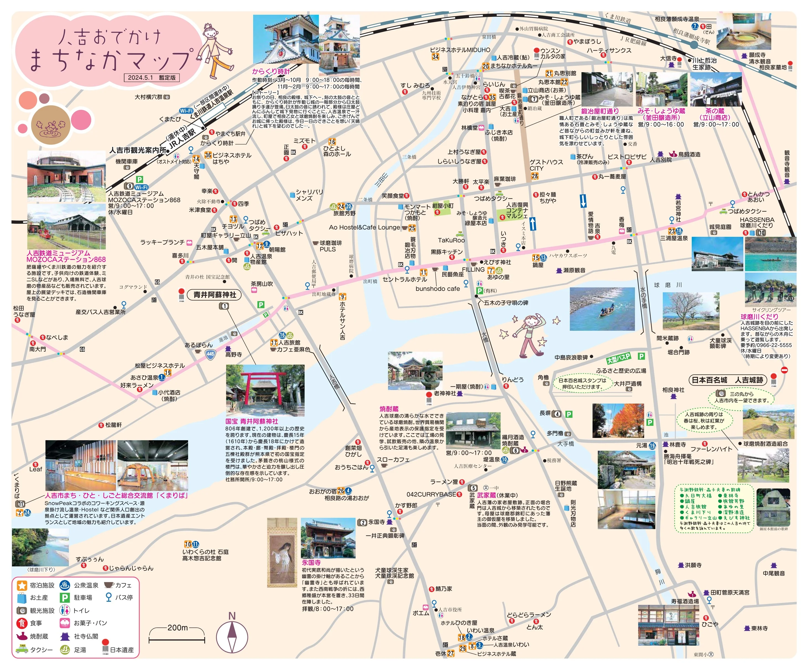

# 青井阿蘇神社

> 神社寺廟散策 · 熊本縣・人吉市上青井町 · 2025-04
> 日文名：青井阿蘇神社（あおいあそじんじゃ）
> 祭神：建磐龍命・阿蘇津媛命・國造速甕玉神
> 社格：舊縣社・別表神社
> 座標：32.213566, 130.753355
> 本頁 HTML：https://chrisincite.github.io/shrine/21-aoi-aso-jinja.html

雨一路沒停，樓門的茅葺屋簷把雨聲收成一片，落在紫幕上的家紋濕透了色。
這座神社的名字裡有「井」，境內外都是水——蓮池、球磨川、山田川，
四百年前選址的人把這些水都算進了風水裡，沒算到的是，
水有一天會漲到只剩鳥居的橫樑露在外面。

社殿群黑漆塗底、赤漆點綴，急勾配的茅葺屋頂像一座座小山，
四百年沒有挪過位置。緊挨著它們的，是一棟去年才落成的新建築，
屋頂同樣模仿茅草的粗糙質感，柱子卻是另一座神社倒下的巨木。
新舊之間隔著的，是一場沒有人能預先設計進風水裡的水患。

## 五棟同時造營之認定

社傳記載，大同元年（806）九月九日，阿蘇神社神主尾方權助大神惟基依神託，
將阿蘇三社的分靈自阿蘇迎至球磨郡青井鄉奉祀，是為創建之始。
這個日子比後來統治此地七百年的相良氏入國，還早了將近四百年。

天喜年間（十一世紀中葉）一度再興，建久九年（1198）相良長賴以領主身分下向此地，
將青井阿蘇神社奉為氏神，寄進神領兩百十六石。此後歷代相良家多次修造社殿，
延德三年（1491）相良為續造營即是其中一例，近世則稱「青井大明神」。

然而今日所見的五棟社殿，並非數百年間層層累積的產物，
而是慶長十五年至十八年（1610〜1613）間，由初代人吉藩主相良長毎與家老相良清兵衛
發起的一次造營工程——本殿、廊、幣殿三棟先於慶長十五年竣工，
拜殿隔年完成，樓門則在慶長十八年最後落成。

這種「同一時期、統一意匠」的完整性，正是平成二十年（2008）六月九日
獲指定為國寶時特別點出的理由之一。五棟建物早在昭和八年（1933）
即依國寶保存法列為（舊）國寶，戰後因新法施行降格為重要文化財，
直到平成二十年才重新指定——這是茅葺社寺建造物全國首例，
也是熊本縣現存文化財的第一座國寶。

*雨中的樓門正面。茅葺屋頂如小山隆起，黑漆軒下垂著紫幕，這是慶長十八年（1613）最後完工的一棟，也是進入社域前最先撞入視野的建築。*

## 立地非屬偶然

決定這座神社位置的，是一套具體的方位計算。境內解說牌記載，
選址時東有球磨川與山田川、南有蓮池、西有大路、北有村山——
四方各有依憑，被認為是與平城京相仿的吉地，而不是隨意擇一片空地。

球磨川同時是這片沖積平原的塑造者，也是它反覆受創的原因。
神社正對著的這條河，日本三急流之一，性情並不溫馴——
灌溉了周邊良田，卻也在數百年間一次次漫過堤岸，逼近社殿。

相良氏入國後，這裡的地理位置又多了一層政治意義。
神社不只是信仰場所，還一度是家臣團議事、神裁的場所——
『八代日記』記載永祿元年（1558）球磨眾曾「於青井籠居」行神裁之事，
可見它在相良氏統治結構裡，兼具信仰核心與統御裝置的雙重角色。

*從境內側回望樓門，兩側懸掛的白色幟旗上寫著「青井大明神」——神社在近世的稱呼，如今仍留在祭典使用的幟旗上。*

## 參道形制及其空間效果

樓門是進入社域前最先撞入視野的建築——三間一戶八脚門，
禪宗樣揉合桃山樣式，寄棟造茅葺，急勾配的屋頂從遠處看像一座隆起的山丘。
軒下黑漆塗底，組物與角材面取部分則以赤漆點綴，這種黑赤併用的技法，
延續著中世以來人吉球磨地方獨自的建築意匠。

樓門上層四隅隅木下，嵌著八個成對的神面雕刻，喜怒哀樂各異其趣，
是別處看不到的「人吉樣式」。初層組物間的琵琶板上刻著二十四孝的故事，
初層天井則繪著一對雌雄龍——相傳牠們每夜會從天井溜出，
結伴到樓門前的蓮池飲水。

*境內解說木牌「8つの顔」，記錄樓門軒下八個成對的神面雕刻，喜怒哀樂各異，是這一帶獨有的「人吉樣式」。*

穿過樓門，連接本殿與幣殿的廊最先引人注目的，是兩側柱子持送上的龍雕，
一對阿吽相對的姿態，據載這種形式影響了南九州近世社寺建築的走向。
幣殿內外裝飾華麗，雕刻圖樣不受柱間侷限、連貫而下，鍍金的飾金具
用當時最先進的工法完成；本殿則是三間社流造銅板葺，
側背面的棧做成交叉的X形，是球磨地方社寺建築常見的細節。

*境內解說木牌「あ・うんの龍」，說明廊柱持送上一對阿吽相對的龍雕，據載這種形式影響了南九州近世社寺建築。*

緊鄰社殿群的，是建築師隈研吾設計的「青井の杜國寶紀念館」，
社務所、展示室與榻榻米大廣間合為一體。木製百葉刻意做出茅葺屋頂
粗糙的節奏感，用來與四百年前的社殿對話；撐起大屋頂的柱子，
用的是宮崎縣狹野神社倒下的一株樹齡四百年杉木——與國寶社殿幾乎同齡。

*拜殿正面，唐破風向拜下垂著繡有家紋的紫幕，兩側石燈籠與紅色玉垣圍出參拜的空間，右側可見授與所窗口。*

## 水患之後的重建

令和二年（2020）七月豪雨襲擊球磨川流域那天，是7月4日。
人吉市區24小時雨量達410毫米，是昭和四十年（1965）紀錄的兩倍半，
球磨川最高水位較那一年再高出兩公尺以上。神社前的一之鳥居只剩橫樑
露在濁流之上，國登錄有形文化財禊橋的朱漆欄杆整段被沖毀。

國寶拜殿床上浸水，蓮池裡的蓮花與被沖進來的車輛混在一起。
神社前的一根電柱上，掛著記錄歷次水位的標示牌，寫著「別忘記，
球磨川的另一張臉」——那是這條河對這座城市的長期提醒，
這一次只是把提醒兌現得比誰都徹底。

國寶紀念館的動工日期恰好撞上這場豪雨。隈研吾後來寫道，
洪水沖毀了禊橋欄杆，社殿也淹到地板以上，一度以為整個計畫要從零開始；
多虧宮司福川氏與地方居民展現出的重建熱情，工程幾乎照原計畫完成。

*「青井の杜國寶紀念館」入口標示，隈研吾設計的參集殿，售有以御神木楠木修剪木料製成的線香「あゆいの香り」。*

紀念館於令和五年（2023）十一月落成，是「令和御大典暨國寶指定十週年紀念事業」，
也是這場水患後最早完工的地標之一。館內販售以御神木楠木修剪木料
製成的「あゆいの香り」（青井的香氣），那株楠木本身是人吉市指定天然記念物，
相傳正是神靈最初鎮座之處。

*館內牆上刻著隈研吾親筆的感言，記述人吉這座「隱世之里」與青井阿蘇神社在他建築生涯裡的份量。*

## 祭儀與授与品

例祭原訂於創祀之日九月九日，明治改曆後固定為10月8日，
連同9日的神幸式，統稱**おくんち祭**，從10月3日一路延續到11日。
3日先舉行**鎮火祭**——這一帶入秋常颳一種叫「くんち風」的突風，
祭期用火機會增加，鎮火祭正是為了祈求祭典期間不生火災。

5日的**獅子奉仕者抽選式**決定神幸式的獅子人選，8頭獅子需要24名奉仕者，
因信仰「奉仕於神幸式可免災厄」而應徵者眾，希望者甚至會在元旦一早就前來登記。
8日清晨先行**寅之刻菊祓**，以白菊祓清社殿與神幸式的道具，
10時半舉行全年最莊重的**獻幣式**，入夜後神樂殿演出約三小時的球磨神樂。

9日上午，**發輦祭**祈求神幸道中平安後，10時半神幸行列自神社出發，
チリン旗（旗竿頂端繫劍與鈴、據信兼具祓邪與神靈依代雙重意義）走在最前，
獅子與神轎隨行，巡遶人吉市街，直到秋風裡返回神社。11日的**報賽祭**
向神明稟報祭典圓滿落幕，一連九天的祭事至此收束。

## 晨間路線之擬定及其限制

青井阿蘇神社所在的上青井町，方圓一公里內疊著這座城市幾乎所有的歷史層次。
人吉市官方發行的《人吉おでかけまちなかマップ》剛好以神社周邊為範圍，
北朝上、附200公尺比例尺，把這一帶的節點都畫進同一張圖裡，可以直接沿用。

參拜完樓門與拜殿，繞進國寶紀念館看過展示，往西北步行約300公尺、
四分鐘，就到**JR人吉驛**——若時間抓得準，還能看到からくり時計裡
十七尊人偶演完一段三分鐘的城下巡遊故事。驛的西南側是**鍛冶屋町通り**，
藩政時代最多曾有六十六軒鍛冶職人聚集於此，如今僅存兩軒，
沿街還有味噌醬油藏與體驗南蠻紙牌「ウンスンカルタ」的店家。

沿胸川往東南續行約1.3公里、十五到二十分鐘，抵達相良家七百年居城
**人吉城跡**——別名繊月城，北倚球磨川、西臨胸川、東南為山地環繞，
曾是易守難攻的天然要塞，文久二年（1862）的一場大火燒盡大半城下町，
如今只剩石垣與水之手門臨江而立。時間充裕的話，可以再往南走到
**願成寺**與相良三十三觀音第一番清水觀音堂，本堂後方就是相良家歷代墓地。

回程沿球磨川岸邊折返，路上會再經過那根掛著水位標示牌的電柱——
這條晨間路線走的不只是社殿與城跡，也是這座城市與河流之間，
反覆拉鋸又反覆和解的一段記憶。

▲ 建議走法（早上出發，約1.5〜2小時）
1. 青井阿蘇神社參拜——樓門、拜殿、廊、青井の杜國寶紀念館
2. JR人吉驛（からくり時計）
3. 鍛冶屋町通り
4. 人吉城跡（相良神社、二之丸・三之丸、水之手門）
5.（視體力）願成寺・清水觀音堂
6. 沿球磨川岸邊折返神社

▲ 路況：全程市街地道路與緩坡，人吉城跡內有石段，沒有明顯高低差風險；
人吉城跡因令和二年七月豪雨部分區域曾一度封閉，出發前宜先確認最新開放範圍。
▲ 交通：JR九州肥薩線・くま川鐵道人吉驛為起訖點，與神社之間徒步4分即達。
▲ 接下來往哪走：往北方向，是同一段神話系譜裡的源頭——
[阿蘇神社](14-aso-jinja.md)，供奉的三神正是青井阿蘇神社分靈而來的本社。

▲ 地圖
人吉市役所發行的《人吉おでかけまちなかマップ》（2024年5月暫定版），
北朝上、附200公尺比例尺，把青井阿蘇神社、JR人吉驛、からくり時計、鍛冶屋町通り、
人吉城跡、永國寺、相良三十三觀音等節點都畫進同一張圖裡，與本篇路線高度重疊。

*人吉おでかけまちなかマップ（發行 人吉市，2024年5月暫定版）。*
