## 我的想法

<!-- 待 Chris 本人填寫，本階段留空 -->

## 導言

四月的午後，下著雨。門前町的店都開著，土產店把商品架擺到騎樓下，
撐傘的人一個接一個走上石段。爬到男坂頂端回過頭，才看見這座神社真正的樣子：
石段一路往下，穿過鳥居、穿過整條商店街，一直通到海——那天海面壓著低雲，
水平線上仍看得到相島那道低平的影子。年裡只有兩次，夕陽會準準落在那條線的盡頭，
把整條參道燒成一片光；一年一次，神轎也會沿著同一條線下到海邊，再走回來。
兩件事那天都沒遇上。但那條線每天都在那裡，安安靜靜地指著海的方向——
它最安靜的時候是清晨，而我來的是一個下著雨的午後。

## 三柱大神之奉齋認定

宮地嶽神社的創建年代不詳，社傳只說是「神功皇后的時代」。傳說神功皇后渡海遠征朝鮮半島之前，
曾在宮地嶽山頂設壇遙拜天神地祇，祈願「奉天命而渡彼地，願垂開運」，之後才出航。
遠征歸來後，人們感念她的功績，將她奉為主祭神；隨行的阿曇族之長也一併合祀，
三位神明合稱「宮地嶽三柱大神」。

這個由來決定了這座神社最核心的性格：**不是為了某個具體的祈願而創建，
而是為了紀念一次「事情辦成了」的結果**。也因此，宮地嶽三柱大神被理解為
「何事にも打ち勝つ開運の神様」——保佑人在任何事情上都能取勝的開運之神，
而不是專司某一項具體事務（例如學問或商業）的神明。

文獻上最早的身影出現在中世。宗像大社記錄年中行事的《正平二十三年（1368）宗像宮年中行事》
裡，載有這座神社十二月二十日的嶽祭，七十五末社的名單中，宮地嶽社與勝村大明神社並排出現。
也就是說，它在中世是被放進宗像的祭祀體系裡看待的；明治十五年（1882），
它還一度正式成為宗像神社的攝社。

明治五年（1872）列格村社，明治三十二年（1899）昇為縣社，現在是神社本廳的別表神社
（べっぴょうじんじゃ，社格制度廢止後另立的高階神社名冊），
也是全國各地宮地嶽神社的總本宮。真正讓它在全國排上號的是後面三件事：
那條直直通向海的參道、境內的三個「日本一」，以及山腹裡那座出過二十件國寶的古墳。

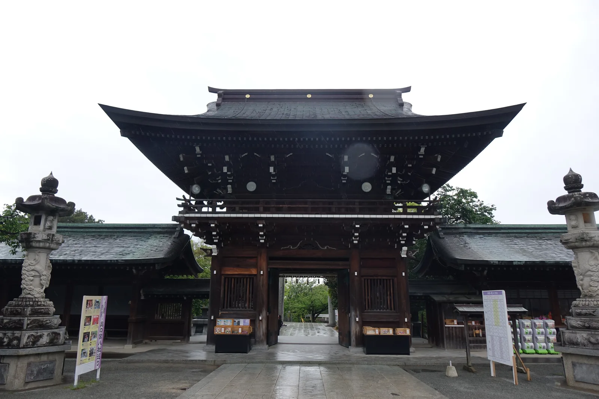

*出簷深遠、斗栱層疊的樓門，與拜殿、迴廊同屬昭和五年（1930）落成的那次大造營。*

## 立地非屬偶然

決定這座神社位置的，是一條看不見的直線。

社殿建在宮地嶽的山腹，正面的石段（俗稱「男坂」）一路往下延伸，穿過鳥居、
穿過山下的門前町商店街，直抵海邊的宮地濱。這段直線參道約八百公尺，
延長出去正對外海的相島（あいのしま）。每年二月二十四日之後數日、十月十八日之前數日，
夕陽會沿著這條軸線落下，就是被稱為「光の道」的那幾天。

神社自己的解釋不是風景而是方位：那條光被說成神社與西方淨土連成的一線，
祖先所在的彼岸與此岸在那幾天被接了起來。日落點每天都在移動，
能正落相島的只有其中幾日，於是這個現象一年兩次、每次撐不滿十天。

這條線也不是只給夕陽走的。九月的秋季大祭，神轎二十一日從神社「下」到宮地濱的御旅所，
二十三日再沿著約兩公里的參道「上」回來。一年一度，那條軸線會被一整列人實際走一遍——
先下到海，再從海邊回到山腳。夕陽是天象，這一趟才是這條線本來的用途。

相島與這座神社還有第二層關係。三番社不動神社的石室，是用高與寬都超過五公尺的巨石堆成的，
社方的說法是那些石材取自相島的玄武岩。海的那一頭既是夕陽的落點，也是石頭的產地；
軸線指向的地方，同時是那座古墳的材料來源。

社方史料研究者古根和彥曾指出一個更細的地理事實：相島上一座積石塚古墳投射過來的軸線，
指向的其實不是現在的本殿，而是參道爬升到頂端後、正面那座「古宮」——社殿真正的故地。
現在的參道走到古宮前會向左折約四十五度，才轉往宮地嶽山上方向。
他推測這個轉折發生在昭和八年（1933）的改修前後，也就是社殿群整體重建完成不久的年代。

山的另一頭還有一個對稱。宮地山標高約一百八十公尺，據載山頂另有宮地嶽古宮的祠
與日之出參拜所。西邊是海上的落日，東邊的山頂是日出，這座神社被安在兩者之間的山腹上。
無論哪一版軸線，方向感始終沒變：山、社、海、島，四點一線。

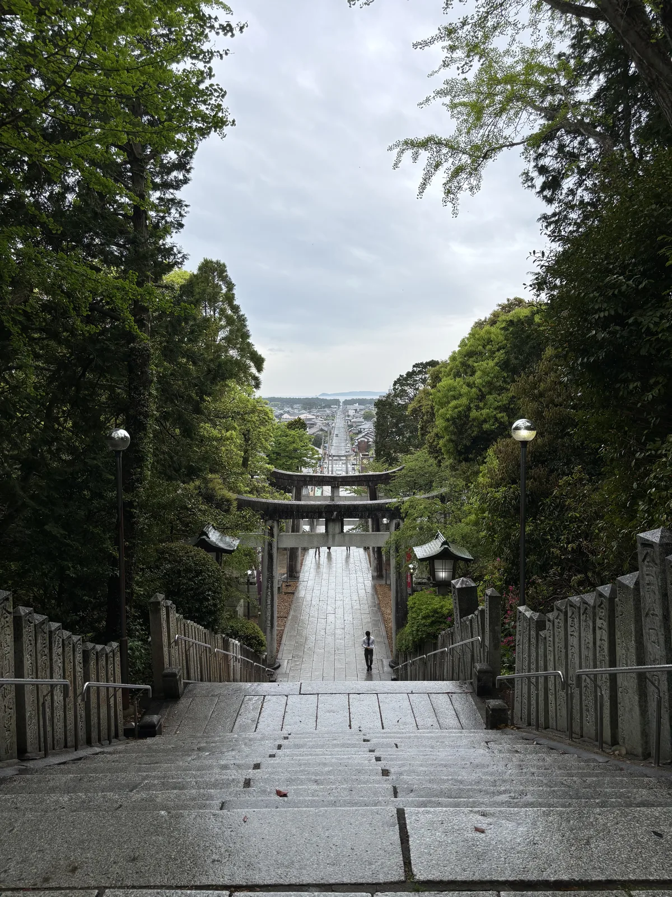

*從男坂頂端回望。石段、鳥居、門前町的直線街道一路往下，盡頭是海；水平線上那道低平的島影，就是參道延長線正對的相島。*

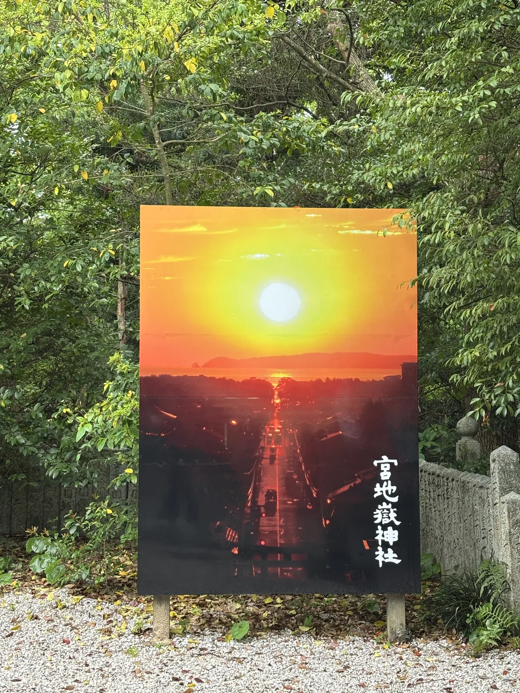

*參道口立著的解說看板，把「光の道」夕陽沿參道直落相島的照片放大展示——年裡僅二月與十月數日能遇上這個畫面。*

## 參道形制及其空間效果

從門前町商店街走到神社，第一段是石造的男坂——筆直的長石段，兩側是店家與販賣機，
爬到頂端才第一次看見鳥居與山林。這種安排讓「進入神域」的感受集中在最後一段陡升，
而不是分散在漫長的平地參道上。

石段頂端的樓門氣勢厚重，出簷深遠、斗栱層疊。但這一整組社殿其實都很年輕：
明治十年（1877）九月社殿燒失，三年後才重建本殿與幣殿；大正七年（1918）神社提出
擴張境內的改築申請並獲准，大正十一年（1922）整地完成後才正式動工。

據社方沿革記載，那次大造營用了台灣阿里山的檜木四十萬才（才是日本傳統的木材材積單位）、
宗像郡孔大寺山的老杉二十萬才、德山產花崗岩十八萬六千才，前後十年、動員延べ二十五萬人次，
把神殿、幣殿、拜殿、透塀、神樂殿、樓門、社務所與南北迴廊一起立起來，
昭和五年（1930）十月二十二日遷座。頭頂上那批檜木，是從嘉義的山上運過來的。

推動這件事的是大正年間就任的社司川島澄之助。他廣募淨財改築社殿，被視為這座神社的中興之祖，
境內立著昭和八年（1933）鑄的銅像。從一場大火之後的縣社到今天這個規模，中間那一步是有名字的。

平成二十二年（2010）遷座滿八十年時，本殿的屋頂換成了金鈦（ゴールドチタン，gold titanium）
板的黃金屋頂。理由與山腹裡那座古墳有關：出土品裡有金銅透雕的冠、金裝的長刀與馬具，
神社把這片黃金屋頂說成古墳之主把黃金寶冠舉在頭上的樣子。

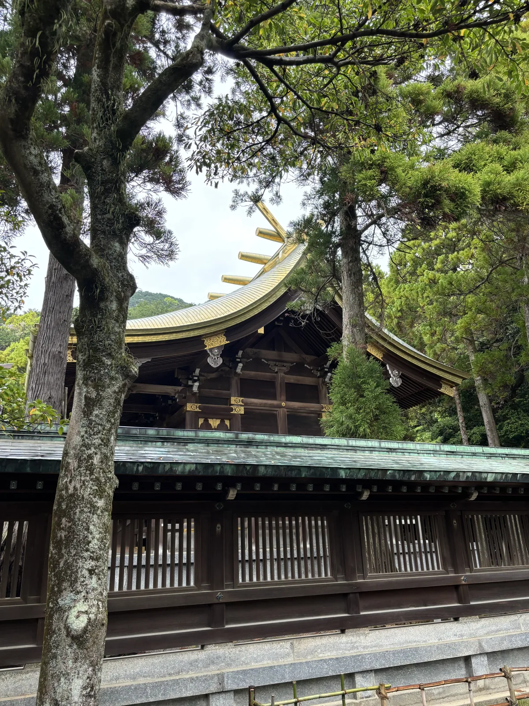

*隔著迴廊的銅板屋頂與松枝望向本殿。金色的千木、鰹木與屋頂，是平成二十二年（2010）遷座八十年時換上的金鈦板。*

穿過樓門才是拜殿，正面橫掛著全日本最大的**大注連繩**：直徑二點六公尺、長十一公尺、重三噸。
它每年更換一次，稻稈來自神社自己約兩反的御神田，從育苗到掛替，社方計為約一千五百人次的奉仕。
這件「日本一」不是一件古物，而是一年做一次的農事。

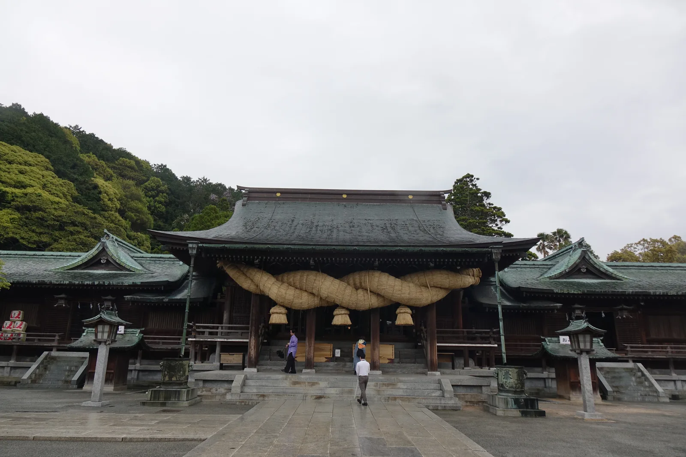

*拜殿正面，橫掛著日本最大的大注連繩——直徑2.6公尺、長11公尺、重3噸，每年以神社自家御神田的稻稈重做一條。*

另外兩件是大太鼓與大鈴。大太鼓直徑二點二公尺，檜木為胴、表面反覆上漆，
鼓面用的是今天的國產和牛已經取不到那種尺寸的皮，每年元旦零時敲響，數公里外都聽得到；
社方自己註明，今日全國已有更大的太鼓，這一面的「日本一」指的是材料全部國產。
銅製大鈴重四百五十公斤，昭和三十五年（1960）以前與大注連繩一起掛在拜殿，
後來因為太重，另建鈴堂與大太鼓同奉。

拜殿後方，本殿是流造（ながれづくり，屋頂前坡長於後坡的社殿形式），
占地約七十坪，隱在社叢深處，不像拜殿那樣直接面對參拜者。

社殿群往後、往山裡走，還有一整片**奧之宮八社**：一番社七福神社、二番社大塚稻荷神社、
三番社不動神社、四番社萬地藏尊、五番社戀之宮、六番社三寶荒神、七番社水神社、
八番社藥師神社，八座小社沿著鋪裝良好的山徑一字排開，繞行一圈約需一小時。

其中三番社不動神社最特別——它的社殿本身就是一座古墳。寬保元年（1741）一場山崩讓石室露了出來，
延享四年（1747）人們在石室深處奉上不動尊，稱作「穴不動」。福津市的認定是七世紀前半、
直徑約三十公尺的圓墳，橫穴式石室長二十三公尺，是全日本第二長的石室；
社方則從出土品推定為六世紀末到七世紀初。

出土品約三百件，其中二十件指定為國寶——金銅裝頭椎大刀、金銅壺鐙、金銅透雕冠、瑠璃板等，
被稱為「地下的正倉院」，古墳本身在平成十七年（2005）成為國指定史跡。
市方的說明更進一步：被葬者被認為是宗像的胸形君德善，附近另外出土的骨藏器（同樣是國寶）
則被認為屬於他的女兒尼子娘——天武天皇第一皇子的生母。

奧之宮巡禮的信仰熱潮，其實是從這座古墳被發現、不動明王奉祀入內之後才真正興盛起來的——
**這座神社最古老的部分，反而是最晚才被納入參拜路線的那一座。**

社殿群旁邊還有一塊性質完全不同的地方。昭和四十九年（1974）開設的民家村自然廣苑，
把日本各地五棟即將消失的古民家移築復原在池畔：富山縣東礪波郡利賀村的合掌造、
熊本縣菊池郡泗水町的二棟造、佐賀縣杵島郡白石町的くど造（kudo-zukuri，
主棟呈ㄇ字形迴繞、俯瞰像個灶口）、福岡縣小郡市的鉤屋造（平面呈 L 形）
與長崎縣對馬的高床式平柱小屋。免費開放，可以走進屋內。其中二棟造是本屋與釜屋
幾乎同大、兩條屋脊平行的形式，約兩百年前作為寺院庫裡而建，神社的解說指出，
這種平行二棟被認為是八幡造的源流之一。一座神社的境內順手收著一部九州民居的斷面。

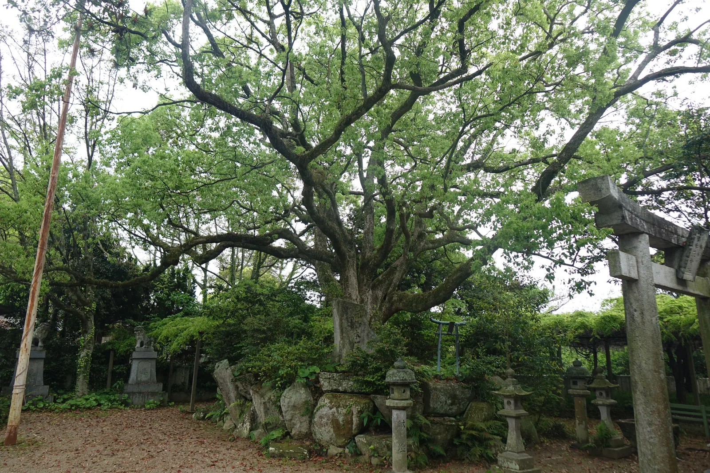

*境內一角的古樟，樹下堆疊著石燈籠與小型鳥居，樹齡難以估算，是這片社叢裡最老的活物。*

## 光之道重塑的門前町

宮地嶽神社的門前町曾經只是一條尋常的參拜商店街，賣紀念品與松ヶ枝餅
（まつがえもち，印著神紋三階松圖案的白餅與艾草餅）。轉折點是一支電視廣告——
偶像團體嵐代言的日本航空廣告，取景就在這條參道，拍下夕陽沿參道直落海面的畫面。
廣告播出後，「光の道」一夕成為全國知名的攝影景點，也讓這條路一年僅有數日的
特殊天象，變成整座門前町一整年的行銷主題。

如今參道口立著解說牌，把那張夕陽落入相島的照片直接做成大型看板，
提醒每一個路過的人：你腳下這條路，年裡有幾天會變成一條光。
門前町也跟著改變體質——除了傳統的松ヶ枝餅店，這幾年陸續開出主打咖啡與雜貨的
「現代風商店街」，經營者把這裡定位為「ふらりと立ち寄りたいエリア」
（適合隨興晃進去逛逛的區域），與海邊咖啡廳、麵包店併存。

但這條街的日常並不是靠一年那幾天撐起來的。每月一日的「ついたち参り」（朔日參拜）
通宵舉行，前一晚深夜參道就開始排隊，一個月一次把人潮送進商店街；九月的秋季大祭則把
海邊那一端也算進營業範圍。一支廣告帶來的知名度，被地方接住、轉成了一整條街的日常生意。

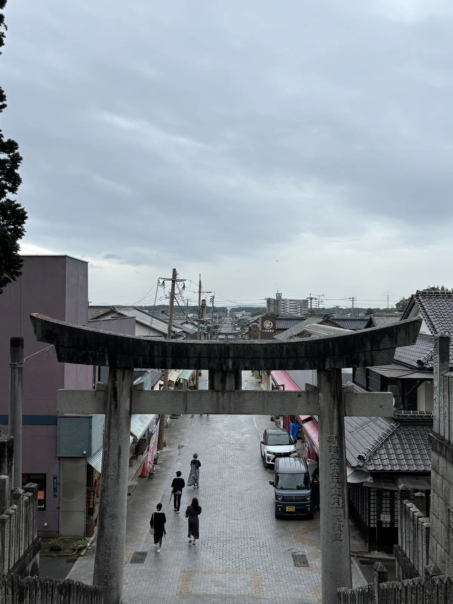

*站在參道的鳥居下往回看門前町。雨天的午後，商店街照常營業，電線橫過街道，盡頭是山下的市街。*

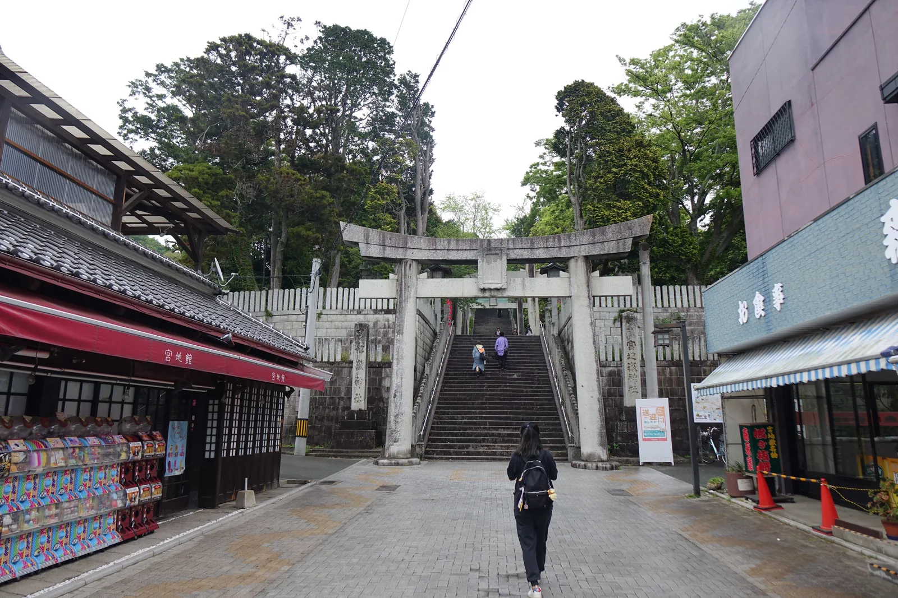

*從門前町商店街望向第一座鳥居與男坂石段。四月的雨天午後，兩側店家都開著，土產店的商品架一路擺到騎樓下。*

## 祭儀與授与品

▲ 例祭
・**四月四日〜六日**——春季大祭
・**九月二十一日〜二十三日**——秋季大祭（又稱放生會，相傳已延續約七百年，
　是這裡最大的祭典。社方把它說成大神巡視氏子區域收成的一趟小旅行：
　二十一日御神幸「お下り」，從神社下到宮地濱的御旅所；二十二日夜有開運花火；
　二十三日「お上り」，以奴姿的毛槍為首，神轎、左右大臣、身著十二單乘牛車的祭王
　與衣冠神職，沿約2公里的參道回到神社。祭王自昭和四十七年（1972）起多由歌手擔任）

▲ 光の道・夕陽のまつり
・二月與十月各數日，日期每年略有移動（令和七年〔2025〕十月為十六日至二十二日）。
　期間齋行「夕陽のまつり特別祈願祭」，祭典後可在特別席觀覽，需電話或現場預約；
　一般拜觀在下午兩點於正面石段旁發整理券，四點半左右引導入席。

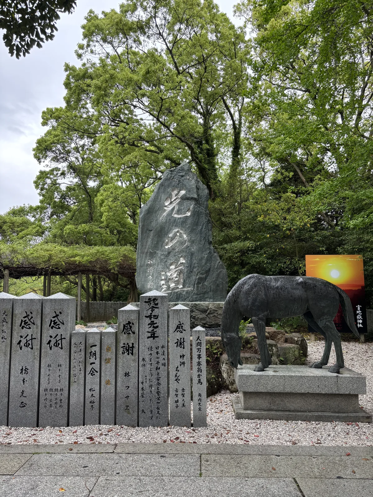

*境內立著一塊草書大字的石碑，刻的是「光の道」，旁邊是神馬像與一塊印著夕陽的小看板。*

▲ 不動神社的石室參拜
・石室內部平時封閉，一般在入口處參拜。每年一月二十八日（初不動祭）、
　二月二十八日（春季大祭，又稱ぜんざい祭）、七月二十八日（夏季大祭）三天，
　可以進到石室深處參拜。

▲ 三つの日本一
・大注連繩（直徑2.6公尺・長11公尺・重3噸，每年以自家御神田的稻稈重做一條）
・大太鼓（直徑2.2公尺，材料全部國產，元旦零時敲響）
・大鈴（重450公斤，銅製；現與大太鼓同奉於鈴堂，不在拜殿）

▲ ご利益
・**開運**——「何事にも打ち勝つ」，適用於各種事務而非單一項目，
　源自三柱大神本身「事情辦成了」的由來；後來也廣泛用於商賣繁昌與家內安全。

▲ 神使モマ（貓頭鷹）
・社傳有一則黃金傳說：一位正直的村人在宮地嶽山中迷路，被當地方言稱為「モマ」的貓頭鷹
　引路而拾得一顆金球，神社因此奉貓頭鷹為神使；每年一月的「玉替祭（幸福モマくじ）」
　即源自這則傳說，參拜者買一顆「モマ玉」糖果籤，籤紙裡包著金玉、銀玉等吉祥物。
・御朱印所前實際飼養著兩隻貓頭鷹，是後來信眾奉納的活體，隔著籠子與參拜者對看。

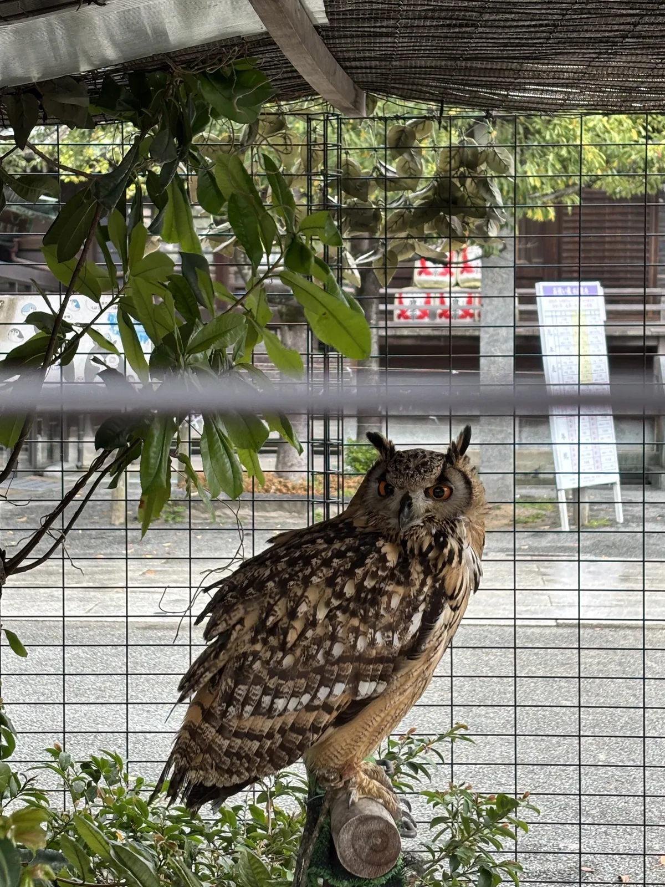

*御朱印所前飼養的貓頭鷹之一。社傳的黃金傳說裡，正直的村人被方言稱為「モマ」的貓頭鷹引路而拾得金球，神社因此奉貓頭鷹為神使；這兩隻是後來信眾奉納的活體。*

▲ 這一帶的吃食
・**松ヶ枝餅**——印著三階松神紋的白餅與艾草餅，門前町多家店鋪各有風味，
　適合邊走邊吃。

具體授与品品項與初穗料未在官方資料上一一確認；現地授与所有掲示，以現場公告為準。

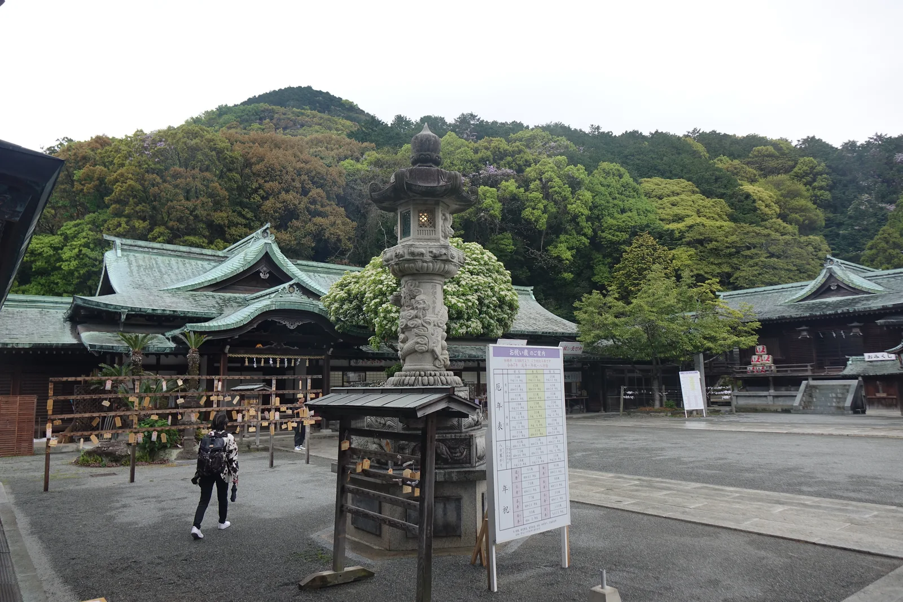

*拜殿一側的廣場，一座石燈籠立在中央，背後是本殿方向的山勢。*

## 晨間路線之擬定及其限制

福津市的觀光單位「ひかりのみちDMO福津」有一份現成的官方おさんぽ地圖，
標出宮地嶽神社交差點到宮地濱的三種所要時間：徒步約十五分、自行車約四分、
開車約三分。地圖從門前町一路畫到海邊的松林公園，沿途的咖啡廳、雜貨店、
公共廁所、公車站牌全部標出。這條路線本身就是一條現成的散步路線，
只是官方地圖沒有把後山的奧之宮八社畫進去——兩段路線得自己接起來。

▲ 建議走法（早上出發，約1.5〜2小時，環路回到神社）
1. 參拜拜殿與大注連繩
2. 轉往本殿後方的社叢，走完奧之宮八社一圈（約一小時，途經不動神社／宮地嶽古墳）
3. 繞進民家村自然廣苑，看那五棟移築的古民家（免費，可入內）
4. 回到樓門，走男坂下山
5. 沿參道直穿門前町（店家多半還沒開，是一天裡最安靜的時候）
6. 抵達宮地濱，沿松林公園走一段海岸，遠望相島
7. 原路或沿海岸另一側折返神社

▲ 為什麼是早上：「光の道」一年只有數日能遇上，但這條軸線本身每天都在——
早上店家未開、遊客未至，是唯一能不被商店街的喧鬧打斷、純粹感受這條
「山—社—海—島」軸線的時段。奧之宮的社叢在晨光裡也比日中更安靜。

▲ 距離與路況：奧之宮一巡加上門前町到宮地濱的往返，總長約三點五至四點二公里，
落在三到五公里的範圍內。奧之宮的山徑鋪裝良好，門前町到海岸是平坦的柏油路，
全程沒有需要特別留意的險段。神社備有停車場。

▲ 兩個先講清楚的限制：不動神社的石室內部平常不開放，除了一月、二月、七月的
二十八日那三天，其餘時間只能在入口參拜；而古墳出土的那二十件國寶也不在現地，
現由太宰府的九州國立博物館保管。想看實物，得把行程往南接。

▲ 接下來往哪走：往南約一小時車程即達福岡都市圈，若同一趟旅程安排太宰府方向，
可接續 [[11-dazaifu-tenmangu]]——那些黃金出土品，正好就寄在同一座城市裡。

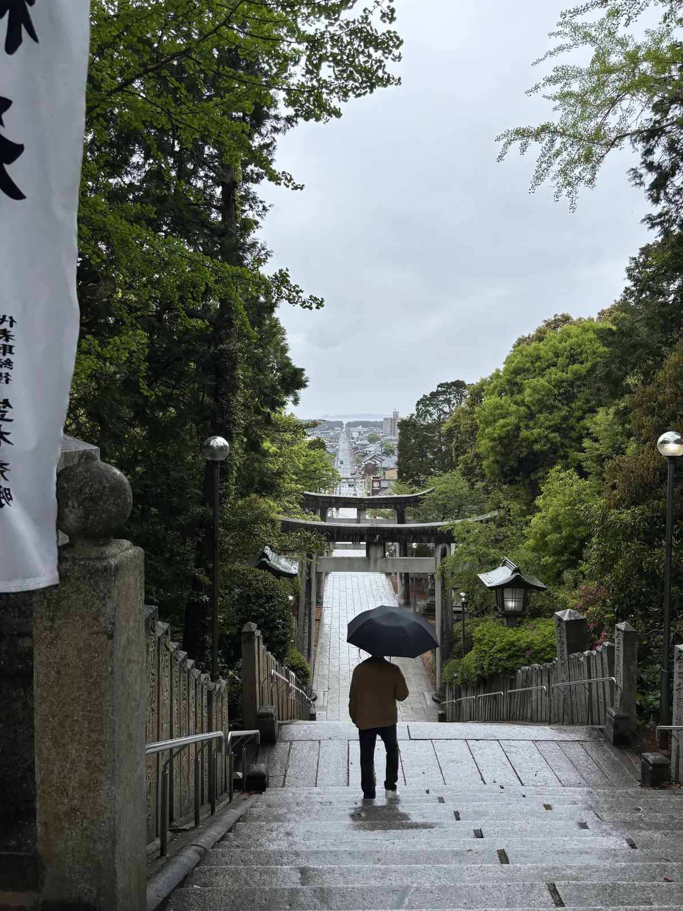

*撐傘的人正要走下男坂。石段盡頭是鳥居與門前町，再往前就是海。*

▲ 地圖
ひかりのみちDMO福津（福津市觀光地域づくり法人）發行的「宮地嶽神社おさんぽマップ」
（2025年3月版），標出神社交差點到宮地濱的所要時間，沿途店家、公廁、
停車場與公車站牌全部畫進圖裡，可以直接沿用。

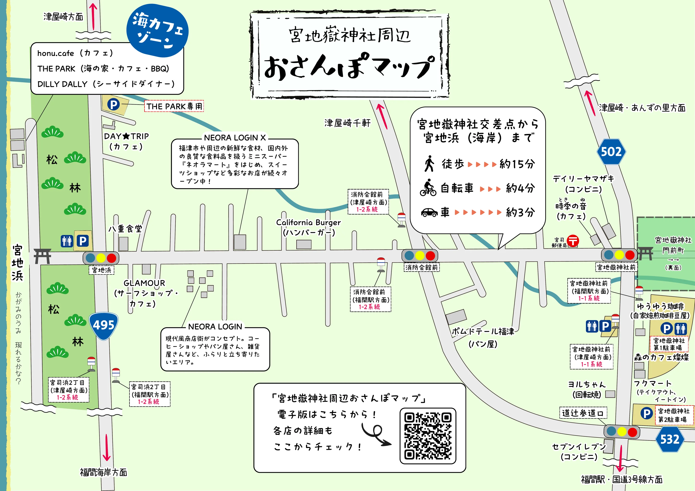
