## 我的想法

<!-- 待 Chris 本人填寫，本階段留空 -->

## 導言

那天御本殿前面立著的不是御本殿，是一座屋頂上長滿植物的建築——曲面的黑色屋頂
從近處看幾乎要浮起來，二十幾種植物順著坡度長成一片小森林，安靜地待在原本該是
正殿的位置上。御本殿正在整修，已經修了快兩年，還要再修一年多。這座臨時的家，
是建築師從一則傳說裡長出來的答案：一株思念主人的梅樹，一夜之間從京都飛到了太宰府。
屋頂上那片森林，就是那株梅樹飛起來以後，順便帶著周圍的山林一起飛過來的樣子。

## 唯一無二聖地之認定

太宰府天滿宮供奉的是菅原道真——平安時代的學者與政治家，官至右大臣。昌泰四年（901）
他因藤原氏的策謀被貶為大宰權帥，來到九州；兩年後的延喜三年（903）二月二十五日，
在大宰府政廳南館——也就是今天的榎社——結束五十九年的一生。貧困的謫居生活裡，
他留下的紀錄是不怨天、不恨人，仍為皇室與國家祈平安。

決定神社位置的不是人。依社方的御由緒，道真公遺言要葬在大宰府，葬列以牛車載著遺骸
往東北方向前進，走到某處牛忽然臥下不動；門弟味酒安行認定這是本人的意思，就地埋葬
並造了祀廟。延喜十九年（919）依勅命在墓上造了御社殿，此後屢有勅使前來。

社方自己的說法是「日本唯一無二の聖地『菅聖庿』」——全日本沒有第二座建在天神墓所
正上方的天滿宮。其他天滿宮供奉的是他的神格，只有這一座供奉的是他本人埋骨的地方，
而這件事到今天仍然決定著這裡的每一項工程：整修的是墳墓上的建築。

去世之後的名分是一路追回來的。延長元年（923）醍醐天皇將他從從二位大宰員外帥
復為右大臣，其後一條天皇再贈正一位左大臣、太政大臣，於是有了「天滿大自在天神」
這個名號，也就是「天神さま」。道真公之孫菅原平忠受任本社別當之後，這裡便由菅原家
直系子孫世代守護，現任宮司是自道真公算起的第四十代，而全國約一萬座天滿宮，
以這裡為總本宮。

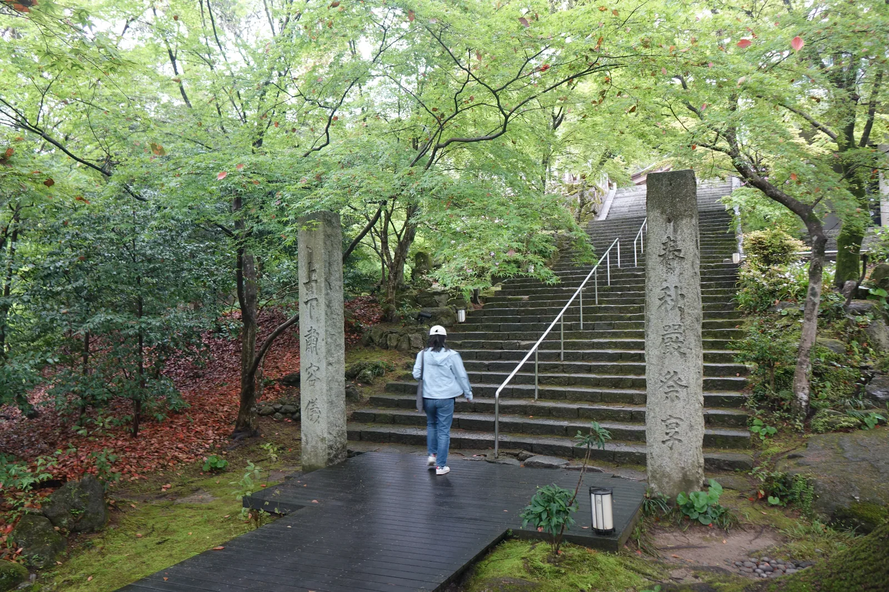

*工事圍籬上掛著「太宰府天滿宮 御本殿について」解說看板，展示的是修復前的原貌——檜皮葺大屋頂配朱漆唐破風，這是訪問當時被黑色防塵網整個包住、看不見的樣子。*

現本殿建於天正十九年（1591），由筑前國主小早川隆景再建，檜皮葺屋頂配唐破風向拜，
是安土桃山時代的珍貴遺構，列為國家重要文化財。這座神社與大多數神社不同的一點是
**沒有獨立的拜殿**——參拜者直接面對御本殿，中間沒有另一層過渡的建築。

## 立地非屬偶然

太宰府這個地名本身就是地理位置的直接說明——七到十二世紀，這裡是治理九州、
對外交涉的「西の都」大宰府政廳所在地，道真公被貶謫到的，正是當時朝廷認定
離京城最遠、最邊陲的行政中心之一。神社建在他的墓所之上，等於把這座曾經的
政治邊陲，重新標記成了信仰的中心。

值得注意的是，這座神社與他生前的住處並不在同一個點上。南館在政廳南側，
距離現在的社殿約兩到三公里，今日是天滿宮的飛地境內榎社；當年那頭牛從南館出發
往東北走了這段路才停下來，社殿的位置就是這樣被走出來的。每年九月的神幸式，
神輿再把御神靈沿著同一段距離送回榎社住一晚——那條路線量的其實是他的住處與埋骨處
之間的距離。

境內本身也順著地勢層層展開：從參道進來先過三座橋——連續跨過心字池的太鼓橋，
橋面陡峭如拱，過橋本身就像是一次小小的儀式；橋後是樓門，樓門之後才是正殿所在的
主庭。境內各處奉納著十一尊御神牛像，全部都是臥著的姿勢，因為牛在傳說裡就是
臥下不動的那一頭；其中延壽王院前那一尊出自雕刻家冨永朝堂之手，昭和六十年（1985）
奉納，背脊那道平緩的曲線模仿的是東北方的靈峰寶滿山。

*本殿西側的夫婦樟，兩株老楠木相依而生，因外形相偎而得名，樹齡推估一千年到一千五百年，早於御本殿本身，大正十一年（1922）與另一株樟樹一同列為國家天然記念物；樹前立牌刻著樹名與樹齡推定的說明文字。*

樹是這裡的另一種時間刻度。境內立牌寫得很清楚：樟是代表筑紫路的樹木，太古以來
自生於此，形成了「天神の森」，其中特別高大的稱為大樟，而大正十一年（1922）三月
與另一株一同被指定為國家天然記念物的，就是本殿西側這兩株相依而生的夫婦樟，
樹齡推定在一千年到一千五百年之間——比御本殿本身還早了六百多年。

## 參道形制及其空間效果

從西鐵太宰府站出站，參道兩側立刻被土產店與梅ヶ枝餅店佔滿，密度很高，
是整條路線裡最熱鬧的一段。路旁還立著一座「和魂漢才碑」，建於幕末的安政五年（1858），
發起人是薩摩藩士與參道上薩摩藩定宿「松屋」的主人栗原孫兵衛——那時佩里艦隊已經來過，
一群人選在道真公的墓所前面，立碑復興「取大陸之學而不失日本之心」的主張。
這塊碑後來成了理解幕末太宰府的入口，此刻它只是路邊的一塊石頭。

這條參道上還藏著另一場傳統與當代的對話：建築師隈研吾設計的星巴克太宰府表參道店，
用約兩千根杉木斜向交錯組成不使用一根釘子的木構空間，內部木組總長度加起來將近四公里——
和後面即將看到的仮殿一樣，都是在傳統參道上插入的當代木構實驗。

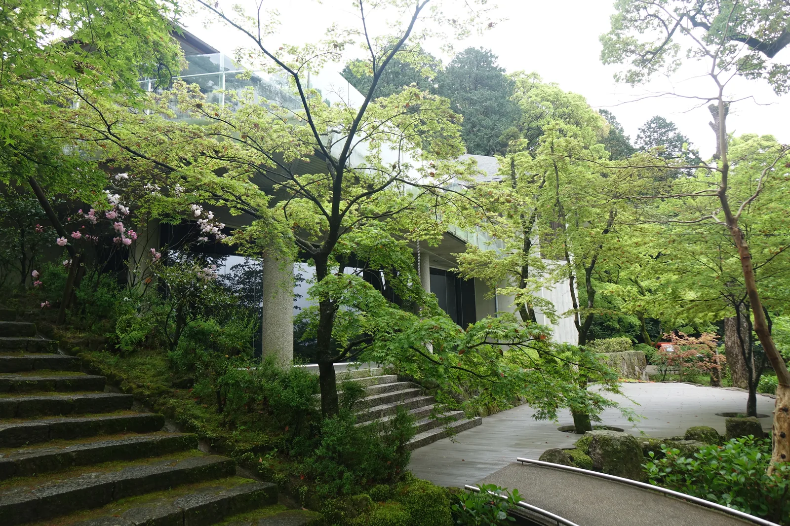

*星巴克太宰府表參道店內部，隈研吾設計，約兩千根杉木斜向交錯、不用一根釘子組成的木構空間，總長度將近四公里，人在其中像走進一條發光的木隧道。*

走到參道底，正對著參拜者的不是鳥居，是一扇木門與一堵白牆——延壽王院，
現任宮司家的宅邸。動線在這裡被迫轉向：往左折才是太鼓橋，橋面的弧度比實際需要的更陡，
過橋的人得低頭看路，抬頭時剛好對上樓門，這個安排把「參拜」的心理準備
壓縮進最後這幾十公尺。

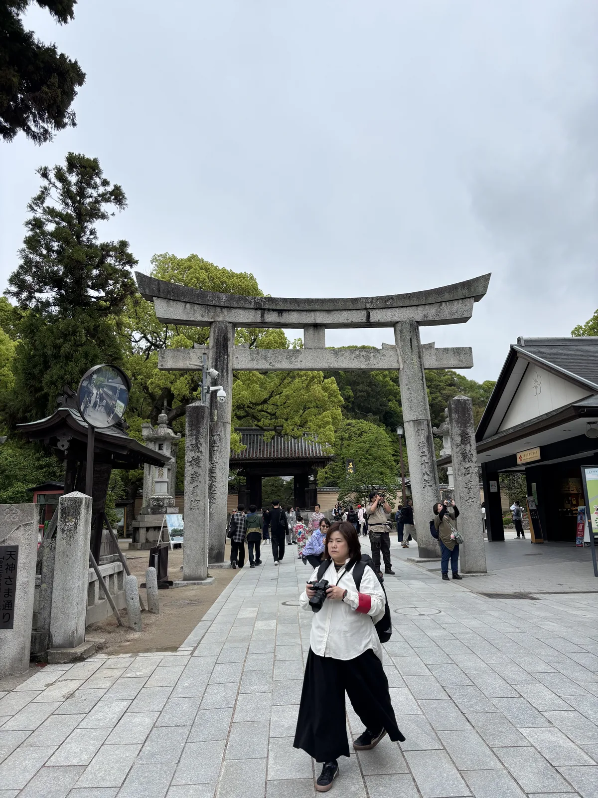

*參道盡頭的石鳥居，兩側石柱刻著奉獻者姓名，鳥居後方已能望見樓門瓦頂，鳥居下總站著舉相機互拍的參拜者——太宰府天滿宮境內外合計有三十七座攝社與末社，各自供奉著與道真公相關、或與地方社會相關的神明。*

樓門之後，御本殿因大修而不在原本的位置，取而代之的是一座造型完全不同於
傳統社殿的建築——仮殿。它的屋頂是曲面的黑色構造，坡度陡峭地向前傾斜，
支撐的柱子同樣是暗色細柱，遠看像是懸浮在空中；屋頂上種著超過六十種、
二十一株喬木與地被植物，其中包括神社自己的花守長年培育的梅樹。
設計者藤本壯介——大阪關西世博會「大屋頂環」的設計者——說這個造型的起點
是「飛梅傳說」：道真公思念的梅樹一夜飛抵太宰府，於是他想像成整片天神之杜的
草木也跟著一起飛起、落在御本殿之前，暫時扛起這座神社的門面。

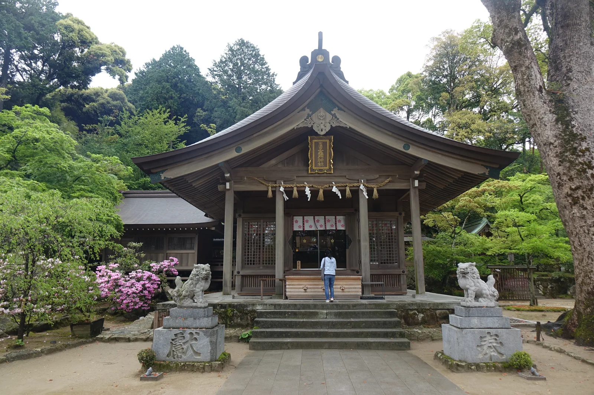

*仮殿外觀。曲面的黑色屋頂上長著一整片草木，柱子暗色細瘦，遠看像懸浮在空中；背後那片黑色防塵網包住的鷹架，裡面就是正在整修的御本殿。*

仮殿內部的祭祀空間，簷口壓得低而深，卻沒有真正把內外隔開；
天花板中央開了一道圓形天窗，抬頭能看見天空與屋頂上的植物。
設計者自己形容這個效果來自傳統社殿的垂木構造——現代的曲面天花板，
其實是御本殿屋頂垂木的另一種畫法。這座只使用三年的臨時建築，
被刻意做成了與背後那座四百三十年歷史的檜皮屋頂互相呼應的東西：
本殿的屋頂本身也是植物做的，只是那層植物是檜皮，還被苔蘚厚厚覆蓋著。

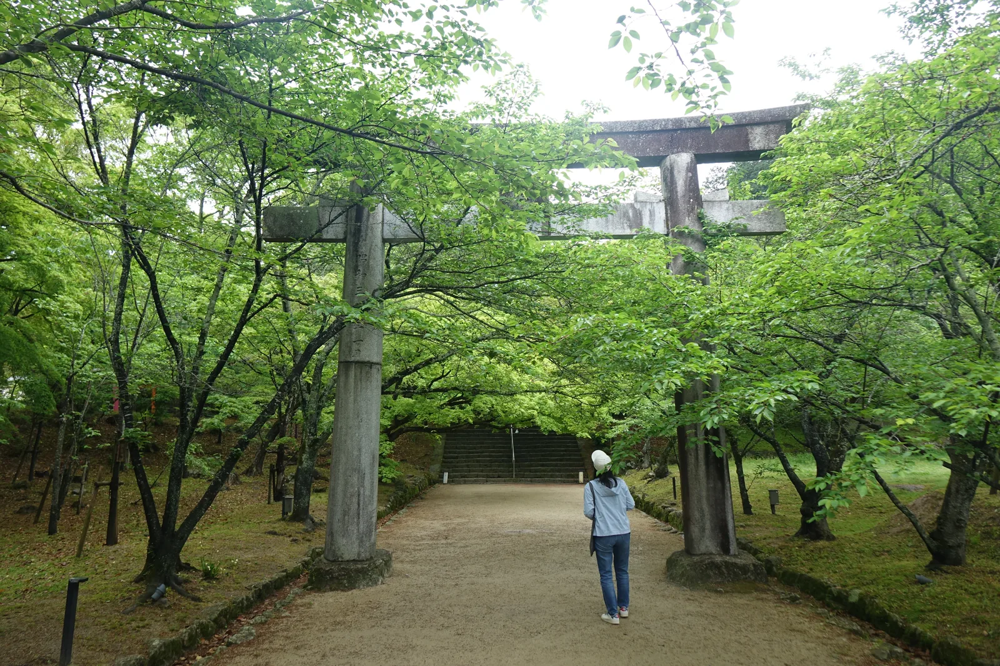

*仮殿內部的祭祀空間。段狀的木製長凳上雕著梅紋，簷口壓得低而深卻沒有真正隔開內外，黑色天花板做出垂木般的節奏，深處的御帳與祭壇隱約可見。*

站在仮殿前面看不出來的事，寶物殿的展覽全部攤開來說了。展場中央擺著一座百分之一
模型，銘板寫著設計為藤本壯介建築設計事務所、施工為竹中工務店、二〇二三年五月竣工，
模型本身則是二〇二四年八月才做的；模型把仮殿與它背後的御本殿放在同一塊底板上，
兩座屋頂的高低與距離一目了然。

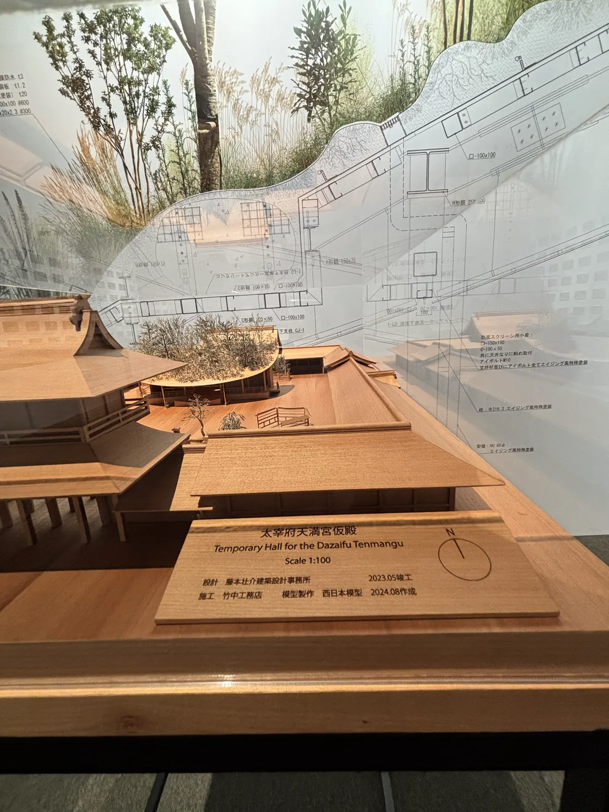

*寶物殿展場中央的仮殿百分之一模型，銘板記著「設計 藤本壮介建築設計事務所／施工 竹中工務店／2023.05竣工／模型製作 西日本模型 2024.08作成」；模型左側是御本殿，兩者的位置關係在這裡才看得清楚。*

模型背後那面半透明的構造詳圖，說出了一件現場看不見的事：那些看起來細瘦、
質感老舊的柱子不是木頭，是圖上標著「柱：Φ216.3」的鋼管，旁邊註明要施以
「エイジング風特殊塗装」——做舊處理的特殊塗裝；屋頂底下也不是垂木，
是H形鋼與C形鋼組成的鋼骨架。長成森林的那個屋頂，重量得由鋼構撐著。

同一面牆上還有一張以四季排成環狀的植栽圖，標題是「季節ごとに彩りを添える
仮殿屋根の草木・花」——春、夏、秋、冬各據一方，每個季節下面貼著當季開花或轉色的
草木照片與名稱，連幾月開都標了出來。臨時建築的植栽被當成永久建築在設計，
因為它得撐過三個年頭的四季。

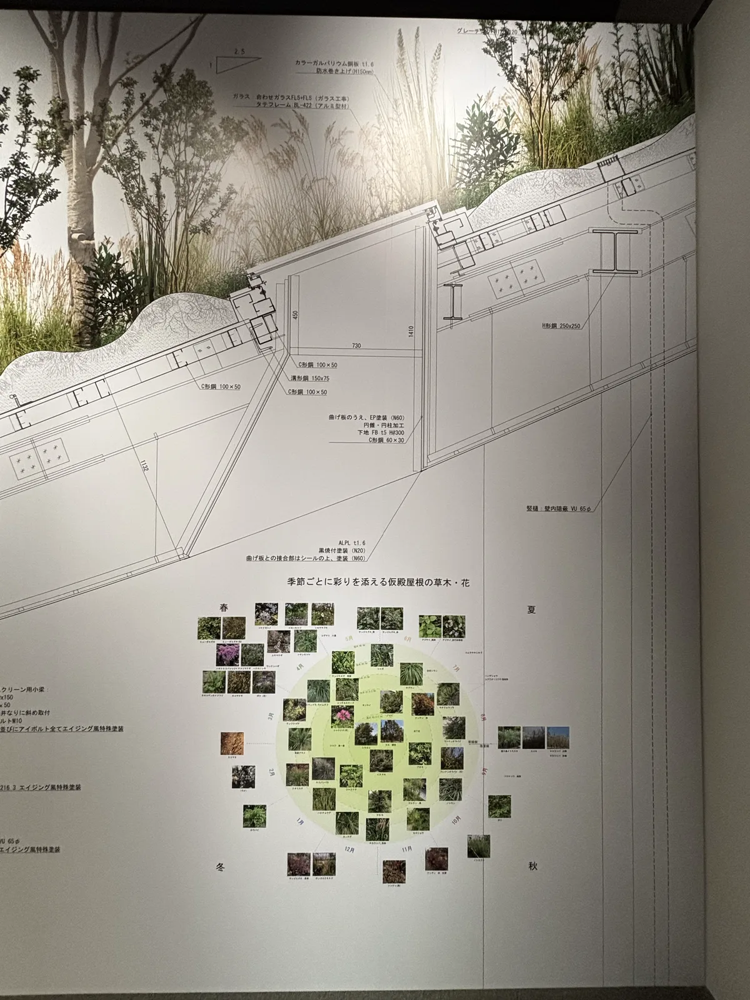

*展場牆面的植栽季相圖，標題寫著「季節ごとに彩りを添える仮殿屋根の草木・花」，四季環狀排列、逐月標出開花與轉色的種類；上半部是同一張圖上的屋頂構造詳圖，密密註著鋼材規格與塗裝做法。*

御本殿的修復本身也值得記一筆：這是它一百二十四年來第一次大規模整修，
屋頂全面更換檜皮（用去岡山縣產檜皮約三十萬片），漆塗與金箔重新上色，
於二〇二三年五月動工，二〇二六年五月完工，正好趕在二〇二七年
「菅原道真公一一二五年式年大祭」之前；同一批記念事業還包括樓門與迴廊的改修、
防火防災設施整備，以及「天神の杜」的環境保全。

宮司選擇讓御本殿的修復維持傳統工法，把當代設計的挑戰留給只存在三年的仮殿——
**該守住的守住，該冒險的讓它冒險**，兩件事分別放在兩棟建築上。

一座臨時建築配得上一整場回顧展。「藤本壯介展——太宰府天滿宮仮殿之軌跡」在寶物殿
企畫展示室展出，會期從令和六年八月十日一路排到令和七年九月十五日，
展場兩側牆面貼滿被放棄的早期方案——曲面屋頂在成為現在這個樣子之前，被反覆推翻過很多次。

道真公生前擅長漢詩與制度改革，死後被奉為文化藝術之神；神社歷代宮司也習慣把最先端的
創作請進境內。從室町時代的曲水之宴到今天的建築展覽，這裡從來不是一座只守著舊東西的神社。

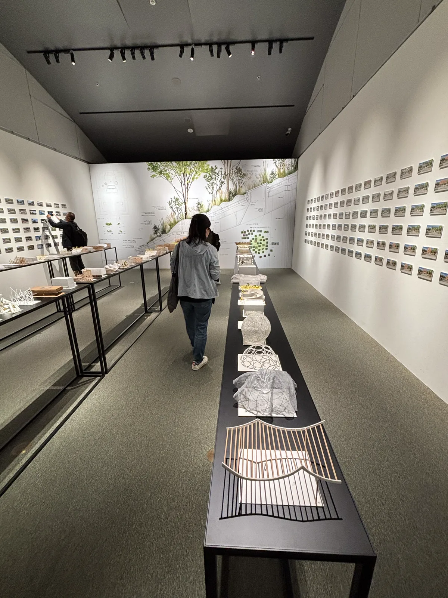

*「藤本壯介展——太宰府天滿宮仮殿之軌跡」展場，狹長的白色空間中軸線上排著模型長桌，兩側牆面整片貼滿被放棄的試案與草模。*

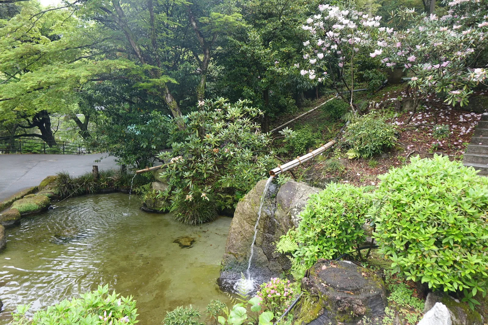

*太宰府天滿宮寶物殿入口，「藤本壯介展——太宰府天滿宮仮殿之軌跡」的展覽海報，空拍圖清楚可見仮殿曲面屋頂與後方御本殿的位置關係。*

## 延壽王院的三年

參道盡頭那扇正對著遊客的門，是延壽王院。它原本是安樂寺天滿宮時代的宿坊，
後來成為留守別當大鳥居家的居所，現在則是宮司西高辻家的宅邸，不對外開放；
從柵欄外往門內看，能看見一塊刻著「五卿遺蹟」的石碑。一條被土產店與抹茶霜淇淋
塞滿的參道，盡頭是一座維新史的現場。

事情從文久三年（1863）八月十八日的政變開始。失勢的三條實美等七位公卿被逐出京都、
南下長州，其後第一次長州征伐的降伏條件之一，是把他們移交福岡藩；扣掉在生野舉兵的
澤宣嘉與在下關病歿的錦小路賴德，剩下的五人——三條實美、四條隆謌、三條西季知、
東久世通禧、壬生基修——於慶應元年（1865）二月十三日帶著隨從進入延壽王院。

福岡藩主黑田長溥原本打算把五卿分散到九州各藩，怕他們聚在一起會成為尊王攘夷派的
象徵；五卿堅決不肯分開，最後才一起落腳太宰府。接下他們的是大鳥居信全——他是
三條實美之父實萬的堂弟，勤王之志甚篤，把自家的延壽王院讓了出來。至於三條實美自己
願意來的理由，除了這層親戚關係，還因為這裡是道真公的墓所：同樣被逐出京都的人，
後來洗清了污名成為神明。

五卿住下之後，太宰府就變成了情報的匯集點。他們抵達十天左右，西鄉隆盛就來了；
坂本龍馬帶著日後薩長同盟的構想來見三條實美，請他引介桂小五郎——當時薩摩與長州
還水火不容。在場的東久世通禧留下一句對龍馬的評語：「坂本龍馬は偉人であり、
奇説家である。」慶應三年（1867）十二月十九日王政復古、五卿復官上洛為止，
這三年間造訪太宰府的志士名單，長到得用一整面解說板才寫得下。

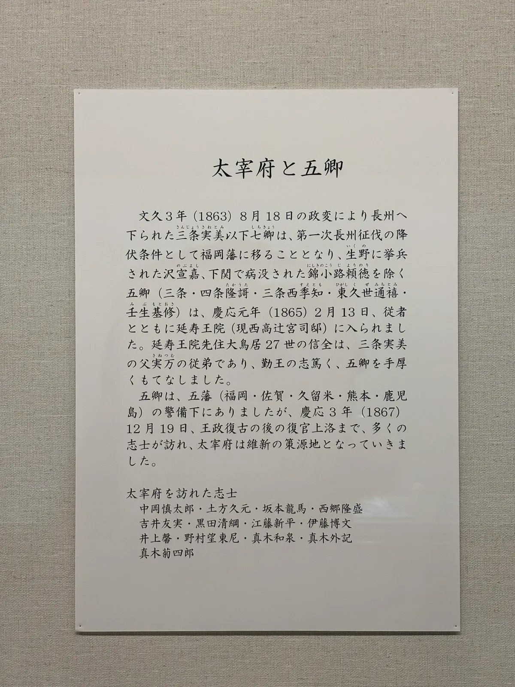

*寶物殿常設展的「太宰府と五卿」解說板，末段列出造訪太宰府的志士：中岡慎太郎、土方久元、坂本龍馬、西鄉隆盛、吉井友實、黑田清綱、江藤新平、伊藤博文、井上馨、野村望東尼、真木和泉、真木外記、真木菊四郎。板上寫明太宰府因此成為「維新の策源地」。*

守著這段歷史的大鳥居家，在更早以前就把太宰府送出去過一次。展場另一件複製品是
「太宰府天満宮絵図」，元祿四年（1691）作，原件為道明寺天滿宮所藏；解說牌寫著
繪圖的奉納者大鳥居信祐生於筑後國水田天滿宮的總領之家，是江戶龜戶天神社的創建者。
圖上畫著天拜山、なまづ石這些菅公傳說之地與附近的名所舊跡，每個地點旁邊都散寫著
相關的和歌——一張把太宰府整片地景折進畫面裡的說明書。

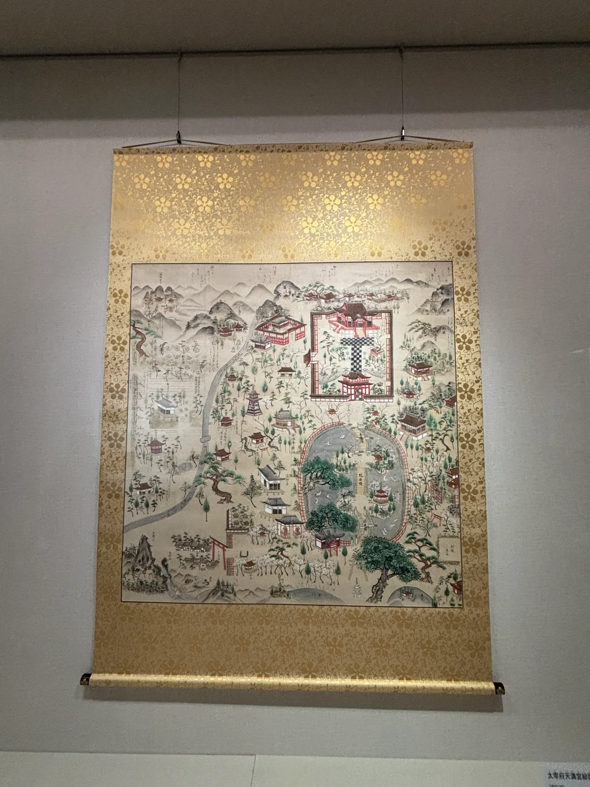

*寶物殿常設展的「太宰府天満宮絵図」（元祿四年／1691，道明寺天滿宮藏，複製），金地裝裱的境內圖上，社殿、參道、心字池與周邊山林一併入畫，各處散寫著相關和歌。*

## 祭儀與授与品

這裡的曆法圍著一個數字轉。道真公生於承和十二年（845）六月二十五日、
薨於延喜三年（903）二月二十五日，於是「二十五」成了與天神最相關的數字：
每月二十五日有月次祭，每二十五年舉行一次式年大祭。令和九年（2027）
就是薨後一千一百二十五年的式年大祭之年，御本殿的大改修正是為它做的準備。

▲ 二十五年一次的節拍器
歷次式年大祭在寶物殿的年表上排成一條線，有趣的是每一次都連著一項地方建設：
明治三十五年（1902）的一千年大祭，前一年文書館竣工，同期九州鐵道二日市站與太宰府
之間的太宰府馬車鐵道開通；昭和三年（1928）的一〇二五年大祭，寶物殿開館，
昭和二十八年（1953）成為福岡縣第一號登錄博物館，現在的建物則是平成四年（1992）
全面改築的；昭和五十二年（1977）的一〇七五年大祭，前一年橫綱輪島與北の湖
在境內舉行了土俵入。二十五年一次的祭典，順便成了這座町的更新節奏。

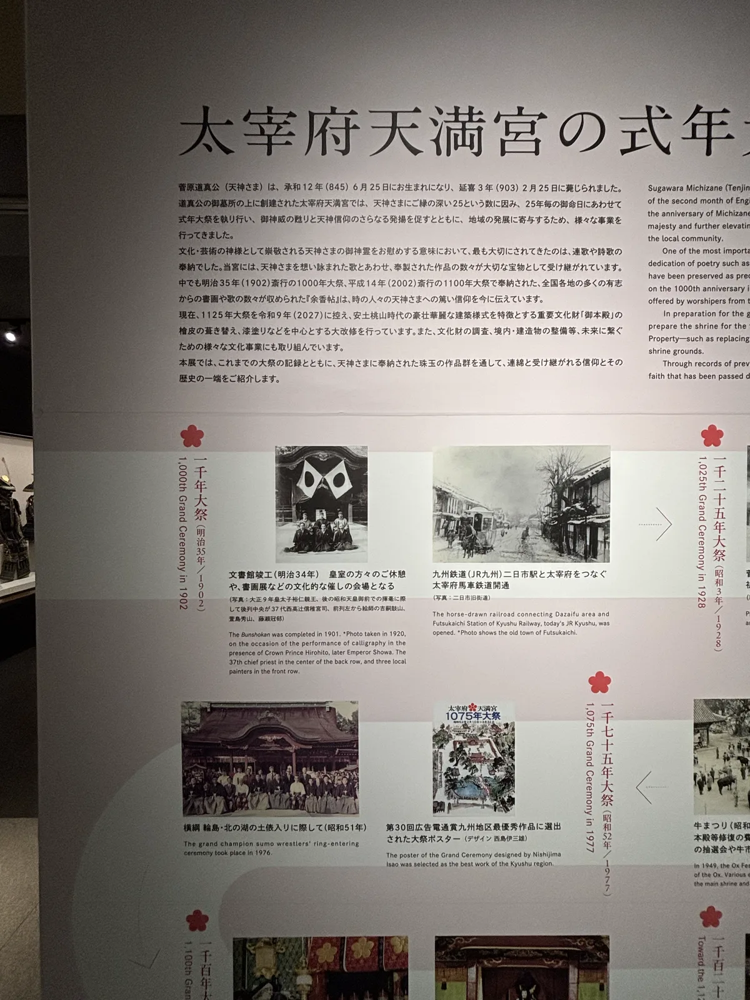

*寶物殿常設展的「太宰府天満宮の式年大祭」年表，以一千年大祭（明治三十五年／1902）、一〇二五年大祭（昭和三年／1928）、一〇七五年大祭（昭和五十二年／1977）為節點，逐次列出當年的記念事業與影像；文字明記現正為令和九年（2027）的一一二五年大祭進行御本殿大改修。*

▲ 神幸式大祭（秋分之日的前兩天〜九月二十五日）
本社最重要的祭典，據載始於平安時代康和三年（1101）大宰權帥大江匡房之手，
現列福岡縣無形民俗文化財。秋分前一日的「お下りの儀」，先在一聲「滅燈」中熄掉
所有燈火，宮司把御神靈自御本殿遷入神輿，隊伍走約三公里到榎社過一夜；
先導的太鼓與鐘聲「どんかん」，讓這場祭典另有「どんかん祭り」之名。
翌日「お上りの儀」由御巫女奏倭舞後起駕，途中在三面環水的浮殿休息，
入夜的「お移りの儀」再過太鼓橋回到御本殿，於黑暗中還御，並奉納竹の曲。
九月二十五日例祭當晚，心字池上點起無數蠟燭的「千燈明」，為大祭收尾。

▲ 其他年中行事
・**一月七日**——鷽かえ・鬼すべ神事
・**二月二十五日**——梅花祭
・**三月第一個星期日**——曲水の宴
・**七月七日**——七夕祭
・**十月十八日**——特別受驗合格祈願大祭（期間十月一日〜三十一日）

▲ 授与品
學問之神的授与品以學業守與學業鉛筆為主，另有飛梅祈願與厄晴れひょうたん；
御神牛像的頭被摸得發亮，社方說法是撫其頭可得智慧。
門前町的梅ヶ枝餅則不是社方授与品，而是這一帶最普遍的名物餅菓子，
外皮印著梅紋，內餡是紅豆沙。

## 晨間路線之擬定及其限制

太宰府觀光協會有一條現成的官方步道「歷史散步道」，從天滿宮參道一路延伸到水城跡，
全長約四點四公里，沿途每五十公尺就埋著一塊「文樣塼」（帶有新羅風格紋樣的磚塊）
當作路標，把大宰府政廳跡、觀世音寺、坂本八幡宮這些古代遺跡串成一條可以走完的線。
太宰府市另有官方城市地圖，用橙色虛線把這整條路徑畫了出來，起點就在天滿宮參道口。

▲ 建議走法（早上出發，約1.5〜2小時，折返回西鐵太宰府站）
1. 西鐵太宰府站觀光案內所取地圖
2. 參道（店家多半還沒開，石疊路很安靜），沿途看和魂漢才碑
3. 參道盡頭的延壽王院——門外看一眼「五卿遺蹟」碑
4. 太鼓橋、心字池、樓門，參拜仮殿
5. 轉往光明禪寺方向，隔牆望一眼紅葉庭園（寺內不開放入內）
6. 折返天滿宮，沿「歷史散步道」南下
7. 朝日地藏尊 → 日吉神社 → 觀世音寺・戒壇院
8. 大宰府政廳跡與坂本八幡宮（史蹟公園裡歇一段）
9. 原路折返西鐵太宰府站

▲ 想把神幸式那條路走一遍的話：從政廳跡再往南約一公里就是榎社，道真公謫居而歿的
南館舊址，現在是天滿宮的飛地境內；從那裡步行約十分鐘可到西鐵二日市站，
不必折返。代價是全程拉長到六公里上下，且榎社本身只是一座安靜的小社，
沒有解說設施，得先知道它是什麼才看得出什麼。

▲ 為什麼是早上：太宰府天滿宮是全國參拜人數數一數二的神社，白天參道與境內都是人潮。
清晨這段時間，太鼓橋的水面、仮殿前的石板路，還有歷史散步道上的史蹟公園，
都還沒被日間的觀光人潮填滿。梅ヶ枝餅適合留到回程再邊走邊吃。

▲ 距離與路況：天滿宮到大宰府政廳跡一段折返，總長落在三到五公里之間，約一個半到兩小時；
若要走完整條四點四公里的歷史散步道到水城跡，需另外規劃約三小時。
沿途以平坦柏油路與石疊路為主，沒有需要特別留意的坡段。

▲ 接下來往哪走：往北約一小時車程可達福津市，若同一趟旅程安排福岡北部，
可接續 [[10-miyajidake-jinja]]。

▲ 地圖
太宰府市發行的《Dazaifu Tourist Guide Map》（2025年10月版），用橙色虛線畫出
「歷史散步道」路徑，天滿宮境內拡大圖與廣域圖各佔一頁，沿途主要景點皆已編號標示。

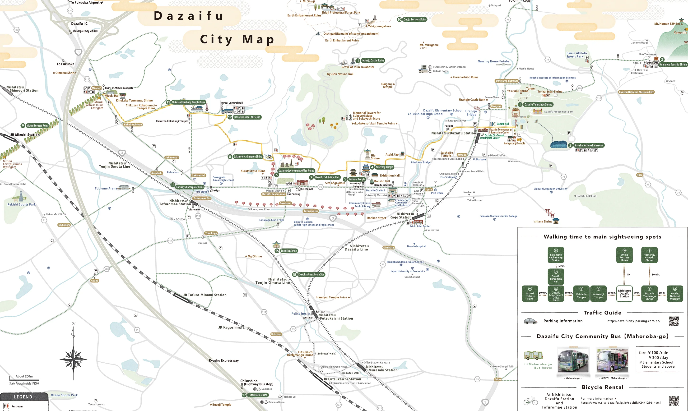

*Dazaifu City Map（發行 太宰府市・太宰府觀光協會，2025年10月版），橙色虛線為「歷史散步道」。*
