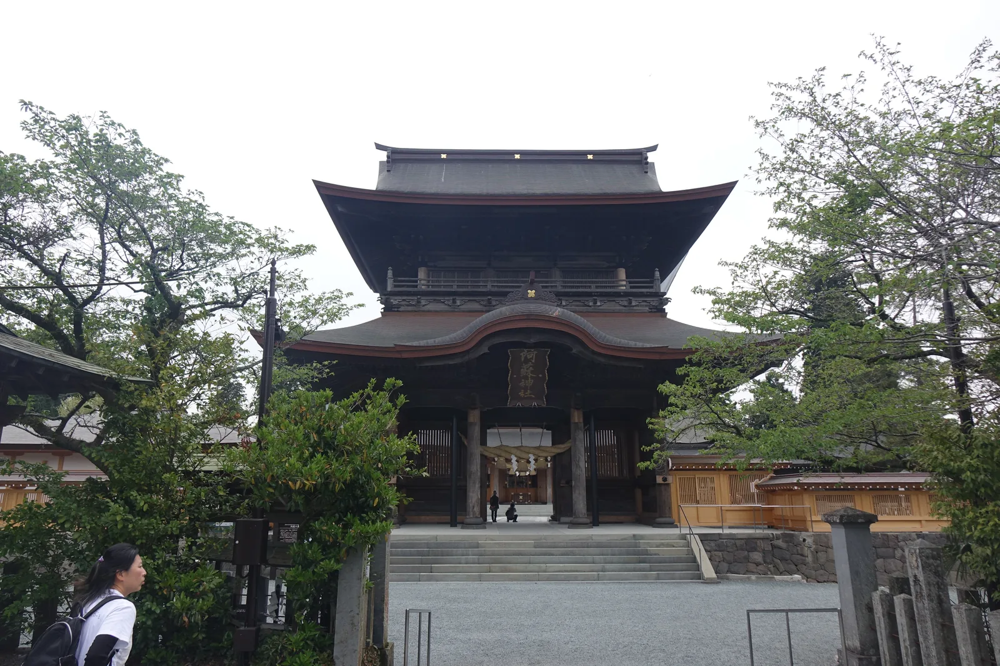
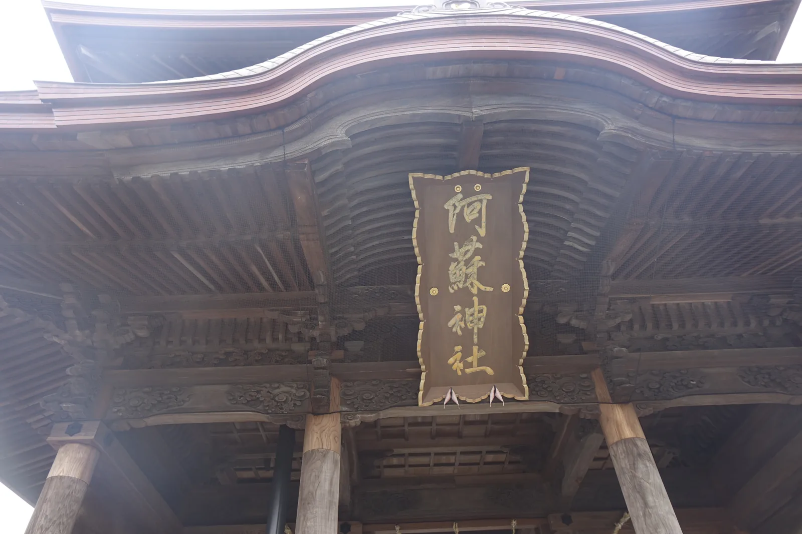
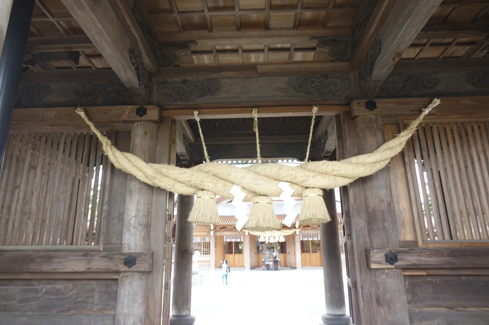
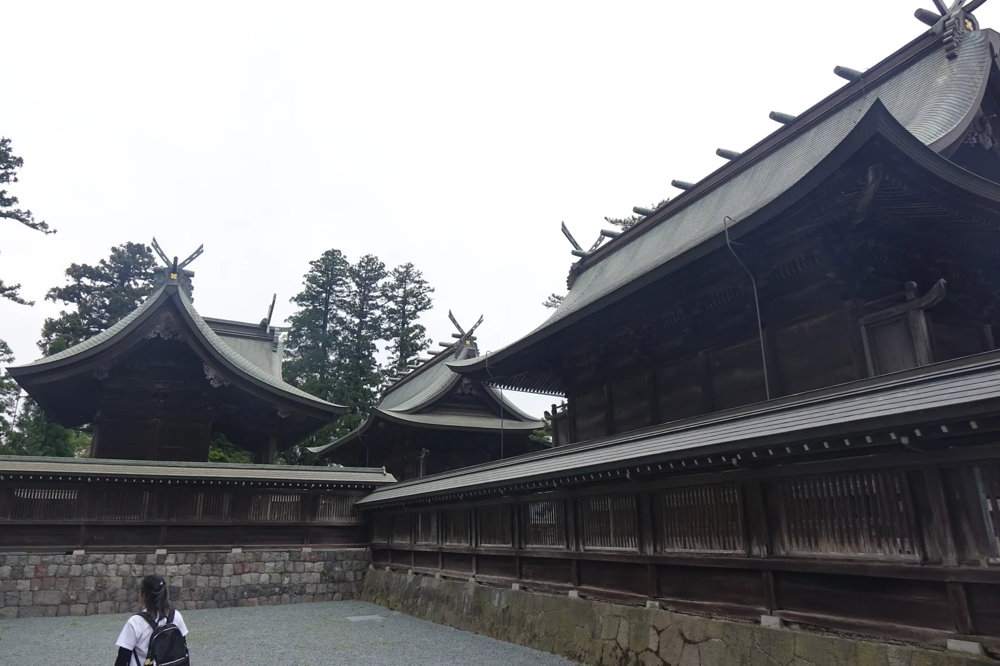
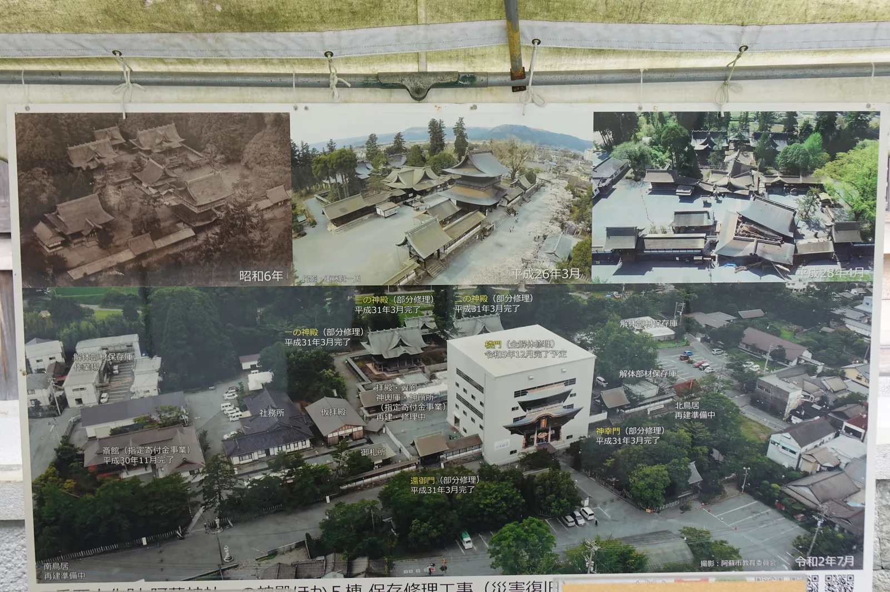
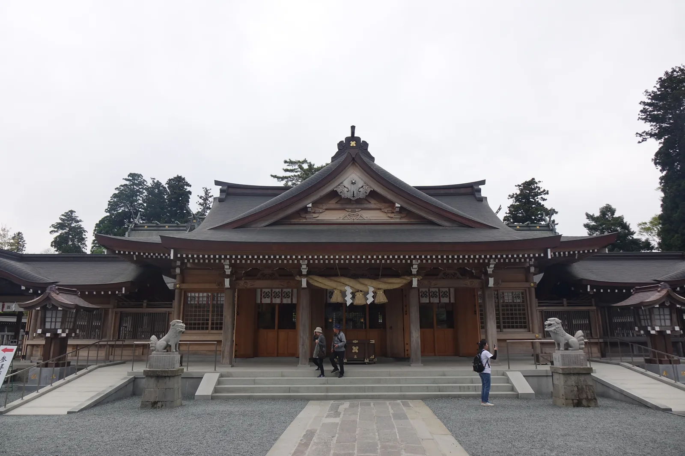

## 我的想法

<!-- 待 Chris 本人填寫，本階段留空 -->

## 導言

樓門是二〇二三年十二月才重新站起來的。地震把它壓成一堆木頭，那是二〇一六年四月，
中間隔了七年半。而整座神社的災害復舊事業宣告結束，是二〇二五年二月十七日；
我走進這裡是同年四月——距離全部完工，兩個月。

門很大，十八公尺高，兩層。穿過去是白砂與新的拜殿。社殿三棟朝著東邊排成一列，
左右對稱，而參道不從正面來——它南北橫過門前，樓門就立在那條橫參道的中央。
往西兩公里三，另有一座神社，那裡祭祀的是被這座神社的主祭神砍下頭的人。

*樓門正面。三間一戶的二重門，上下兩層屋簷都往兩端翹起，下層中央做成弓形的曲線；黑褐色的木頭在陰天裡壓得很沉，門洞裡橫著注連繩。石階前的地面是白砂，兩側連著木造的迴廊與塀。這是二〇二三年十二月才重新組裝完成的那一座。*

## 御神體係火口之認定

阿蘇神社祭祀的是**健磐龍命**（Takeiwatatsu-no-mikoto），神武天皇的孫神，開拓阿蘇的神，
連同他的家族神一共十二柱。這座神社是肥後國的一の宮，
全國大約五百座阿蘇神社的總本社，宮司職由**阿蘇氏**世襲——
中世的時候這一家武士化，長成代表肥後的豪族。分社會有五百座，理由在這裡。

但這座神社真正拜的東西不在境內。阿蘇山頂的火口，湯溜在底下，自古稱作**神池**，
那就是阿蘇神的御神體。
山上另有一座**阿蘇山上神社**，只有一座遙拜火口的拜殿，沒有別的。
在歷史上，山上的叫**上宮**，山下的這一座叫**下宮**。

換句話說：這是一座火山的神社。古代阿蘇火口的變異會經由太宰府上報朝廷，
火山的動靜就是神的動靜——這件事抬高了阿蘇神在國家祭祀裡的位置。
現在每年六月上旬，山上神社還會舉行**火口鎮祭**，把御幣獻進去，祈求活動平穩。

至於這座神社從什麼時候開始，社記寫的是孝靈天皇九年——換算成西曆是紀元前二八二年。
官方自己的說法是「兩千年以上的歷史」。這是社傳，不是年表。
能確定的是：這座神社的祭祀對象，是一座到今天還在噴的火山。

## 立地非屬偶然

御神體在山上，神社在山麓。這一點與 [[15-kamishikimi-kumanoimasu-jinja]] 的岩、
[[16-amanoiwato-jinja]] 的洞是同一件事的不同形態——**拜的東西與拜的地方，不在同一個位置**。
差別在於，這裡的那個東西還會噴火。

山麓有水。阿蘇神社的參道接出去就是門前町的商店街，
那一帶湧水多，設了三十六處**水基**（mizuki，路旁的湧水飲水場），
木造或石造，就擺在路邊給過路的人喝。
火山把水存在地下，再從街上還回來——門前町的熱鬧是這麼來的。

而往西，地形是一片平的。宮地的街走完是水田，水田過去兩公里三，
就是**霜神社**。兩座神社的緯度幾乎一樣，一東一西，中間隔著人耕的地——
那片地會不會結霜，正是兩座神社共同管的事。

## 參道形制及其空間效果

這座神社的配置在日本的神社裡少見：**神殿三棟與三座門朝東而立，左右對稱**；
而參道**南北橫過**，樓門就立在那條橫參道的中央，面向東方。
一般的神社是參道正對社殿、人從正面走進去；這裡是人橫著走過，再轉進門。

*樓門正面的扁額，金字寫著「阿蘇神社」，掛在唐破風下的組物之間。四周是密密層層的斗栱與垂木，木色深褐，靠近屋簷的地方還看得到新舊木料的色差——約七成的部材是從倒壞的舊門上回收再用的。*

*從樓門底下往內看。一條粗大的注連繩橫過門洞，垂下三束稻草與白色紙垂；天花板露出整組的組物與彩色的雕刻，兩根圓柱撐在兩側。穿過去的另一頭是白砂鋪地的境內與拜殿。*

**樓門**是嘉永三年（一八五〇）的建築，三間一戶二重門，高約十八公尺，
以二重門而論是九州最大——官方的措辭是，也有人說它是「日本三大樓門」之一。
兩側各立一座四腳門，北為**神幸門**（一八四九），南為**還御門**（一八四九）。
再往裡是**一の神殿**（天保十一年・一八四〇，五間社入母屋造）、
**二の神殿**（一八四二，同形式）與**三の神殿**（一八四三，三間社流造）。

這六棟是天保六年（一八三五）到嘉永三年之間，熊本藩寄進重建的，
二〇〇七年一併指定為國家重要文化財。全部**總欅造**，
屋根當初是柿葺（kokerabuki，薄木片鋪成的屋頂），現在改成銅板葺；
軸部與組物上刻著波頭紋與雲紋。
造營的大工棟梁叫**水民元吉**（一八一五〜一八八七），二十二歲被拔擢為阿蘇宮造營的棟梁，
後來成了藩的御用大工。

*拜殿背後的神殿群，三棟並排朝東而立。屋頂是氧化成青灰色的銅板，千木與鰹木排在棟上；前方是黑色的木塀與石垣，塀上開著細密的連子。這一排就是天保十一年到天保十四年之間，熊本藩寄進重建的三棟神殿。*

然後是二〇一六年四月。熊本地震是觀測史上第一次記錄到兩次震度七的地震，
樓門倒了，拜殿也倒了。

復舊分成兩期。第一期（二〇一六〜二〇一八年度）做神殿與神幸門、還御門的部分解體修理，
以及倒壞樓門的解體——解體回收的部材大約一萬一千件。
第二期（二〇一九〜二〇二三年度）只做一件事：把樓門裝回去。
最後**大約七成的部材重新用上**，並加了構造補強。
二〇二三年十二月七日舉行竣工祭，從地震算起七年半。

境內有一面工程說明的幕，上面貼著四張空拍：昭和六年、平成二十六年三月、
地震後的平成二十八年，以及令和二年七月。最後那一張上，樓門的位置是**一個巨大的白盒子**——
把整座門包起來的假設上屋，牆面印著門的原貌。
幕上逐棟標著進度：三棟神殿與兩座門，部分修理，平成三十一年三月完了；
樓門，全解體修理，令和五年十二月完了預定；拜殿與翼廊，再建・修理中；
北鳥居與南鳥居，再建準備中。那是二〇二〇年的阿蘇神社：門在盒子裡，拜殿還沒有，
參拜的人拜的是一座臨時的拜殿。

*境內的工程說明幕。上排三張空拍照分別是昭和六年、平成二十六年三月，以及地震後的平成二十八年；下方那張大的攝於令和二年七月，逐棟標著工程狀態——三棟神殿與兩座門「部分修理　平成三十一年三月完了」，樓門「全解體修理　令和五年十二月完了預定」。畫面中央那個包住樓門的白色巨大方盒，就是施工用的假設上屋。*

## 討伐者為被討伐者焚火

拜殿是後來重建的，用的是熊本縣產的木材。
其中一部分來自**阿蘇中央高校**的學校演習林——地元的高中把自己林子裡養了幾十年的樹捐出來，
蓋了這座神社的拜殿。宮司在復舊完成的致辭裡特別寫了這一段。

*重建後的拜殿正面。入母屋造的屋頂配銅板，木頭是淺色的新材，正面掛著注連繩；石階前的參道用石板鋪成，兩側各蹲著一頭石造狛犬。這棟建築用的是熊本縣產的木材，其中一部分來自地方高中的學校演習林。*

但這座神社與地方之間最長的一條線，不在境內，在西邊那兩公里三。
阿蘇的神話裡，健磐龍命責備家臣**鬼八**（Kihachi）的過失，斬了他的首。
鬼八的怨恨變成霜害，住民年年受苦。
**後來健磐龍命祭祀鬼八，並且為了溫暖那道斷頸的傷口，開始了火焚神事。**

這段不是傳說的裝飾，是現在還在執行的祭儀。**火焚神事**（hitaki-shinji）
在阿蘇神社附近的霜神社舉行，
時間是**八月十九日到十月十六日**——將近兩個月，火不能斷。
氏子地區選出一位童女，稱作**火焚乙女**，由她溫暖御神體；
氏子地區的住民則輪班守火，輪整整兩個月。

而這套祭儀是有名份的。阿蘇神社、國造神社與霜宮所行的一連串祭事，
以稻作的節奏排成一圈——預祝、播種、田植、災除、收穫、再預祝——
在昭和五十七年（一九八二）被指定為**國家重要無形民俗文化財**「阿蘇の農耕祭事」。
也就是說，**為被斬首者取暖這件事，是國家指定的文化財的一部分。**

[[17-takachiho-jinja]] 那邊也有一個鬼八。那一則裡討伐他的是三毛入野命，
遺體被切成三段埋在三處，而那座神社每年舊曆十二月三日獻上一頭豬安撫他。
討伐者不同，來歷不同，是兩則各自傳下來的故事，接不成一條。
但兩邊做的事情一樣：**討伐的那一方，親自去祭祀被討伐的那一方**，
一個獻豬，一個燒火。
[[15-kamishikimi-kumanoimasu-jinja]] 的穿戶岩是這一則裡他逃亡時踢穿的洞。

## 祭儀與授与品

阿蘇的祭典是跟著稻子走的。**御田祭**（Onda-matsuri，正式名稱御田植神幸式）
在七月二十八日。
神社裡的十二位神分乘四基神轎組成行列，繞行神社周邊的青田，
看稻子長得如何。隨行的有全身白裝束的女性，稱作**宇奈利**（unari），
連同其他人一共約兩百人。行列走的時候唱田歌，中途在兩處御旅所停下，
在那裡舉行田植式——把稻穗朝著神轎的屋頂扔上去。

**田作祭**在三月，日子是初卯到下一個卯日之間的申日，晚上舉行。
祭典的內容是社家祖先神國龍神的婚儀，據說當年地方的人舉著松明迎接姬神，
所以這場祭典又叫**火振り神事**（hifuri-shinji），參加的人繞著揮動火把。
山上那邊，六月上旬另有火口鎮祭。

一年繞完是這樣的：三月點火迎親，七月抬神轎看田，八月到十月在西邊的神社裡守火，
十月十六日火熄，收成。

## 晨間路線之擬定及其限制

這條路線是一條直線，往西走。從阿蘇神社出發，先走**橫參道**——它南北橫過樓門前，
往南接的是門前町的商店街。三十六處水基就散在那一帶的路邊，
一路走一路有水可以喝。從神社穿過商店街，走五分鐘左右會遇到舊的洋裁女學校，
木造校舍現在給店家用。

從那裡轉上縣道一一〇號，一路往西。宮地的街收在後面，兩側變成水田。
走大約三公里、四十分鐘，抵達**霜神社**。
再往南走兩公里到 JR 阿蘇車站，可以搭車回去。全程約五公里，兩個小時。

**走的順序本身就是這條路線的內容**：從討伐者的神社，走到被討伐者的神社。
兩座神社的緯度幾乎相同，中間是他們共同管的那件事——稻子會不會被霜打壞。

▲ 限制
・**火焚神事是八月十九日到十月十六日。**其他季節走到霜神社，那裡沒有火。
　我去的是四月。
・霜神社的現況、參道與火焚殿的位置，我沒有走到，
　出發前值得先確認一次。
・縣道一一〇號有沒有人行道，地圖上看不準，這段要先查。
・時間不夠的話，只走前半段也成立：宮地車站到阿蘇神社徒步十五分鐘，
　繞完境內與門前町再走回車站，約三公里、一小時。
　那樣走完的是「門在盒子裡出來以後的樣子」，西邊那一段留著。

▲ 往別的方向
往北約六公里是**國造神社**，別名北宮——農耕祭事的另一個舞台，與這裡和霜宮是同一套指定。
往山上是上宮，火口的那一座；那不是走路的距離。
