## 我的想法

<!-- 待 Chris 本人填寫，本階段留空 -->

## 導言

從青島車站走出來，一條筆直的參道往海邊去，八百公尺，車子開不進來。
走到底是沙灘，沙灘外面的海面上鋪著一片灰黑色的岩——
一道一道平行的稜線，一路延伸到看不見為止。那叫鬼の洗濯板。

橋在洗濯板的上方跨過去。過了橋是島，島不大，樹幾乎長滿，
那些樹是**蒲葵**（ビロウ birō，扇形葉的棕櫚科喬木），葉子一片一片壓著陽光，
朱紅色的社殿就在林子中間。

從社殿旁的門穿出去，路變窄，兩側是密到看不見天的林。
六十公尺以後是元宮。地上有東西——貝殼、石頭，還有碎掉的陶片，
一層一層鋪在樹根之間。

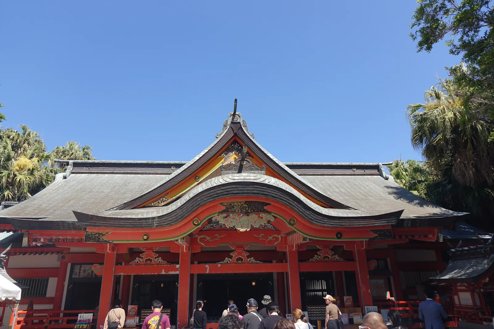

*拜殿正面。朱紅色的柱與欄杆，屋頂是灰色的銅板；唐破風（中央拱起的弓形山牆）與千鳥破風（屋坡上另加的三角形山牆）的底下佈滿彩色的雕刻，朱、金、綠都有，在南國的強光下顯得更鮮。殿前站滿了參拜的人，兩側是蒲葵與蘇鐵。*

## 御宮居之跡係海神宮還幸之認定

青島神社祭祀三位神：**彦火火出見命**（Hikohohodemi-no-mikoto）、
他的妻**豐玉姫命**，以及**鹽筒大神**。彦火火出見命就是「海幸彥・山幸彥」故事裡的山幸彥。
他把哥哥的釣鉤弄丟了，在海邊發愁的時候鹽筒大神出現，教他造船到海裡去找。
他照做，在海神宮外的井邊被侍女發現，侍女通報海神的女兒豐玉姫，
於是他在海神的宮裡受款待——一轉眼過了三年。
某天他嘆了口氣，人家問他怎麼了，他才說出來意。
海神召集魚群，在鯛的喉嚨裡找到了那枚釣鉤。
他帶著釣鉤回陸地，臨行海神給了他兩顆珠，一顆叫鹽滿瓊，一顆叫鹽涸瓊。

**這座神社是他從海神宮回來以後，落腳的地方。**官方的措辭是「御宮居之跡」。
祭祀從什麼時候開始，官方說不清楚。有紀錄的是平安時代的國司巡視記《日向土産》，
裡面寫著「嵯峨天皇之御宇奉崇青島大明神」——大約一千兩百年前。
室町的文龜年間以後，藩主伊東家崇敬這座神社，改建社殿、維護境內。
明治以後，來的人變多了，官方自己的說法是：人們來看的是「熱帶植物繁茂的國內絕無的靈域」。

但這座島上被祭祀的時間，比神話能追到的更早。島的深處有一座**元宮**，
相傳是青島神社原本的所在。
那裡出土過**彌生式土器與獸骨**——官方據此推定，古時候這裡就有小祠，有人在祭祀。
神話講的是三代神的事，土器講的是彌生時代的事。兩者疊在同一塊地上。

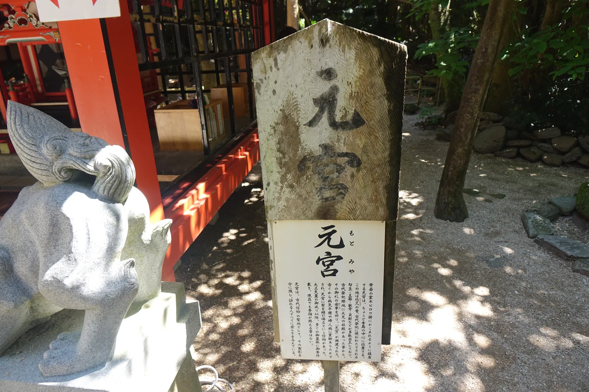

*元宮的石標與旁邊的白色狛犬。石柱風化得厲害，刻著「元宮」兩字，底下的木牌是解說。背後是朱紅色的社殿一角與格子窗，四周是蒲葵林的樹影與砂地。這裡出土過彌生式土器與獸骨。*

## 立地非屬偶然

先說島周圍那片岩。海岸的案內板寫得清楚：青島周邊的岩盤是**約六百五十萬年前**、
新第三紀的互層，
傾斜著露出海面，被波浪侵蝕，硬的部分留下、軟的部分被掏走，
於是變成一道一道平行的稜。這種地形從日南海岸的戶崎鼻一直分布到巾着島。
一九三四年，它以「青島の隆起海床と奇形波蝕痕」之名指定為國家天然記念物。
當地人叫它**鬼の洗濯板**。

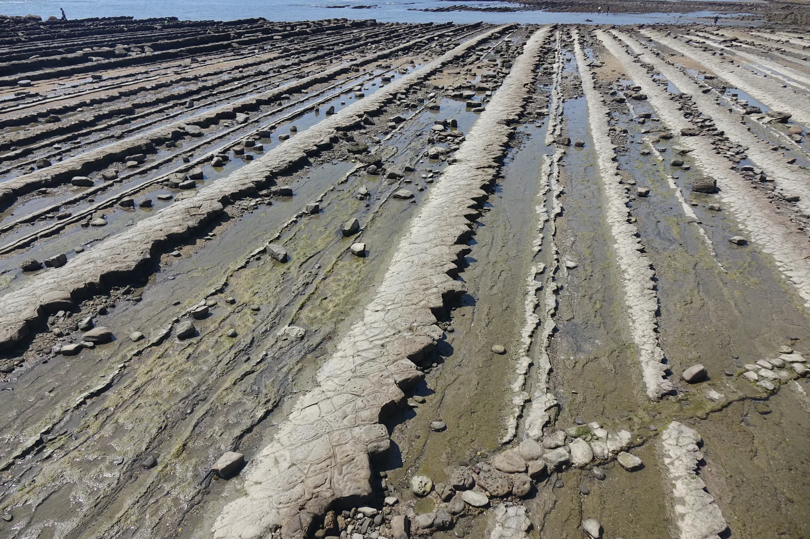

*島周圍的波狀岩。一道道平行的岩稜從腳下延伸到海面，稜與稜之間積著水與碎石，表面帶著綠藻。這是約六百五十萬年前的互層傾斜露出海面以後，硬的部分留下、軟的部分被波浪掏走的結果，一九三四年指定為國家天然記念物。*

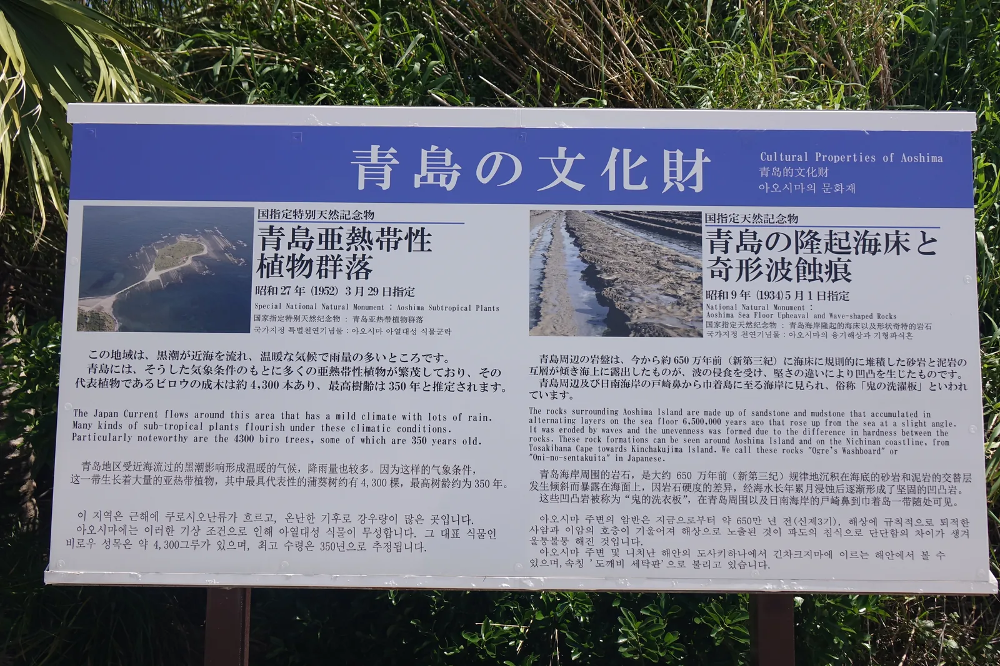

*海岸邊的案內板，把島上兩件國家指定的天然記念物並排寫在一起：左邊是「青島亞熱帶性植物群落」，特別天然記念物，昭和二十七年三月二十九日指定，蒲葵成木約四千三百株、最高樹齡三百五十年；右邊是「青島的隆起海床與奇形波蝕痕」，昭和九年指定，岩盤約六百五十萬年前。四種語言並列。*

再說島上那片林。黑潮從近海流過，氣候溫暖，雨多，於是島上長滿亞熱帶的植物，
其中最具代表性的是**蒲葵**，成木**約四千三百株**，最高樹齡推定**三百五十年**。
一九五二年三月二十九日，整片指定為國家**特別**天然記念物。

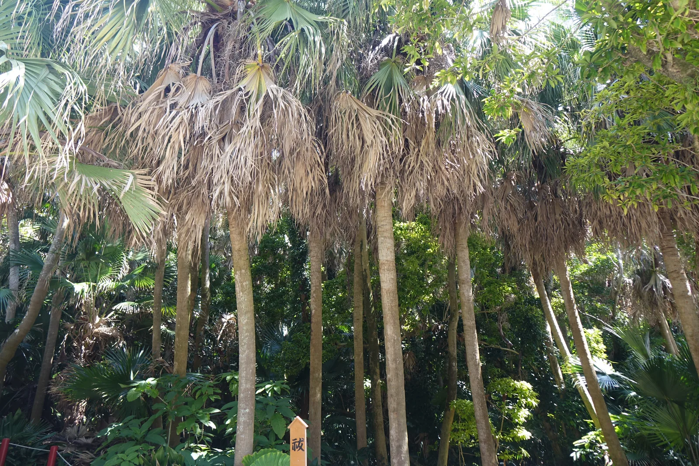

*島上的蒲葵。細長的樹幹密密站著，扇形的葉子在頂端張開，枯掉的老葉垂在幹的上半段；底層長滿蕨類與其他亞熱帶植物，光要穿過好幾層葉子才落到地面。整片林子是國家特別天然記念物。*

兩件國家指定的天然記念物，一件在島的周圍，一件在島的上面，
而神社就在島的中央——**島本身就是境內**。在這裡，參拜與看地質、看植物分不開。這一點跟
[[15-kamishikimi-kumanoimasu-jinja]] 的岩、[[16-amanoiwato-jinja]] 的洞不一樣：
那兩座神社拜的是那塊自然物本身，社殿只是面向它的裝置；
這裡的自然物不是被拜的對象，是被指定的文化財，
而神話與地質年代恰好落在同一座島上。
官方另外提到，這座島的別名叫**真砂島**——貝殼堆積起來的島。

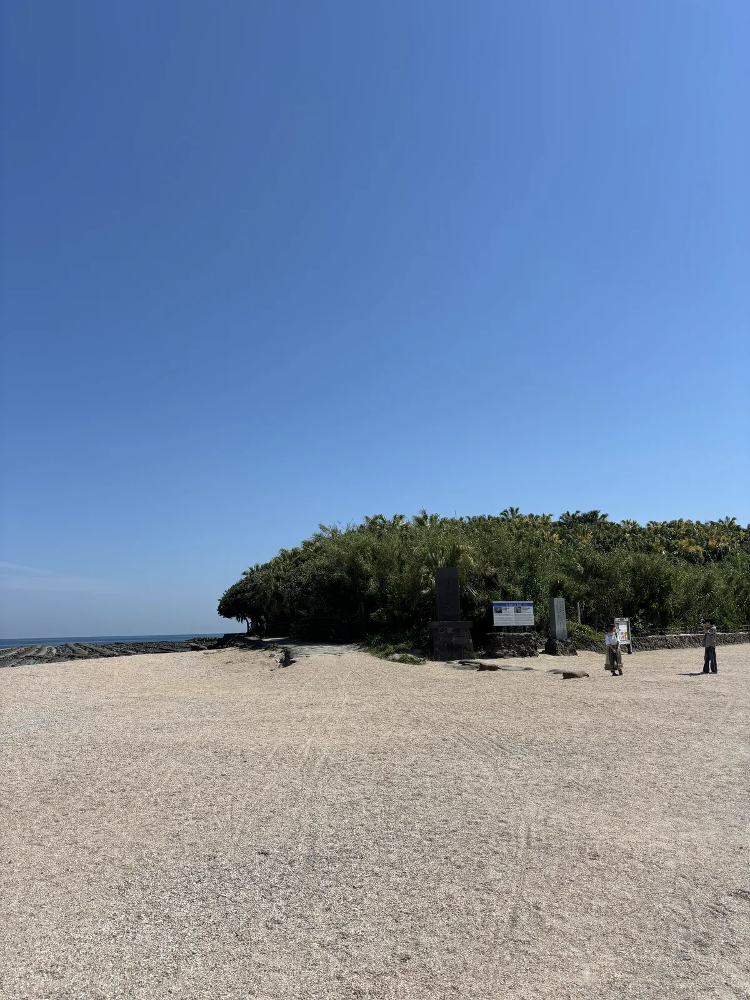

*從沙灘上看整座島。島壓得很低，從水邊到頂全被蒲葵蓋滿，看不到一塊裸露的地面；島腳下立著一座石碑與兩塊案內板，左邊水際那片深色的岩層就是鬼の洗濯板。神社在這片綠的中央。*

## 參道形制及其空間效果

從車站到神社大約八百公尺，走十分鐘。這段參道**車進不來**，
是行人優先道路，兩側是賣東西的店。四月的時候頭上掛著鯉魚旗。

參道走完是海，然後過**彌生橋**上島。島上是朱紅色的：拜殿正面的破風底下佈滿彩色的雕刻，
朱、金、綠都有，屋頂是灰色的銅板，跟底下的朱色對比很強。那天拜殿前站滿了人。

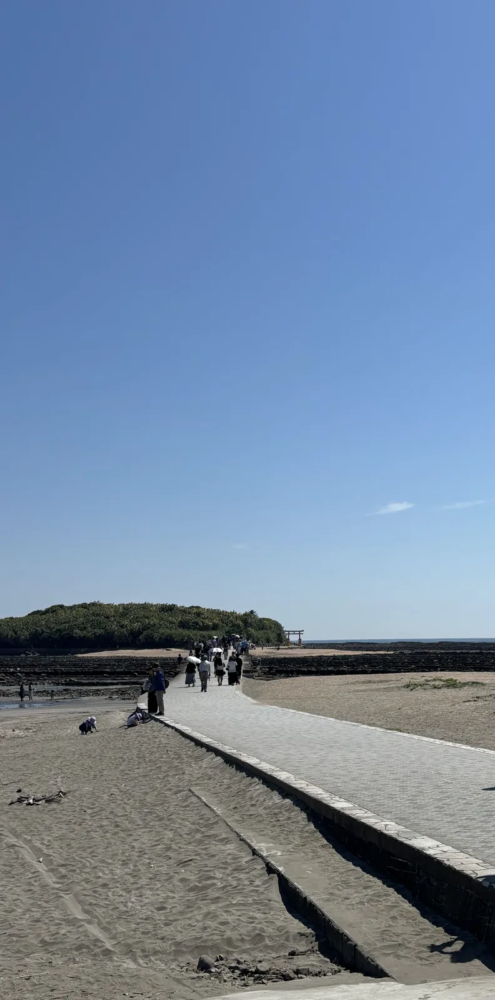

*參道走完就是這裡。石板鋪的走道從沙灘上抬起來，直直伸向對岸的島；島是一片壓得很低的綠，走道盡頭立著朱紅色的鳥居。走道左邊是沙，右邊那片一道一道的深色岩是鬼の洗濯板。車進不來的那八百公尺，走完是這個畫面。*

但這座神社真正的空間在後面。從**神門（神社的正門）**穿出去，路變成一條窄道，兩側是蒲葵林。
現地的案內板寫著：走這條路，「彷彿置身南國之島的密林」。
這條路有名字，叫**御成道**（onarimichi）。從神門算起六十公尺，盡頭是元宮。
林子裡光線是綠的，葉子把天遮掉，聲音也悶下來；走到底，地面開始出現東西。

## 皇族來訪的名單刻在板上

御成道的名字有來歷，而且那來歷就寫在路口的板子上。
**明治四十年（一九〇七）十月三十一日**，後來的大正天皇還是皇太子的時候，
西國巡幸途中來到青島，在林中獻上玉串。**那條路就是趁那次機會整備出來的**。
此後皇族來訪不斷。板子的右半邊，是一整欄密密麻麻的年表，
一行一個年月日，一行一個名字，從明治四十年一路排到昭和後期。

其中一次寫得特別清楚：**昭和二十四年（一九四九）六月五日，昭和天皇行幸**，
在神社參拜，並且為了**植物與海產動物等的研究**，
在這座島上停留了**兩個半小時**。一個以海洋生物為專業的天皇，
在一座周圍是天然記念物的波蝕地形、島上是特別天然記念物的植物群落的島上，
花了兩個半小時——而這件事被刻在通往元宮的路口。

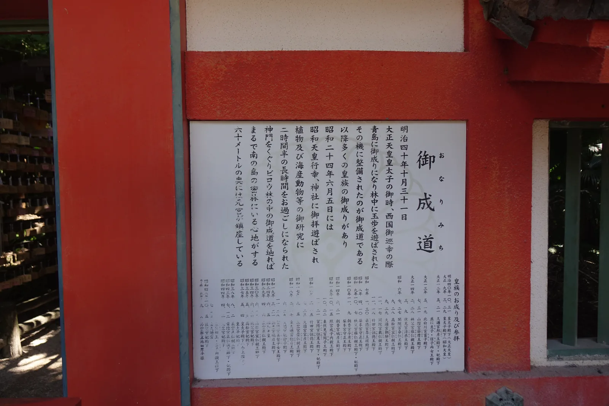

*朱紅色柱間的白色板子，標題是「御成道」。正文從明治四十年十月三十一日皇太子（後來的大正天皇）巡幸寫起，記著昭和二十四年六月五日昭和天皇行幸、為植物與海產動物的研究停留兩個半小時，末尾寫著穿過神門走六十公尺就是元宮。板子的右半邊是一整欄皇族來訪的年表，一行一個日期。*

明治以後訪客大增的理由，官方自己寫得直白：人們來看的是繁茂的熱帶植物。
**這座島在近代變成了一個「來看」的地方**——來看神話，也來看植物與岩石。
路口的那塊板子把兩件事並排放著，誰也沒有讓誰。

## 祭儀與授与品

元宮那一帶，地上的東西是分層的。一種是**貝殼**。官方說青島是**貝殼堆積而成的島**，別名真砂島；
在這裡，貝殼中特別被珍視的是**寶螺**（タカラガイ takaragai），稱作真砂。
做法是：在神社前的沙灘上找一枚真砂，把心願寄在上面，供到波狀岩上。
元宮旁邊那塊岩，整片被白色的貝殼蓋住了。

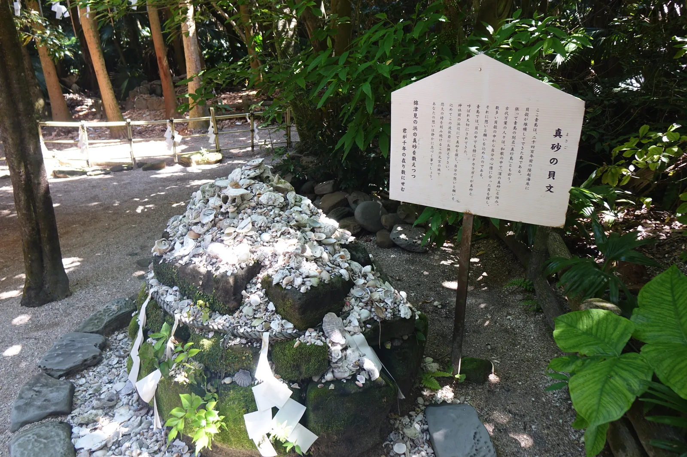

*元宮旁的波狀岩，整片被白色的貝殼蓋住——參拜者在神社前的沙灘上撿一枚寶螺，把心願寄在上面，供到這塊岩上。岩的周圍圍著注連繩（標示神域的稻草繩）與紙垂（夾在注連繩上的鋸齒形白紙），右邊立著寫有「真砂の貝文」的木牌。*

一種是**陶片**。元宮相傳是古代臨時祭祀的遺址，那裡出土過大量破碎的彌生式土器。
土器的皿是祭器的一種，叫**平瓮**（hiraka）。《日本書紀》神武天皇條裡有
「作天平瓮八十枚」的記載。於是這裡有一個**投瓮所**：
向瓮台一禮，把願望默默託在平瓮上，投出去——
落進磐境就是心願成就，摔破了就是開運除厄。
竹柵欄後面的地上，碎掉的素燒陶片鋪成一片。

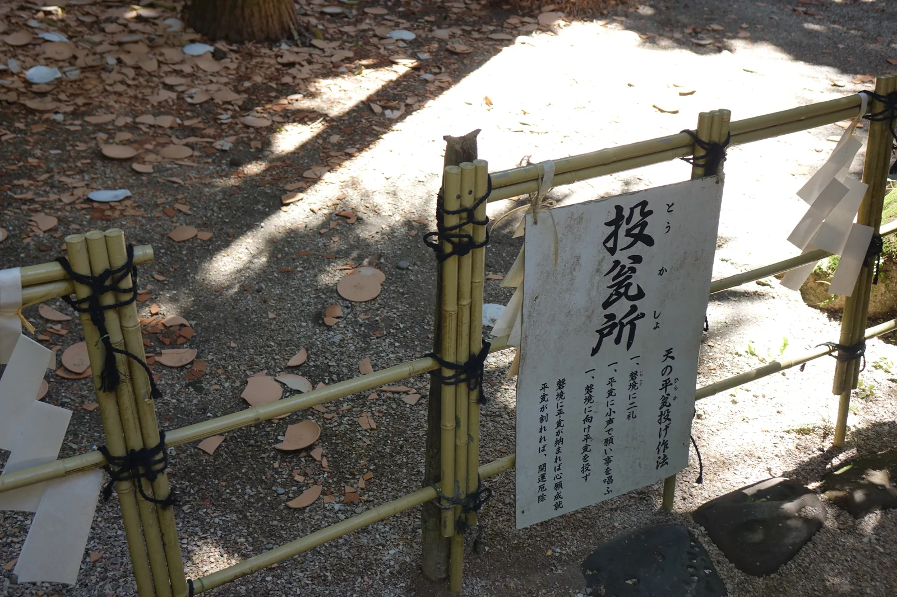

*竹柵欄後面的地面，鋪滿碎掉的素燒陶片。木牌上寫著「投瓮所」與作法：向瓮台一禮，把願望默默託在平瓮上，投出去；落進磐境就是心願成就，摔破了就是開運除厄。柵欄上綁著白色的紙垂。*

一種是**石頭**。蒲葵林裡有幾處堆起來的石塊，樹上掛著紙垂，地面同樣散著貝殼。
除此之外，這座神社還有**產靈紙撚**——用紙撚結成的祈願，
以及元宮參道旁的繪馬掛，官方稱之為「祈禱的古道」。

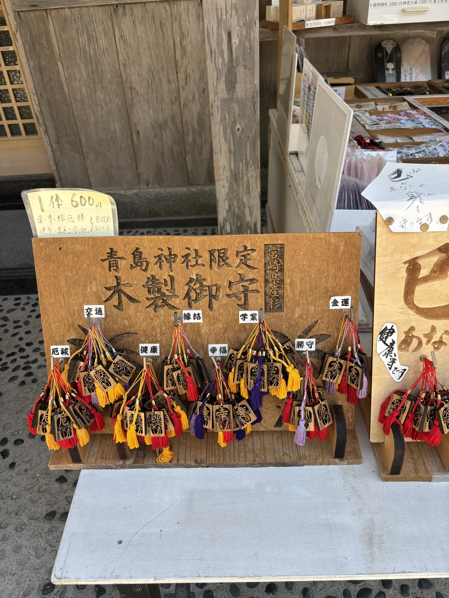

*授与所前的木製御守。烙印的木牌寫著「青島神社限定　木製御守」，牌面上釘成兩排的是木雕的小御守，各繫紅、黃、紫的房飾，一枚一枚掛在白籤標好的類別底下。旁邊的價牌寫「一体 600円」，並註明共八種。*

祭典裡最有名的兩場都跟海有關：冬天的**裸まいり**（hadaka-mairi，赤身入海行禊的參拜）在神社前的海岸行禊，
夏天的**海を渡る祭礼**（umi o wataru sairei，渡海的祭禮），神轎渡海。

## 晨間路線之擬定及其限制

這條路線不長，而且只有一個方向：往海走。

從 JR 青島車站出發，沿參道往東走八百公尺、十分鐘。車進不來，這段路是走的。
參道盡頭是海岸，先看鬼の洗濯板——退潮的時候那些稜線露出最多。

過**彌生橋**上島。島上是蒲葵林與朱紅色的社殿。

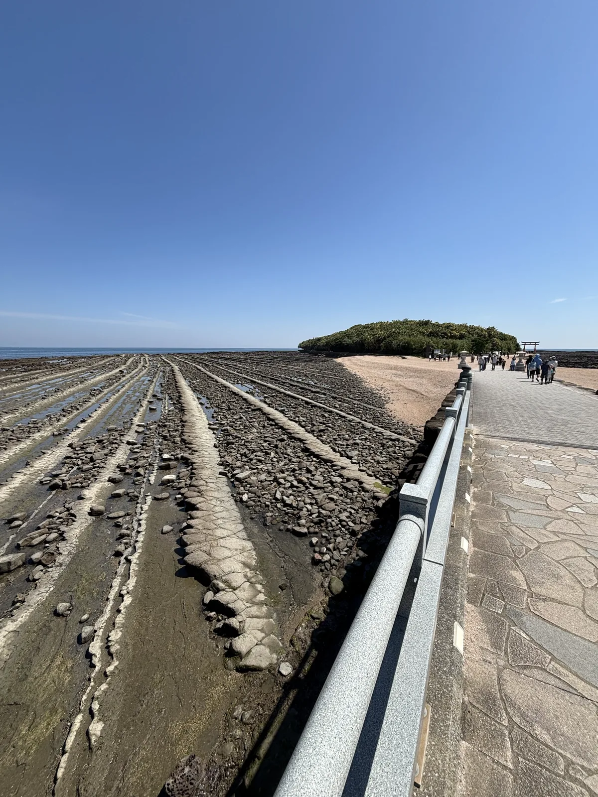

*彌生橋上。高欄（欄杆）是灰色的金屬，橋面鋪石板；橋下退潮的洗濯板露出最多，一道道岩稜之間積著水與礫石。橋的另一端是島，人正陸續走過去。退潮的時間決定這一段看得到多少。*

拜完從神門出去，走御成道六十公尺到元宮，看那三種堆積物。

回程沿海岸往北，經過海水浴場一帶，再往內陸接**宮交ボタニックガーデン青島**（Miyakoh Botanic Garden Aoshima，宮交植物園）——
熱帶植物的溫室與花壇，跟島上的植物群落是同一套氣候的產物。
從那裡走回車站。全程約三公里，一個半到兩個小時。

▲ 限制
・島能不能繞一圈、潮位會怎麼影響，我沒有走完整圈，不清楚。
　行前值得先查當日的潮汐。
・參道與海岸沒有遮蔭。四月的中午已經很曬，早上走比較舒服。
・林子裡與海岸的溫差明顯，島上的路是碎石與砂。
・時間不夠就只走前半：車站、參道、洗濯板、神社、元宮，原路折返，約兩公里、一小時。

▲ 地圖
宮崎市觀光協會發行的「AOSHIMAP」把這一帶畫成一張，
車站、參道、彌生橋、島、海水浴場、植物園都在上面，比例尺兩百公尺。

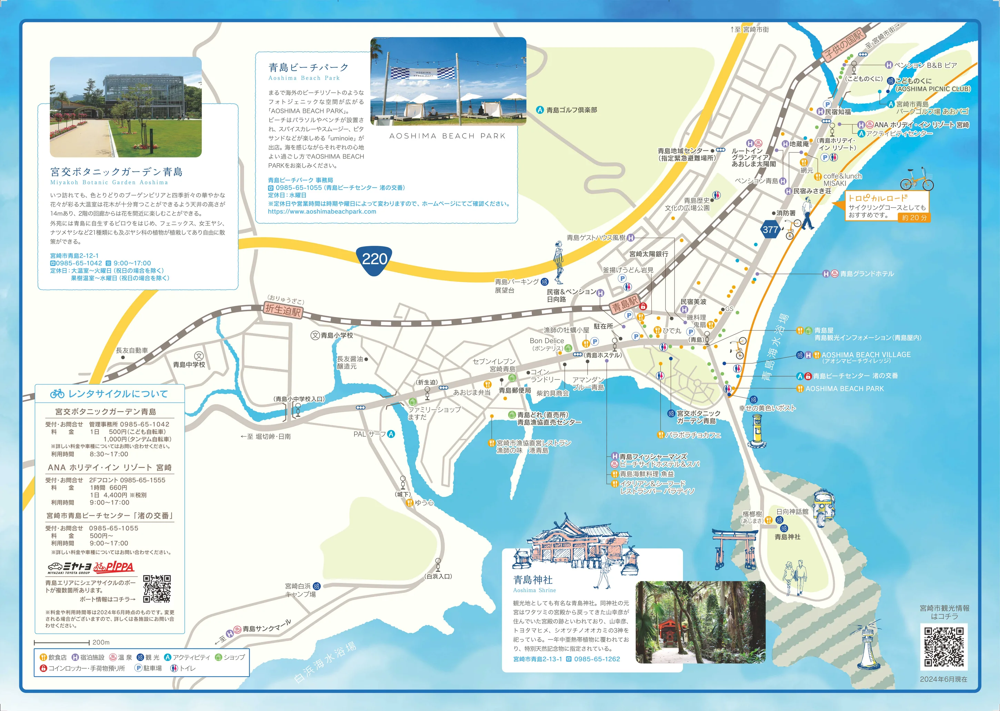

*AOSHIMAP（あおしまっぷ）（發行 宮崎市観光協会）。*
