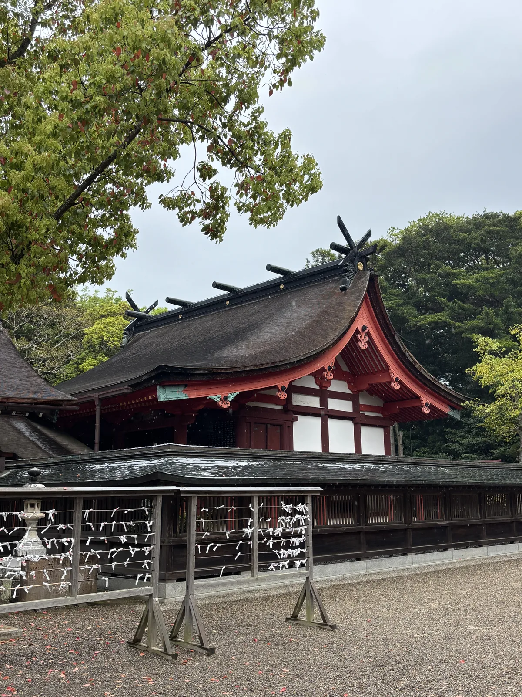
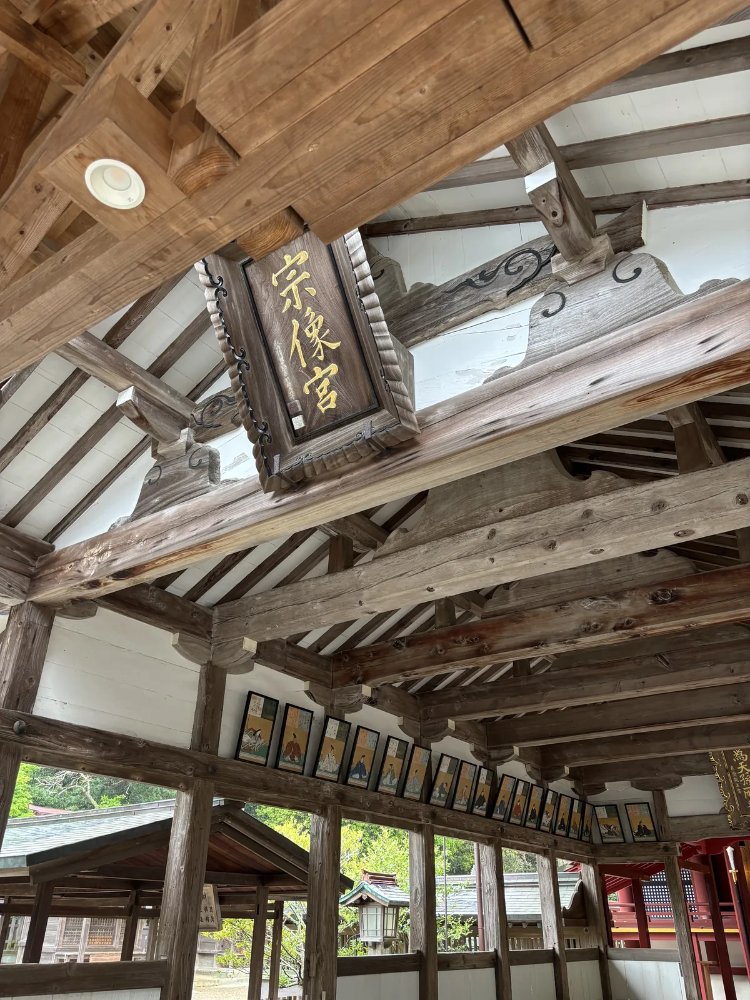
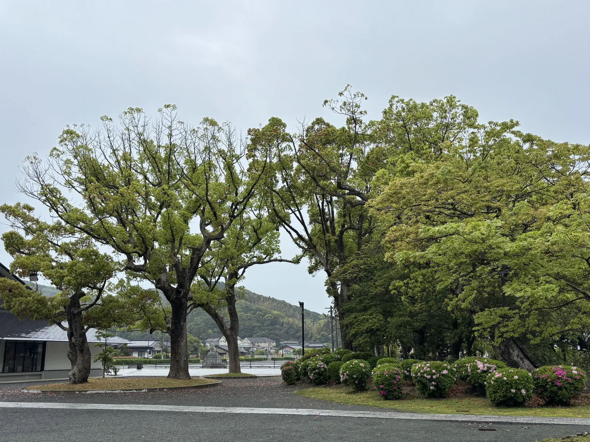
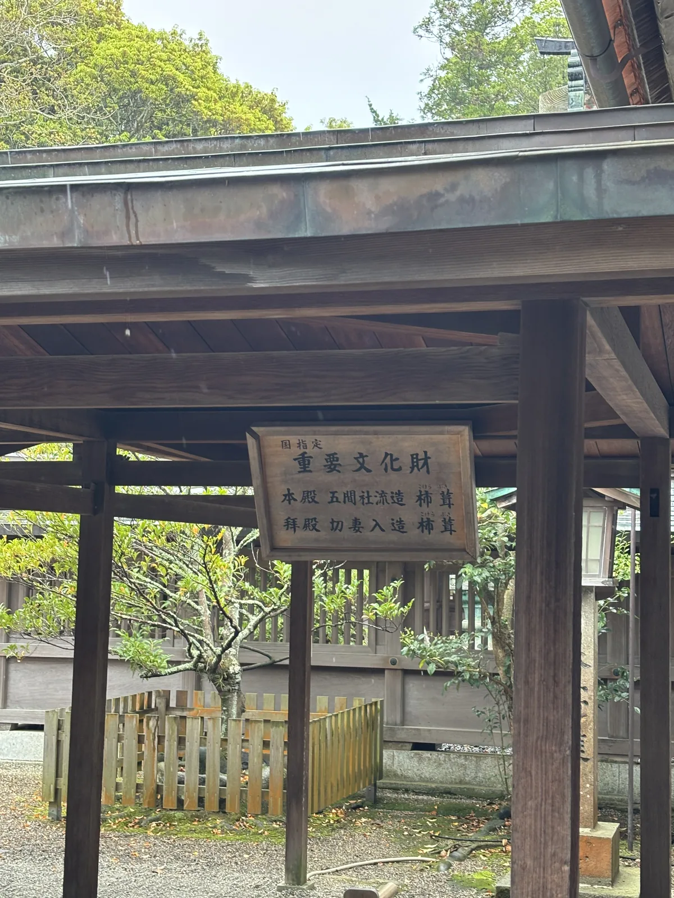
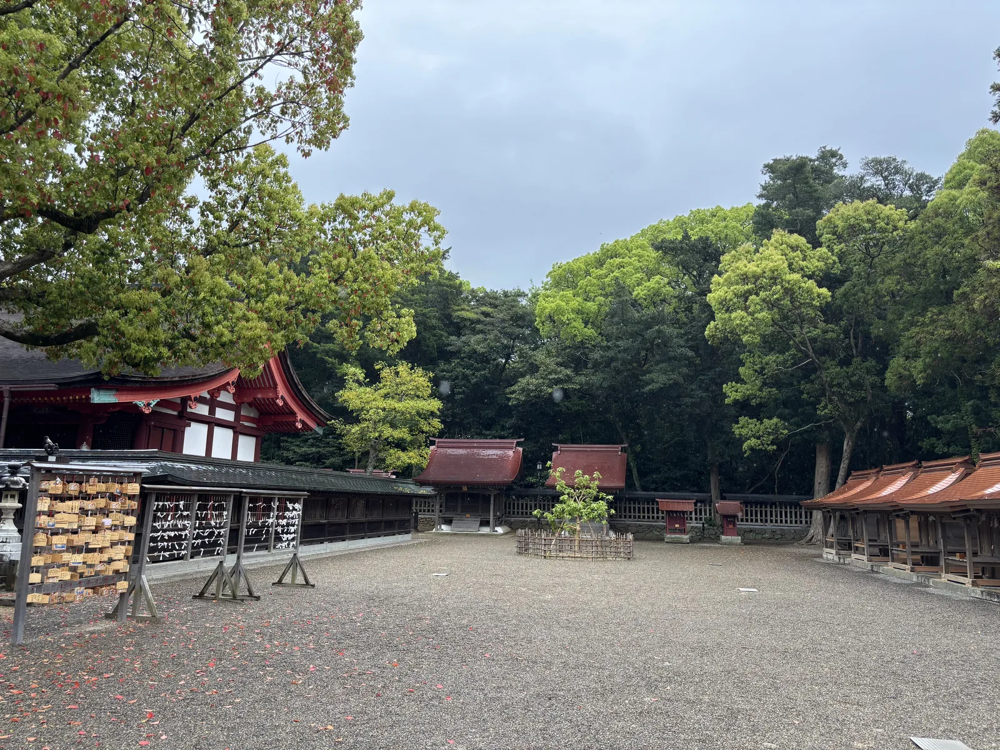
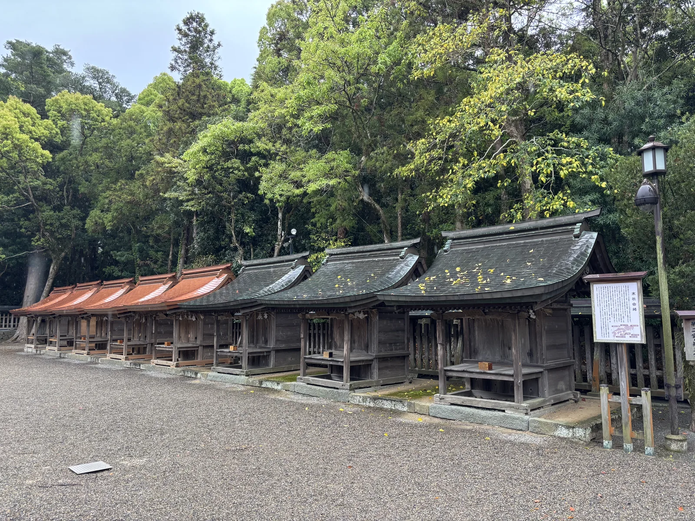
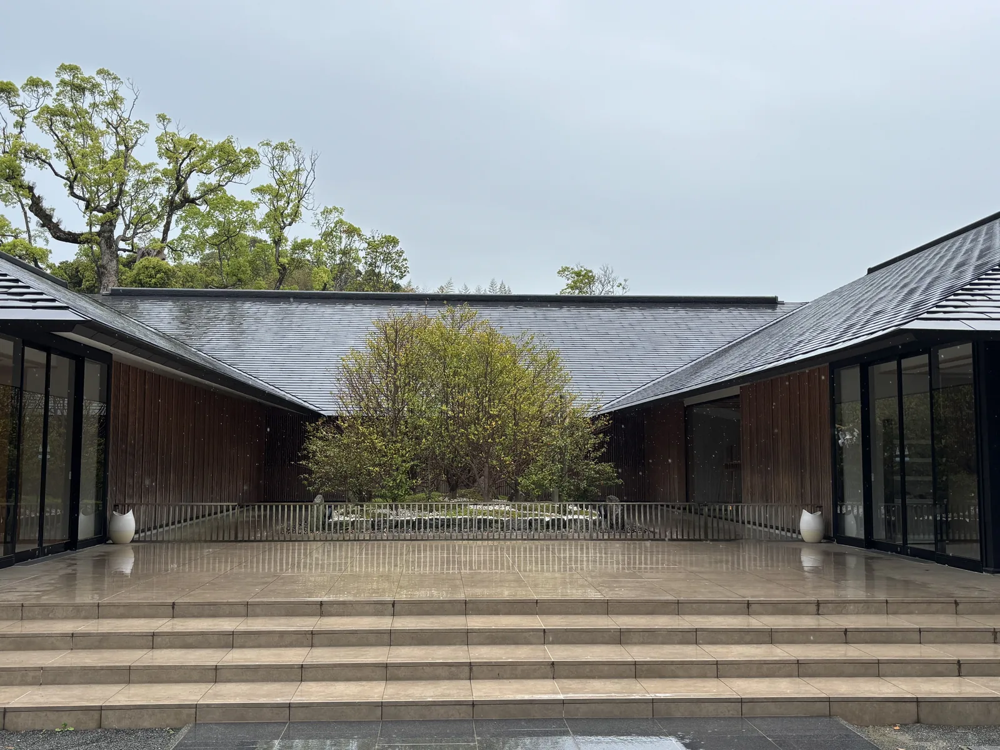
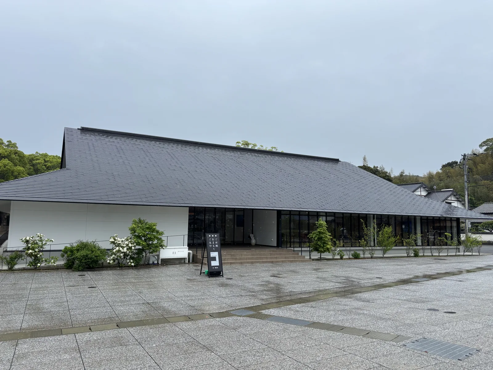
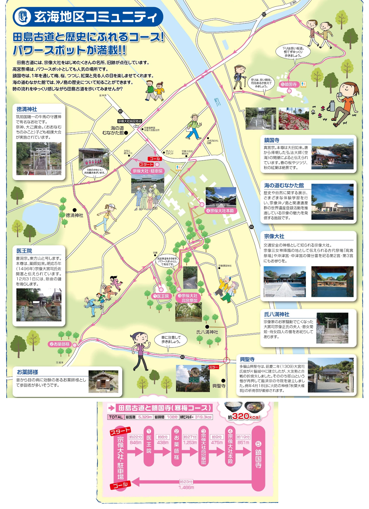

## 我的想法

<!-- 待 Chris 本人填寫，本階段留空 -->

## 導言

宗像大社這個名字不指一座神社。沖ノ島上的沖津宮、大島上的中津宮、本土田島的邊津宮，
三宮合稱才是宗像大社，而那天下午我只到得了最後一座。四月下旬的雨把停車場的花崗岩
洗成一片亮灰，社殿背後的山是濕的，境內幾乎沒有人。

宗像市發行的散步地圖上畫著一條五點三公里的路：從神社的停車場出發，先繞過坡下的兩座小寺院，
再從背後的山坡爬上高宮祭場，回到本殿，然後過釣川去鎮國寺，全程一百零八分鐘。
這條路清晨走最好——沿途過半的地方九點以前都還沒開門，而它們本來也不是這條路的重點。

*本殿隔著瑞垣看過去。屋頂是柿葺，脊上立著千木與鰹木，簷下的組物與連子窗塗朱，牆面是白的。前景那排木架上結滿御籤，紙條被雨打濕後貼在一起。*

## 道主貴之認定

宗像三女神誕生於天照大神與素盞鳴尊的誓約（うけい，以生子判定心意清白的儀式）：
天照噛碎弟弟的劍、向碎片吹氣，生出田心姫神、湍津姫神與市杵島姫神。
三柱分別鎮座於玄界灘上的沖ノ島、中途的大島與本土的田島，邊津宮祀的是最後一位；
三宮各有社殿、各有神職，合起來才是一個宗像大社。

《日本書紀》記下天照給三女神的話：助歷代天皇，則歷代天皇祀之。
神社官方的解釋很直白——宗像是日本最早的國際港，三女神被託付的是通往朝鮮半島的
「海北道中」，也就是航路本身。由此她們被稱為「道主貴」，掌管一切道路的神，
分靈至今散在全國六千餘社。

這個名分決定了此後一千二百年的事。既然掌管的是「道」而不是某一條航路，
信仰就能一路延伸到陸上：宗像大社至今以交通安全祈願聞名，全國各地的人開車來受祓，
普通車的初穗料五千日圓、大型車六千日圓，四月二日的祭典時間表上還排著專門的交通安全講社祭。

古代國家對這裡的重視留下兩組硬證據。一是沖ノ島出土的約八萬件奉獻品，全部指定為國寶；
二是大化改新之後宗像郡被列為全國僅八處的「神郡」之一，九州唯一，
郡的收入直接充作神社的祭祀與修理費用。從五世紀的雄略天皇到十一世紀的後一條天皇，
天皇的勅使五度被派到這裡。

*拜殿內部不設天井，屋架直接露出來。中央懸著黑漆金字的扁額「宗像宮」，兩側樑上並排掛著一列歌仙額。木料經過四百年的煙燻與日曬，白木與朱漆的界線已經很淡。*

## 立地非屬偶然

邊津宮在釣川沿岸一個叫田島的地區。釣川的中下游與鄰接的勝浦潟過去是一片入海，
海水一度逼近今天的社殿附近；《日本書紀》提到邊津宮時，寫的是「海浜」兩個字。
現在從境內看不到海，那條水線被沖積與開墾抹平了，只剩地名與古籍還記得它。

神社的起源不是社殿，是祭場：突出於舊入海的丘陵上有下高宮祭祀遺跡，
社殿是後來才在它的山麓造起來的。那個祭場現在叫高宮祭場，從社殿旁的路爬階梯就到，
西北側視野開闊，釣川、大島與玄界灘依次排開——沖ノ島在更遠處看不見，
但三宮之間的關係就是在這條視線上成立的。

河也曾經是祭典的舞台。中世最大的神事之一放生會裡有「船闘（ふなくらべ）神事」，
鐘崎、神湊、勝浦濱、津屋崎這些漁村各自供上神船，載著神輿在釣川上競漕。
神社與海之間的往來不是比喻——一年一次，是真的把神抬上船划出去。

*境內西緣。兩株大樹立在停車場的分隔島上，枝葉還沒完全展開；左緣壓低的白色建築是新的社務所群，右側花壇裡的杜鵑正開，樹的空隙間看得到田島的屋頂與遠處低山。海的方向在那些山的另一邊。*

## 參道形制及其空間效果

動線是規矩的：穿過鳥居、走完參道，神門之後本殿才出現。
這種一路壓到最後才開的手法在大社並不少見，但宗像的參道短，
從神門到社殿只有幾步，開闔之間幾乎沒有緩衝，雨天走進去更像忽然被推進一個亮著的房間。

社殿的年代寫在境內一塊木札上：「国指定 重要文化財／本殿 五間社流造 柿葺／拝殿 切妻入造 柿葺」。
弘治三年（1557）的一場火把前身燒光，天正六年（1578）由大宮司宗像氏貞再建本殿；
氏貞無嗣而歿、大宮司家就此斷絕，天正十八年（1590）改由轉封九州的小早川隆景再建拜殿。

兩棟建築相差十二年，屬於兩個不同的主人：一個是這片土地最後的神職領主，一個是外來的大名。
此後的修理費由福岡藩主黑田氏歷代負擔，統治者換過三輪，柿葺的屋頂還是原來那兩座——
今天的說法是重要文化財，四百多年前的說法是誰出錢。

*掛在社殿旁一座簷下的木札。上款小字「国指定」，下面兩行分別寫本殿與拜殿的形式與屋頂做法，柿葺兩字旁注著假名。木札後方是圍住本殿的板塀，以及一株用木柵護著的小樹。*

拜殿內部不做天井，屋架整個露出來，抬頭是一層層交錯的橫材。
中央懸著黑漆金字的扁額「宗像宮」，兩側樑上並排掛著一列歌仙額。
從拜殿的位置往內看，正對的就是本殿那面柿葺的屋頂——參拜的視線終點不是門，是屋頂的斜面。

本殿背後還有兩棟，是第二宮與第三宮。昭和四十八年（1973）伊勢神宮舉行第六十回式年遷宮時，
把別宮的舊殿舍下賜給宗像，移築於此，第二宮祀田心姫神、第三宮祀湍津姫神。
換句話說，到不了沖ノ島與大島也沒關係，在邊津宮拜完這三棟，就算拜過了三女神。

*本殿後方的廣場。左側朱漆的是本殿一帶的社殿群，正中偏右兩棟暗紅色屋頂的小社殿就是第二宮與第三宮，來自伊勢的舊殿舍。右緣一整列連著屋簷的小社是末社。*

最重要的地方反而是空的：高宮祭場沒有社殿，只有一塊被樹與繩圍起來的地面，
被認定為市杵島姫神降臨之處。神社把它維持成沒有建築的樣子，維持到今天。

## 境內裡的宗像郡

本殿周圍大小二十四社，祀著一百二十一位神。這個數字不是逐年累加出來的，
而是延寶三年（1675）第三代福岡藩主黑田光之把宗像郡內各處的末社集中到境內合祀的結果；
現存的那一列社殿，就是當時所造的那一批。

中世的宗像郡內有七十五座末社，各村的氏神散在山谷之間。
今天宗像地區的人常常同時是大社的氏子與自己集落神社的氏子，兩邊的境內清掃與祭禮都要參加。
一個人身上疊著兩層歸屬，而其中一層的地址，就在這座神社的本殿背後。

這種關係在關鍵時刻起過作用。昭和十二年（1937），軍方計畫在沖ノ島建砲台，
氏子總代寫了要求中止的上申書，理由是要把神域挪作軍用，得先尊重神的意思；
另有氏子致電當時的宮司，只有一句「身を賭して沖ノ島を守れ」，神職隨後也上呈了陳情書。

*本殿周圍的末社排成一列。屋頂的顏色深淺不一：後段幾棟是新葺的銅板，還是剛換上的橙紅色；前景幾棟的銅板已經氧化成暗綠。右側白色立牌是「末社由緒」的說明板，附著一張分佈圖。*

戰後的重建也是氏子的事。昭和十七年（1942）結成的復興期成會花了二十四年編纂《宗像神社史》，
昭和四十六年（1971）完成「昭和的大造營」；四十多年後建物再度損傷，
平成二十五年（2013）起展開「平成的大造營」，三年一期分三次進行，工程總額十九億日圓。

修理現在還在進行。本殿周圍二十二社的末社從令和二年（2020）起依序更換銅板屋頂與腐朽的木料，
分年完成六社、四社、五社，最後三社在令和七年度收尾，前後六年。
我去的那天正在中途，一列末社的屋頂新舊並排，顏色從剛葺上的橙紅一路變到氧化的暗綠。

境內最新的建築是祈願殿，令和三年（2021）竣工，設計與施工者以競圖選出，
鋼構二層、樓地板面積約一千七百九十平方公尺，同時整合了社務所與齋館的機能。
從外面看只是一片壓得很低的大屋頂，入口擺著寫「ご祈願／おまもり／ご朱印」的立牌，
看不出這是「平成的大造營」裡最大的一項單體工程。

*祈願殿的中庭。兩翼向前伸出，深色屋頂壓得很低，中央的庭園鋪白砂、植一株樹並置石，外圍以低矮的木欄圍起。從一段寬階梯上去就是中庭前的平臺；石面因雨反光，把兩翼的屋頂映在上面。*

那座中庭才是這棟建築的核心。庭中植榊為神籬（ひもろぎ，神明降臨時憑依的樹），
另置岩石模擬沖ノ島前方的岩礁為磐座（いわくら），受祈禱的神殿正面朝向它。
一棟二〇二一年的鋼構建築，把社殿出現以前的祭祀形式又做了一次——
和山上那個沒有社殿的祭場，做的是同一件事。

*從廣場看祈願殿。屋頂一路斜下來壓到玻璃面上方，左半段是白牆，右半段整面開窗。入口前立著寫有祈願、御守、御朱印的立牌。廣場的花崗岩剛被雨洗過。*

## 祭儀與授与品

一年裡最大的一天是十月一日的みあれ祭（miare-sai）。它是中世神事的復興，
內容是把沖津宮的田心姫神與中津宮的湍津姫神迎到邊津宮來——三女神一年只在這天聚齊一次，
而迎接的方式是出海：宗像七浦的漁師出動約一百艘漁船，掛滿旗幟，從大島駛向神湊。

時程排得很細。上午九點半自大島港出發，十點四十抵達神湊港，十一點十分改走陸路，
十一點半起徒步，十二點整到達邊津宮的一之鳥居，十分鐘後入御。
隔天上午八點是流鏑馬神事，十一點的例祭上奏主基地方風俗舞——
那是昭和天皇即位時特別下賜給宗像大社的舞，祭後另有翁舞。

第三天傍晚六點的高宮神奈備祭在那個沒有社殿的祭場舉行，奏悠久舞、唱八女神事古歌，
為秋季大祭收尾。春天的大祭來歷比較實際：它起源於把神寶與古文書拿出來曝曬的虫干し，
公開展示久了就成了祭典，四月二日的總社祭之後緊接著上午十一點四十分的交通安全講社祭。

御札、御守與御朱印都在祈願殿授與，九點開始。沖ノ島出土的那八萬件國寶收在境內的神寶館，
九點開館、下午四點停止入館，一般拜觀八百日圓——
這是唯一能親眼看到沖ノ島的地方，因為島本身不對外開放。

## 晨間路線之擬定及其限制

宗像市的散步地圖上有現成的一條：〈田島古道と歴史にふれるコース〉，
總距離五千三百二十九公尺、總時間一百零八分鐘，六個節點，
起點與終點都是宗像大社的停車場。它把神社放在後半段，前半段全給了村子。

節點順序是刻意的。先走八百四十六公尺到醫王院，再四百三十八公尺到お薬師様，
然後是全程最長的一千二百五十三公尺，才接上高宮祭場——
也就是說，這條路要人先在田島的田與屋頂之間繞一圈，再從背後的山坡進神社，
而不是從大鳥居直接走進去。

從高宮祭場下到本殿只有四百七十五公尺，之後才是往鎮國寺的八百五十一公尺。
鎮國寺相傳為自唐歸國的弘法大師所開，位在釣川的對岸，地圖上特地標了兩句提醒：
上去是長階梯，下來是長坡道。最後一千四百六十六公尺沿河回停車場。

限制都在時間上。神寶館與祈願殿九點才開，海の道むなかた館也是九點、而且週一休館；
七點出發的話，這條路走完時它們差不多剛開門，參觀只能排在最後而不是路上。
高宮祭場每月一日與十五日有月次祭，雨天中止，那天的山坡上會什麼都沒有。

起點是停車場而不是車站，這件事本身說明了現在的宗像大社怎麼被使用——
最近的 JR 東鄉站還要再搭十分鐘巴士。古代從海上來，現在從國道來；
而那條把神從海上迎進境內的路，一年只走一次，其餘的日子由散步的人代替。

*出典：《むなかたウォーキングマップ Vol.5 田島古道と歴史にふれるコース》（發行 宗像市）*
