## 我的想法

<!-- 待 Chris 本人填寫，本階段留空 -->

## 導言

四月下旬的下午一點多，太陽正硬。表參道的大鳥居底下沒有陰影，
柏油被曬得發白，往北一直走到底就是國道十號。過了朱紅的神橋，
寄藻川的水面浮著一層綠藻，橋的另一頭立刻進了樹林，溫度掉下來，
從那裡到山上的上宮，路都在樹底下。

那片樹林是國指定天然記念物。組成它的樹叫イチイガシ（ichiigashi，二位樫），
最高長到三十公尺、樹幹直徑一點五公尺，四季常綠，所以這座山一年到頭都是暗的。
它同時是表參道的行道樹——你在停車場旁邊看到的那排樹，
和山頂那片被國家指定保護的樹，是同一種。

這篇文章要從山腳走到山上，再從山上走下山腰，最後往西走一公里的平路。
最後那一公里是勅使走過的直路，路旁有一座祀著被鎮壓者的小神社、一座古墳、一口井——
整趟路裡最需要解釋的東西，全部在那一段。

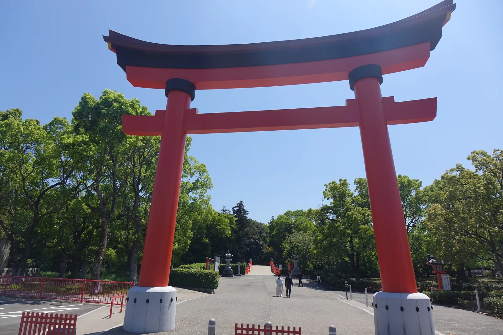

*表參道的大鳥居。柱子頂端那圈黑色的東西叫台輪，兩根橫木之間本來該有一塊寫社名的額束，這裡是空的——這是被大分縣指定為有形文化財的「宇佐鳥居」形式，境內所有鳥居都照它做。*

## 神佛初遇之地之認定

境內一塊看板上寫著一句話，字很大：「神様と仏様が日本で最初に出会ったのは、この場所でした」
（神與佛在日本第一次相遇的地方，就是這裡）。發行者是國東半島宇佐地域六鄉滿山開山
一千三百年的紀念事業，不是神社自己。這句話聽起來像廣告詞，但它指的是一件有年份的事。

社傳說，八幡大神在欽明天皇三十二年（571）現身於這片盆地，
現身的地點是菱形池畔一處三眼湧泉，也就是現在的御靈水。
鎌倉時代後期由彌勒寺僧人神吽編成的《八幡宇佐宮御託宣集》記下了那句話：
神以三歲小兒之姿站在竹葉上，自稱「我是日本人皇第十六代譽田天皇」，
下一句緊接著是「我的名字，是護國靈驗威力神通大自在王菩薩」。

一個名字裡同時有天皇和菩薩，這在西元六世紀是不可能自然發生的說法——
《御託宣集》成書於一三一三年，中間隔了七百年。真正發生過的，
是七百年之間這座神社不斷被中央派任務。而每接一次，它的身分就往上加一層。

第一件任務在養老四年（720）。大隅、日向兩國的隼人起兵，
朝廷向宇佐宮祈請平亂，八幡大神率神軍南下。第二件在天平年間，
聖武天皇要造東大寺大佛，經費龐大而貴族未必同意，
宇佐降下託宣：「我率天神地祇，必成之。」——朝廷等的就是這句話。

第三件是神護景雲三年（769）。僧道鏡想當天皇，偽造了一份宇佐八幡的神託。
和氣清麻呂奉命前來查證，齋戒沐浴之後得到的答覆是：
「我國自開闢以來，君臣之分已定。以臣為君，未曾有也。」
清麻呂把神託寫成兩份，一份留在神宮，一份帶回京城。那年他三十七歲。

三件事的性質完全不同——一次鎮壓、一次募款、一次政爭裁決——
但共同點是：它們都不是宇佐自己的事。這座神社的地位不是靠信眾累積出來的，
是靠中央一次次把難題丟過來，而它每次都給了答案。

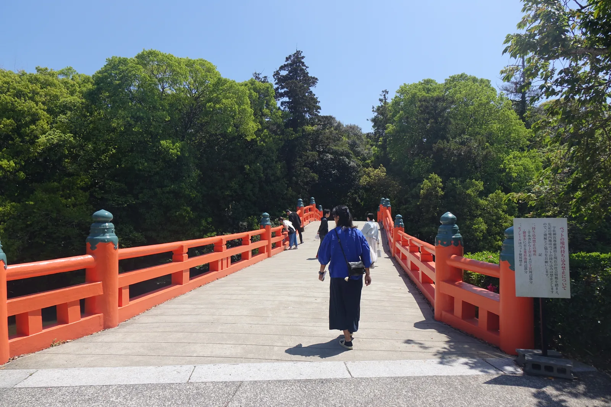

*表參道的神橋，跨的是寄藻川。過了這座橋才算進入神域，橋的另一頭立刻是樹，溫度明顯降下來。*

## 立地非屬偶然

社殿搬過四次。這件事寫在神社自己的歷史略年表裡，一行一行，日期清楚。

和銅五年（712）八幡大神的社殿首次落成，地點在鷹居；靈龜二年（716）依神託遷到小山田；
神龜二年（725）再依神託遷到小倉山，也就是現在這座山，並在山上造了一之御殿；
天平神護元年（765）又遷到東邊的大尾山；延曆元年（782）遷回小倉山。
七十年間搬了四次，最後回到第三個地點——那不是找不到地方，是有人在挑。

值得注意的是最後那一次的時間。七六五年遷往大尾山，正是道鏡權勢的最高點；
七八二年遷回小倉山，道鏡已死十年、平安遷都在即。
社殿的位置和中央政局的節奏對得上，這是一件難以視為巧合的事。

這座山有兩個名字。國指定天然記念物的說明板寫「亀山、また小椋山とも称し」，
官方年表寫「小倉山」，散策圖兩個並列——三種寫法指同一座山。
山上另有一座龜山神社，祀大山積命，是這座山的山神與地主神；
古代到明治年間，這裡用龜甲占卜，占完的龜甲據傳就埋在龜山神社。

地主神比八幡神早。二之御殿祀的比賣大神也一樣：《日本書紀》記三女神降臨於宇佐嶋，
神社官方寫得很直接——「比賣大神是八幡神出現以前的古老神祇、地主神」。
八幡神天平五年（733）造了第二座御殿把她請進來，
弘仁十四年（823）再造第三座請進應神天皇的母親神功皇后。
三殿橫排的順序，其實是三個時代疊上去的順序。

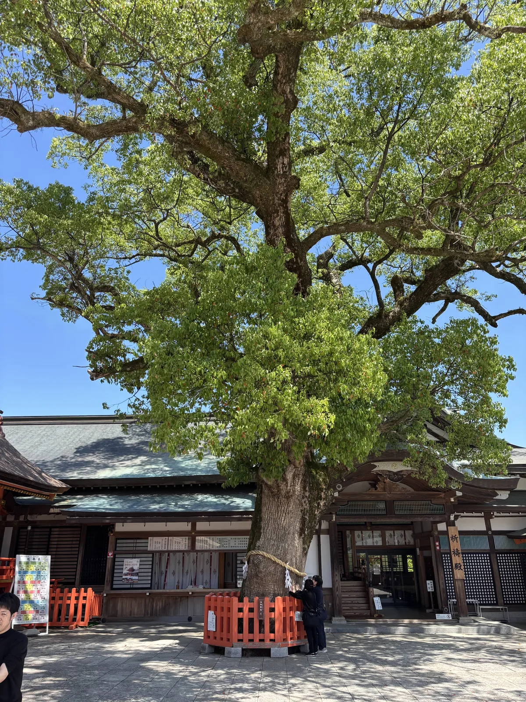

*上宮庭院附近的大楠。宇佐神宮社叢是國指定天然記念物，優占種是イチイガシ與楠——這棵是後者。四季常綠，所以這座山一年到頭都不透光。*

## 參道形制及其空間效果

從大鳥居到上宮，路分成三段，質地一段比一段硬。

第一段是平的，柏油與碎石，兩側是停車場、寶物館和初澤池。
第二段過了手水舍開始爬石階，石階很寬、每階很淺，
兩側是那片天然記念物的常綠林，光被濾成一片片。
石階中途立著一座宇佐鳥居和一塊木牌，牌上寫「上宮参道」。

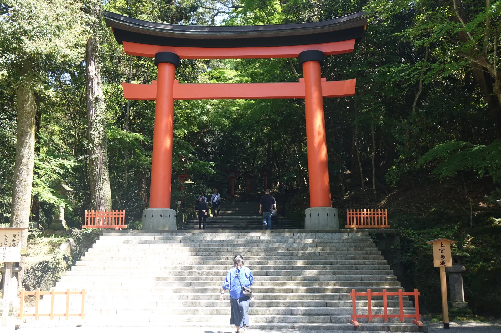

*上宮參道的石階。石階很寬、每階很淺，早上這個角度會有一整片斜光穿過樹葉落在階面上。右側木牌寫著「上宮参道」。*

第三段最短，卻是整段路唯一會讓人停下來的地方。
石階走到頂，穿過第二座宇佐鳥居，正對面就是西大門——
文祿年間（1592〜）改築的桃山風建築，切妻與向唐破風併用，
屋頂是檜皮葺，門洞裡面滿是極彩色。那個唐破風的曲線在一路的直線裡特別突出。

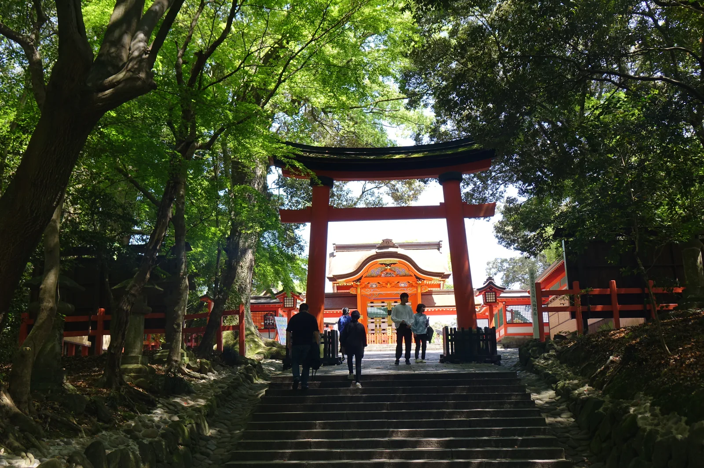

*上宮參道石階的頂端。穿過這座宇佐鳥居之後，正對面就是西大門，唐破風的曲線在照片裡剛好被鳥居框住。*

進了門是上宮的外院。這裡有一件事要先說清楚：**國寶看不到。**
八幡造的本殿三棟被迴廊圍在裡面，平常不對外開放，
站在庭院裡能看見的是迴廊、南中樓門，和三個屋頂的一部分。

八幡造的作法是這樣：兩棟切妻造平入的建築前後相接，
中間夾一間寬的「相の間」（又稱馬道），兩邊屋簷相接的地方架一道大型的金色雨樋。
後面那棟叫內院，裡面設御帳台；前面那棟叫外院，裡面放御椅子。
神明白天在前殿的椅子上，夜裡移到後殿的帳台裡——一天之內移動兩次，
建築就是為了這個動作而做的。三棟這樣的建築橫向並排，就是宇佐神宮的本殿。

現存的三棟建於安政六年（1859）到文久元年（1861），
昭和二十七年（1952）指定為國寶。神社自己說，八幡造的原型可能是
二之御殿的脇殿北辰神社——那是一棟藏在上宮西中門裡的小社，也是八幡造。

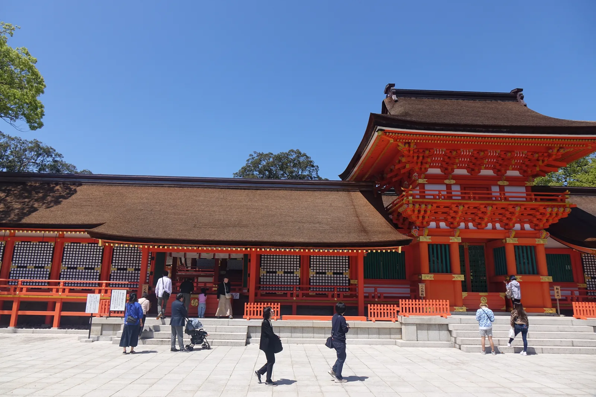

*上宮的外院。國寶本殿就在這道迴廊後面，但從庭院裡看不到全貌——照片裡低矮寬大的檜皮葺屋頂是迴廊，右邊那座兩層的是南中樓門。*

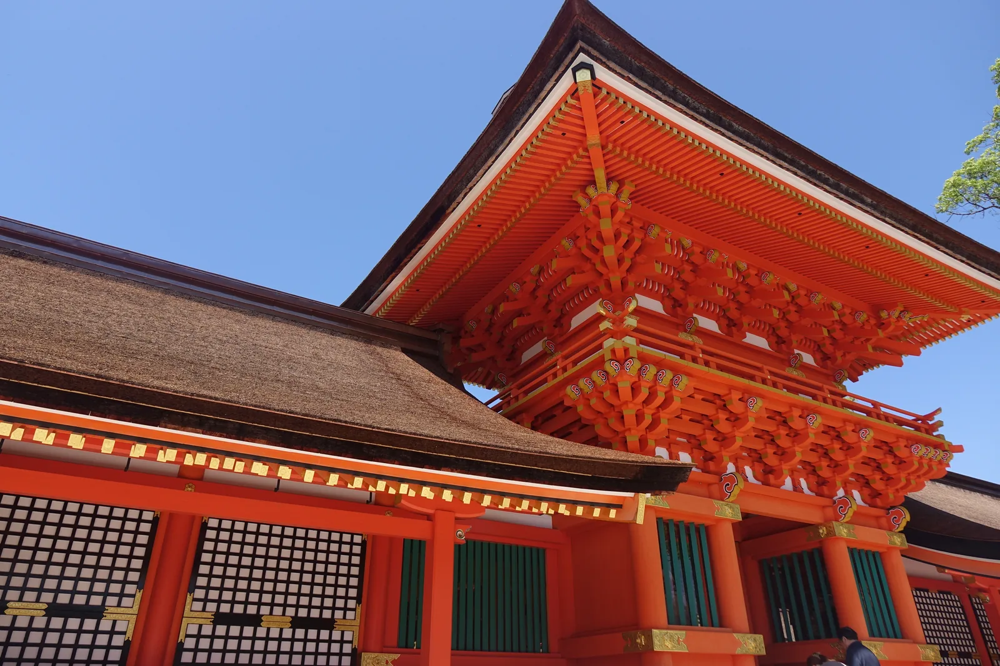

*迴廊轉角的細部。屋頂是檜皮葺，靠近屋簷處可以看見檜皮一層層疊壓的斷面；下方朱紅色的斗栱與白色的間隔構件，是昭和大造營到平成大造營之間反覆重新上漆的結果。*

南中樓門是內郭的南正門，也是勅使門，平常不開。
它是入母屋造檜皮葺的樓門，正面五點三四公尺、側面三點一七公尺、高十點六公尺，
門上祀著高良大明神與阿蘇大明神兩位御門之神。
十年一度的臨時奉幣祭——勅祭——才開門，那也是西參道那座有屋頂的吳橋唯一開放的日子。

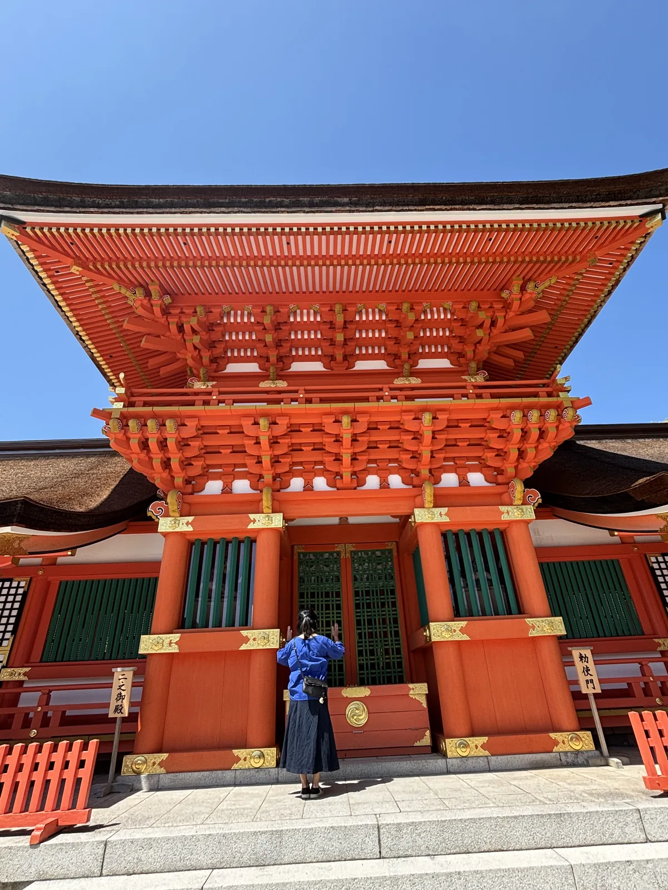

*南中樓門。神社官方稱它「通常は開かずの門」，十年一度的勅祭才開。*

離開上宮往下宮走，路況再變一次：石板變成長長的下坡，
兩側是連續的朱紅玉垣，坡度不陡但一路往下，林子把天空幾乎遮滿。
指路的木牌上寫「お帰り順路（下宮経由）」——**回程的順路，經過下宮**。
神社把動線寫死了：先上宮，後下宮，不能顛倒。

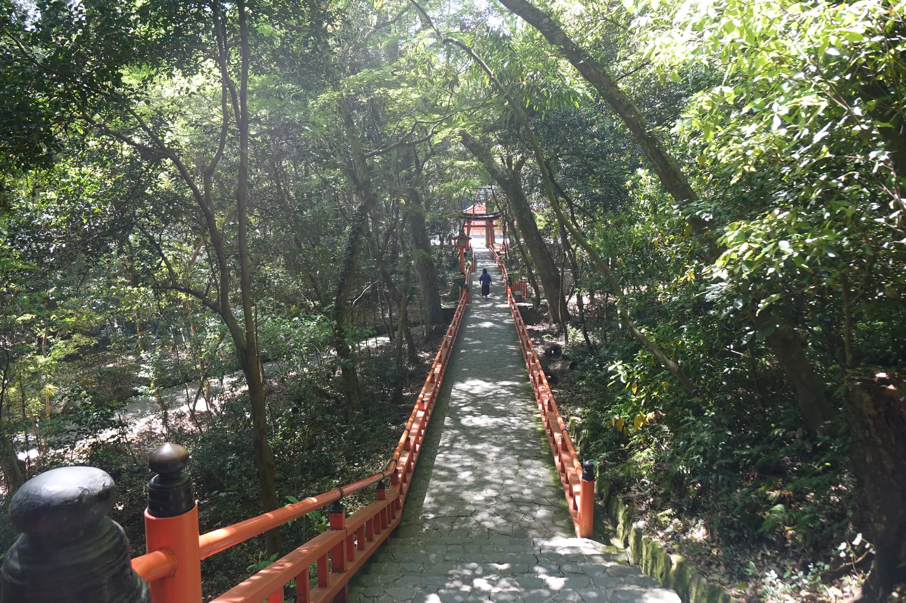

*上宮往下宮的下坡。兩側的朱紅玉垣一路延伸到坡底，遠處能看見下宮的一角。*

## 散在鄰寺的另一半

上宮的西邊曾經有一座寺。天平十年（738）依神託建的彌勒寺，
位置就在宮的西側，規模是「壯大なお寺の御堂」——這是宇佐市自己的說法。
它給國東半島的六鄉滿山文化極大的影響，
而傳說中八幡神的化身仁聞菩薩，在國東半島建了許多寺院。

彌勒寺在明治元年（1868）的神佛分離政策下被廢止。
現在原地只剩一片草坪和一塊立牌，寫著「彌勒寺跡」。
但寺裡的佛像沒有消失，它們散進了周圍的四座寺，而且全部走得到。

金堂的藥師如來坐像去了西邊的大善寺，曹洞宗，
那尊像現在是國指定重要文化財。講堂的火之彌勒大佛去了極樂寺，淨土真宗本願寺派——
這座寺本來就在宇佐宮境內，昭和大造營時才整座遷到現在的位置，
連同它本尊的阿彌陀如來立像，那尊像原本在境內的大貳堂，
捐建者是太宰府的次官，而大貳堂的舊址就在現在的繪馬殿附近。

再往北，臨濟宗的圓通寺是大分縣內最古的臨濟宗寺院，鎌倉時代創建。
開祖神子榮尊曾經致力於復興宇佐宮境內的彌勒寺，宇佐宮因此把這座寺定為神宮寺。
宇佐市在散策圖上補了一句地形上的觀察：圓通寺參道的延長線上，就是宇佐神宮的表參道。
兩條參道本來是同一條軸線。

高野山真言宗的大樂寺在元弘三年（1333）由宇佐宮大宮司到津氏創建，
既是到津家的菩提寺，也是後醍醐天皇的勅願寺。它本堂裡的彌勒佛、脇侍與四天王共七尊
全數是國指定重要文化財——七尊齊備，大分縣內只有這一座寺。

把這四座寺連起來看，會得到一個不太舒服的結論：
宇佐神宮的神佛習合不是一種觀念，是一批具體的木頭與金屬。
一八六八年那道命令把它們從一棟建築裡搬出去，分裝到四個地址。
今天走進宇佐的人如果只走境內，會覺得這裡是一座純粹的神社；
只有把腳往外多走一公里，才會發現這座神社的另一半一直在旁邊。

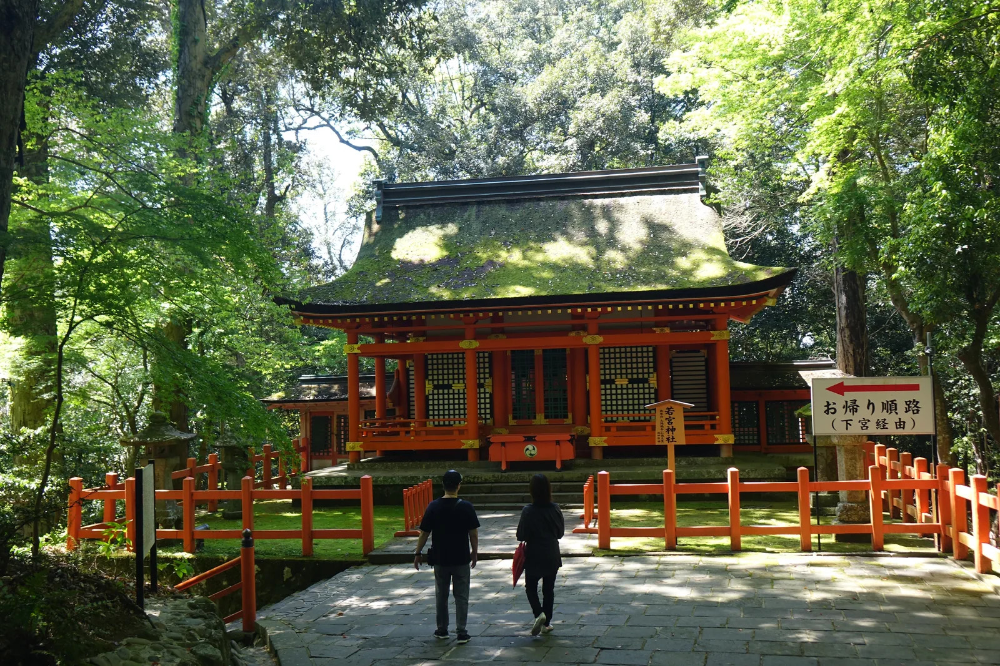

*若宮神社，國指定重要文化財。天長元年（824）與同七年兩度有神託，仁壽二年（852）才派造營使建成，祀應神天皇的若宮大鷦鷯命（仁德天皇）與皇子。檜皮葺的屋頂上長滿了苔。*

## 祭儀與授与品

宇佐神宮一年最重要的祭典是三月十八日的例祭，皇室賜幣帛，
以「大祭」的最上級儀禮舉行。但真正把這座神社的來歷演出來的，是十月的仲秋祭。

仲秋祭又叫放生會，神社自己說它是「宇佐神宮最古の祭り」。
起源在養老四年那場隼人之亂：八幡大神率神軍平定之後，宇佐一帶開始流行疾病、連年歉收，
被解釋為隼人亡靈的作祟。為了安撫這些亡靈，人們到和間之濱放生螺貝——這就是放生會的開始。

祭典的規格對得起這個來歷。一之御殿的神輿載著八幡大神從山上出發，
一路渡御到海邊的浮殿（和間神社），三天之內排了十一場祭儀，
從御發輦祭、蜷饗祭、水神祭、鹽屋祭，一直到放生式與御還著祭。
被鎮壓的一方，每年秋天讓鎮壓他們的神走到海邊來道歉一次。

同一個邏輯還安在神社的官方文字裡。境內末社百体神社祀的是大隅、日向兩國隼人之靈，
春祭在三月二十日，神社給的理由是八幡大神的御神意——
「**罪を憎んで人を憎まず**」（憎其罪，不憎其人）。
現在的仲秋祭，百体神社的祭禮仍由宇佐神宮的宮司親自主持。

七月底到八月初另有御神幸祭，通稱宇佐夏越祭：三基神輿第一天從上宮下到頓宮（おくだり），
最後一天從頓宮回到上宮（おのぼり）。八月一日在境內大尾山參道的馬場行流鏑馬神事，
由小笠原流一門奉仕，令和元年為慶賀天皇即位而辦，此後成為每年的恆例。

十月二十一日的御神能值得單獨提一句。宇佐的能樂承觀世流之流，特稱「宇佐觀世」，
由氏子擔任主體奉納。神社明記一條故實：能樂曲目之中，
**唯獨《清經》這一曲不奉納**。清經是平家的武將，投水自盡；
而壽永二年（1183）平氏奉安德天皇來過宇佐宮——這兩件事之間的關係，官方沒有寫。

授与品這邊反而樸素。寶物館收著大內盛見在應永二十七年（1420）奉納的三基神輿，
是縣指定有形文化財；神社在介紹東大寺大佛的頁面末尾補了一句
「『神輿』は宝物館にてご鑑賞いただけます」。
但寶物館十點才開，而且只在週日與假日開館——這件事會直接影響下一節。

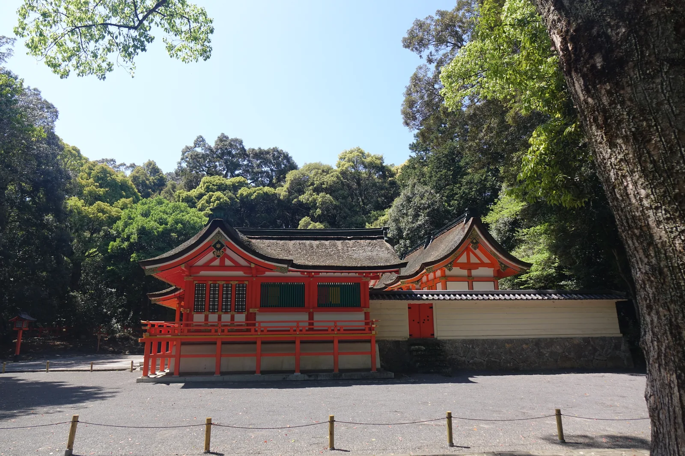

*下宮。弘仁年間（810–824）嵯峨天皇派造宮使來，把上宮的御分神請下來奉祀。古稱御炊殿，因為這裡有炊煮神饌的竈殿——現在那個位置是下宮的授與所。*

下宮的由緒板上有一句宇佐地方的俗諺：「**下宮参らにゃ片参り**」——
不拜下宮，只算拜了一半。上宮的八幡大神管的是國家鎮護，
下宮的八幡大神管的是御饌，以及農業、漁業和一般產業。同一位神，換一個位置就換一種職務。

## 晨間路線之擬定及其限制

宇佐神宮的開門時間是早上六點。這在這個系列裡是難得的條件——
多數神社的境內雖然全天開放，附屬設施要等到九點，
但這裡從六點就可以走進去，樹林裡的光那時候正斜。

錨點站是 JR 日豐本線的宇佐驛，但它離神社直線三點四公里，
官方交通指引一律寫「計程車十分鐘」，不列入徒步。
路線的實際起點是神社北側的宇佐八幡停車場，宇佐市觀光協會的案內所就在那裡。

前半段照神社的動線走：案內所往南過大鳥居，
沿表參道進林子，爬石階上上宮，再從「お帰り順路」下到下宮，
出下宮往西經吳橋——那座有屋頂的神橋據說是吳國之人所架，
鎌倉時代以前就在了，但十年一度的勅祭才開，平常只能從外面看。

後半段是這條路線真正的理由。從吳橋往西，有一條筆直的路一路延伸出去，
宇佐市的散策圖上標它為「勅使街道」，別名「光の参道」。
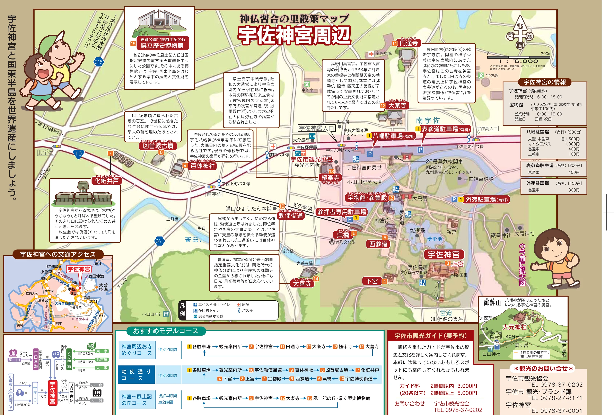

*出典：《國寶 宇佐神宮　神仏習合の里散策マップ》裏面（宇佐市發行）。圖中央偏右的宇佐神宮往左（西）延伸出去的那條直線就是勅使街道，`7` 化粧井戶、`8` 凶首塚古墳、`9` 百体神社依序排在路旁。下方藍色那條「勅使通りコース」即本節路線的官方版本。*

即位奉告或國家大事之際，天皇派來傳達旨意的勅使就走這條路進宮。
自從和氣清麻呂那件事之後，赴宇佐的勅使被稱為「宇佐使」或「和氣使」，
由和氣氏派遣成為慣例——這條路是為了那個慣例存在的。

沿路的三個點都很不起眼，但它們把前面幾節講過的事全部落回地面。
先是百体神社，祀大隅、日向兩國隼人之靈；
再走五十公尺是凶首塚古墳，六世紀末的古墳石室，
八世紀的放生會傳承裡被說成埋隼人首級之塚；
再往西一百八十公尺是化粧井戶——宇佐神宮所在的這片盆地舊稱「宮中」，
是一整片聖域，這口井是聖域入口的清淨之井，
放生會的時候，據傳在這裡洗傀儡人形。

從案內所出發、走完勅使街道再原路折返，全程約四公里，
兩個小時走得完，而且後半段是平地。回程如果不趕時間，
可以繞南邊經過大善寺——那尊從彌勒寺金堂搬出來的藥師如來坐像就在那裡。

**這條路線有四個限制，其中兩個沒辦法解決。**

第一，寶物館看不到。它十點才開，而且只在週日與假日開館，
所以那三基一四二〇年的神輿，晨間路線一定錯過。
第二，奧宮到不了。八幡神降臨之地御許山上的大元神社，
官方標明自參拜者停車場步行單程四十分，且註明是行人專用道、車輛不可通行；
來回加上山徑，晨間的兩小時放不下。

第三個限制比較安靜：**凶首塚古墳與化粧井戶都只是路旁的一塊立牌。**
沒有停車場，沒有解說員，沒有屋頂。走到它們面前的時候，
會有一瞬間懷疑自己是不是找錯了地方——一千三百年前那場戰爭的兩端，
一端是山上那三棟國寶，另一端是這口井和這座石室。

第四個限制其實是提醒。順序不能顛倒：上宮在山上、下宮在山腰，
中間是一段長石階，先下後上會多爬一次。
神社的木牌已經替你決定好了方向，照著走就是了。
