## 我的想法

<!-- 待 Chris 本人填寫，本階段留空 -->

## 導言

到武雄神社的時候是四月底的傍晚將近五點，太陽正掛在拜殿的屋脊上，
逆著光看過去只剩剪影。白色的牆、青綠色的屋頂、正面一道往上翹的唐破風（中央拱起的弓形山牆），
破風下面的雕刻在陰影裡看不清顏色。石階前立著一對狛犬（成對的守護石獸），
和幾乎所有九州神社的傍晚一樣，境內沒有人。

然後往拜殿後面走，穿過一座石鳥居——那座鳥居的扁額上刻的不是社名，
是「御神木」三個字，兩根柱子上分別刻著「奉　武雄の大楠」和「献　樹齢三〇〇〇年」。
一座為了一棵樹而立的鳥居。從那裡再往林子裡走一百五十公尺，才會看到那棵樹。

從神社大門往東走三分鐘，是一棟磚牆的公共圖書館，晚上九點才關門，
裡面有咖啡店、書店和一整面兩層樓高的書牆。
這篇文章講的是這兩件事之間的距離。

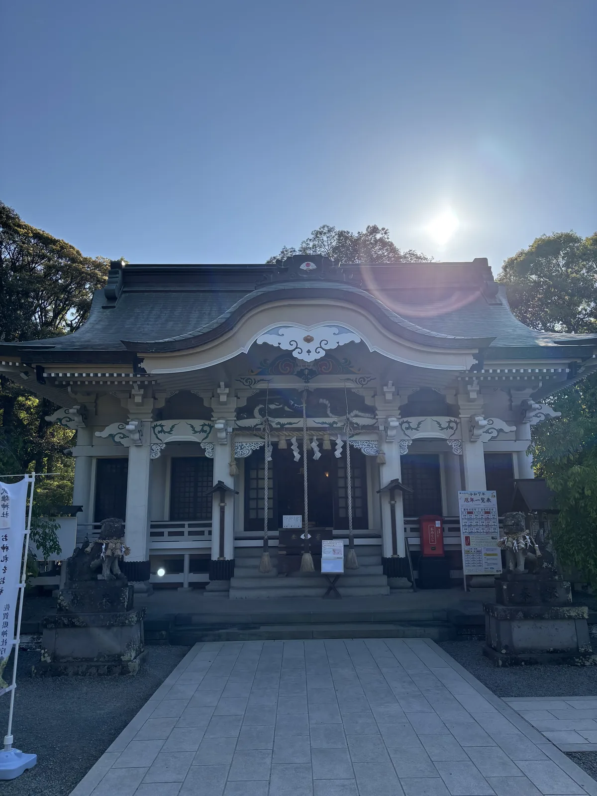

*拜殿正面。白色的牆與青綠色的屋頂，正面是一道唐破風，破風底下與柱頭的木鼻都施了青綠色的彩色雕刻。傍晚五點，太陽正落在屋脊的正上方。*

## 臣下為神之認定

武雄神社的主祭神不是天皇，是一位臣子。

武內宿禰，相傳自第十二代景行天皇到第十六代仁德天皇，
連續輔佐五代天皇的忠臣與大臣，年壽據說達三百六十歲。
神社把他的神德列成一串：長壽延命、開運招福、厄除守護、家運隆昌、金運、良緣成就——
沒有一項和國家鎮護有關，全部是關於一個人怎麼活得久、活得順。

其餘四柱是仲哀天皇、神功皇后、應神天皇，以及武內宿禰之子武雄心命，
五柱合稱「武雄大明神」。祭神系圖畫在境內的案內板上，
武內宿禰底下三條線，一條到武雄心命，一條到平群木莵宿禰（下宮的祭神），
一條到影媛——她是境外末社黑尾神社的祭神。

神社還記了一件很現代的事：明治十四年（1881），
武內宿禰因其誠實與智慧被採用為**五圓紙鈔的肖像**。
神社從這裡接出一句諧音——「五円（ごえん）」通「ご縁」（go-en，緣分），
於是他又成了結緣之神。一位上古的大臣，
在十九世紀因為印在鈔票上而多了一項職務，這個轉折本身就值得記下來。

創祀寫在《武雄社本紀》裡，是神社自己的社傳。天平七年（735），
初代宮司伴行賴受到神託：「我是武內大臣。艫（船尾）那邊有住吉大神鎮座，
我自己也被祀在艫嶽上，實在惶恐而不安穩。若能把我祀在軸嶽，這片土地將長久有福德到來。」

伴行賴經大宰府向朝廷奏請，把武內宿禰立為主祭神，
合祀仲哀天皇、神功皇后、應神天皇與武雄心命，遷座到北麓。
——請注意這則神託的內容：**神自己說，和別的神並排在同一座山頭上，他覺得不自在。**
一位臣位之神對座次的敏感，被寫進了創社的理由裡。

真正讓這座神社的來歷站得住的，不是神託，是紙。
天曆五年（951），大宰府的國司來檢分社地，發給一份「四至實檢狀」，
劃定四方界線。這份文書現存，是**佐賀縣最古的文書**，
國指定重要文化財。神社另藏平安中期到室町末期的古文書二百餘通。

有這份文書，就能證明武雄神社在平安時代是**大宰府直轄的府社**——
國司會親自來參向祭祀，同時是杵島郡的總鎮守。
九州多的是自稱古老的神社，但能拿出一張九五一年的官方地界圖的，不多。

## 立地非屬偶然

神社背後那座山叫御船山，因為它長得像一艘船。

它不高，兩百公尺上下，但形狀非常特殊：三個峰連成一列，各有各的名字，
而三個名字正好是船的三個部位——南端是**艫岳**（船尾），中間是**帆岳**，北端是**舳岳**（船首）。
從武雄市街的任何一個角度看過去，那道輪廓都是一艘擱在平原上的船。

社傳解釋了它為什麼是船。神功皇后三韓征伐歸途，把兵船停泊在武雄，
那艘船就變成了御船山。隨行的住吉大神與武內宿禰，
鎮座在**御船山南嶽，也就是船的艫**——武雄神社從船尾開始。

四百年後它走到了船頭。元永年間（1118〜1120 年前後），
武雄第二代領主後藤資茂抬頭看見鎮座在御船山麓的這座神社，
認為那裡是**築城的適地**，於是奏請朝廷把神社遷到**舳嶽東麓**，也就是現在的位置。
神從船尾搬到船頭，理由是人要在船尾蓋城。

這件事值得多想一層。第一次搬家是神自己要求的，理由是座次；
第二次搬家是領主要求的，理由是地形。兩次都成功了，兩次都留下了紀錄。
**這座神社的位置，從頭到尾是被人決定的。**

同一座山、同一支船隊，還生出了武雄的另一個招牌。
武雄溫泉的開湯傳說是：神功皇后凱旋途中，以太刀的柄戳了一下岩石，
溫泉就湧出來了。所以這座溫泉舊名「柄崎溫泉」——柄，就是刀柄的柄。
神社與溫泉共用同一次航行、同一位人物、同一個回國的下午。
一座城鎮的兩個地標，來自同一則故事的兩個動作。

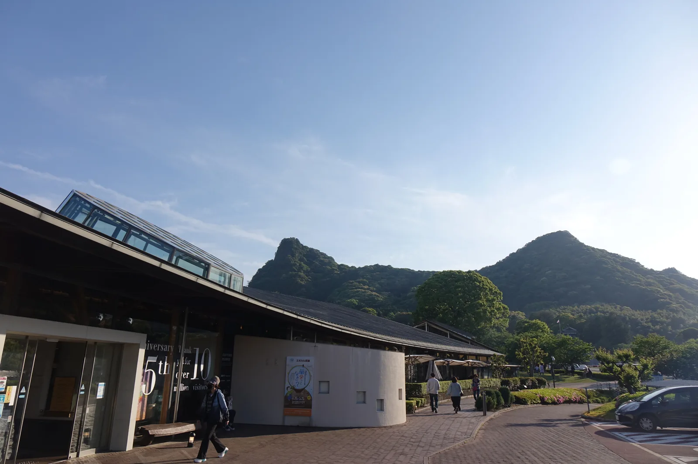

*從圖書館入口往南看，御船山的稜線就在屋簷上方。那道輪廓是三個峰連成的，從這個角度看得到其中兩個。*

## 參道形制及其空間效果

武雄神社的建物用色和九州多數神社相反：**不是朱紅，是白色配青綠。**

拜殿的牆是白的，屋頂是帶青綠的瓦色，正面設一道唐破風，
破風下的蟇股與柱頭的木鼻上，雕刻用青、綠兩色描邊。
從側面看，屋簷底下那些雲形的雕刻一層層挑出來，白底襯著青綠，
和宇佐神宮那種整面朱漆的效果完全是兩種語言。

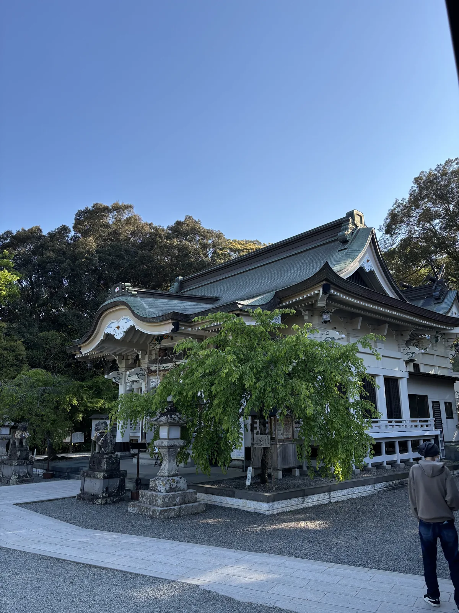

*從側面看拜殿與境內。庭中那棵垂枝的樹就長在拜殿正前方，右後方白色的低矮建築是社務所。*

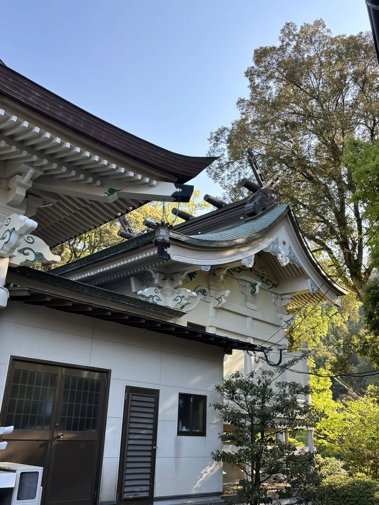

*屋簷底下的細部。雲形的木雕一層層外挑，白底、青綠描邊——這是武雄神社和九州多數朱漆神社最不一樣的地方。*

參道口的石鳥居值得單獨看。武雄市稱它為「肥前鳥居」，
形容它「像香蕉一樣」——笠木的兩端明顯往上翹，柱身分節，
是石造文化史上相當貴重的一種形式。同樣是石鳥居，
肥前的做法和常見的明神鳥居不是同一套比例。

境內另有兩處和樹有關的設施。一是**夫婦檜**：兩株檜並立，
中間以一條粗注連繩（標示神域的稻草繩）相連，繩子用紅布束在兩株樹幹上，
底下設了石階與一座小祭壇。它就在停車場與馬路旁邊，
背景是電線、汽車和白天的天空——一組被完整都市化包圍的神木。

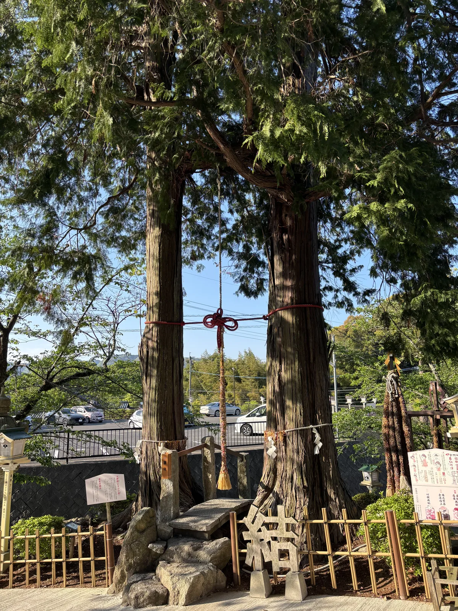

*夫婦檜。兩株檜之間拉了一條注連繩，用紅布束在樹幹上。左後方就是停車場與馬路——這組神木完全被日常生活包住。*

二是通往大楠的石鳥居。它立在拜殿後方，扁額刻「御神木」，
柱上刻「奉　武雄の大楠」「献　樹齢三〇〇〇年」。
**這座鳥居不是為神社立的，是為一棵樹立的。**
穿過去以後是一條鋪石與階梯混合的林間路，一路往上，
兩側是竹林與雜木，走一百五十公尺才到。

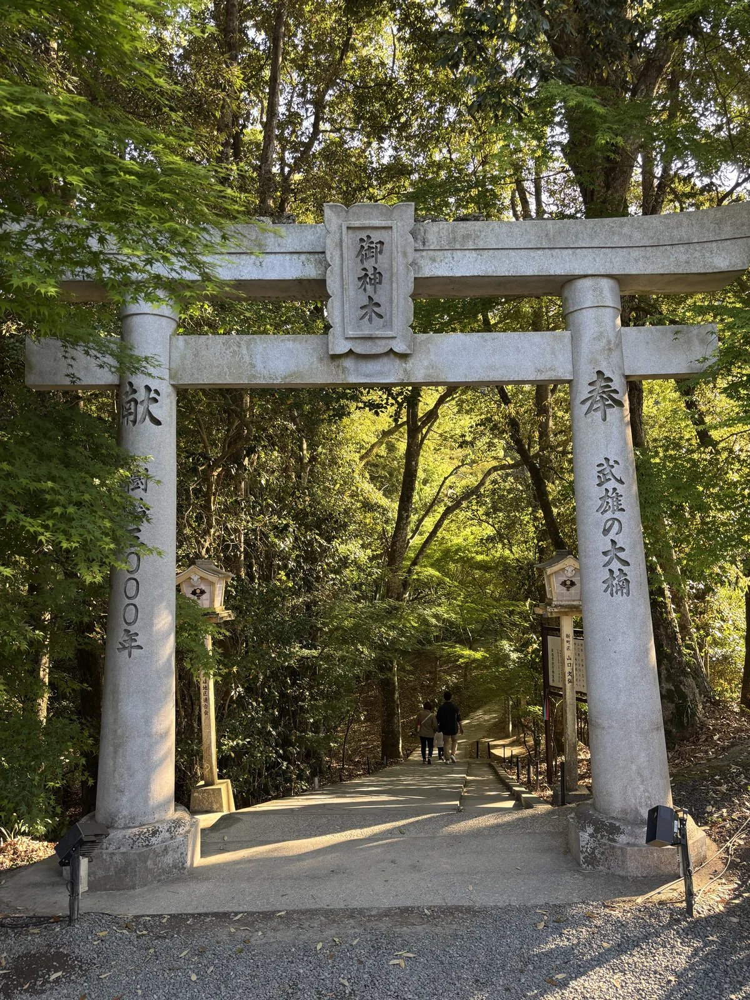

*通往大楠的石鳥居。扁額刻的是「御神木」而不是社名，兩根柱子分別刻著「奉　武雄の大楠」與「献　樹齢三〇〇〇年」。*

到了那棵樹前面，路突然開闊。樹站在一塊斜坡地的中間，
背後是竹林，前面是一片被清出來的空地。它的樹幹已經不能算樹幹——
底部完全是塊狀的、瘤狀的、糾結的一團，中央在接近地面的地方張開一個洞。
上半部倒是還在長，枝條往四面撐開，四月的新葉是亮綠色的。

現地的「佐賀の銘木・古木」標示牌記著：登錄番號 06314，
樹種クスノキ（樟），樹齡推定三千年，所有者或管理者為武雄神社。
武雄市補充的數字是：佐賀縣第二位、全國巨木第七位，
樹高三十公尺、根周二十六公尺，枝張東西三十公尺、南北三十三公尺。
底部那個洞裡有十二疊大的空間，**裡面祀著天神**。

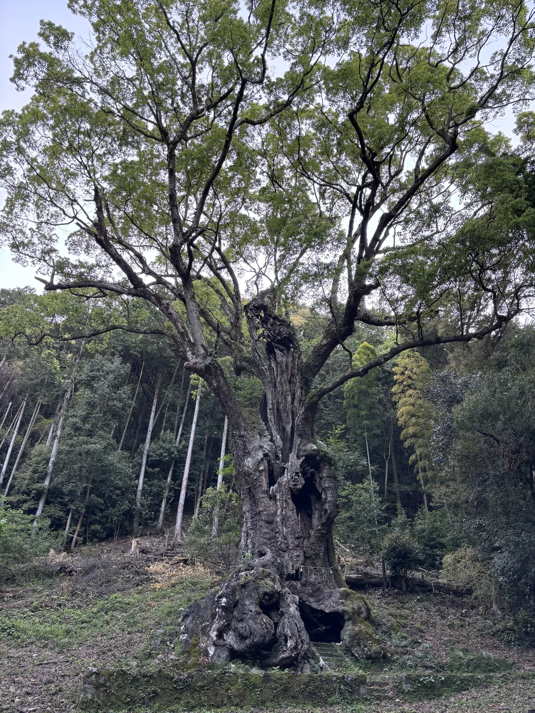

*武雄の大楠。根周二十六公尺，底部那個洞的內部有十二疊大，裡面祀著天神。上半部仍然在長新葉。*

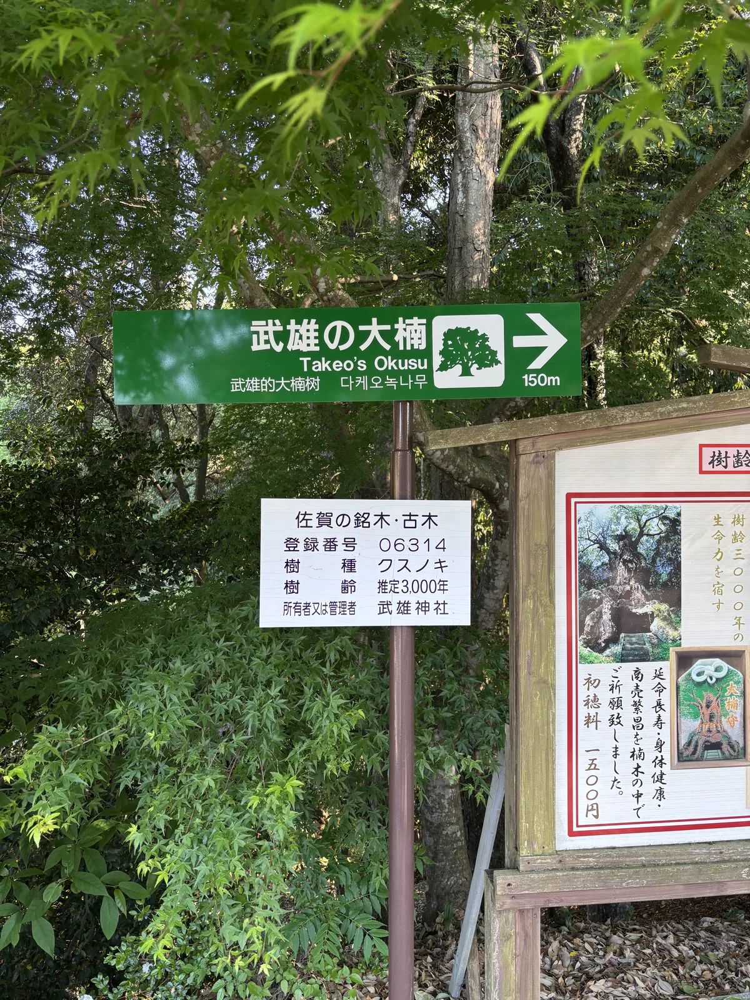

*路口的指示牌。「武雄の大楠」下面依序是英文、中文與韓文，右方白牌是佐賀縣的銘木・古木登錄資料：登錄番號 06314、樹種クスノキ、樹齡推定三千年。*

## 三分鐘外的圖書館

從武雄神社的參道口往東走，官方觀光地圖標的是**徒步三分**，
實測直線兩百八十公尺。那頭是武雄市圖書館・歷史資料館。

它二〇〇〇年十月開館，佐藤総合計画設計，延床面積三千八百平方公尺。
外牆是磚，正面一段是弧形的曲面，金屬字釘在磚縫上寫著
「武雄市図書館 TAKEO CITY LIBRARY」。從外面看，這是一棟很安靜的公共建築。

真正讓它出名的是二〇一三年。武雄市把指定管理者交給了 CCC——
經營 TSUTAYA 的那家公司——那年四月重新開館，
改修的基本設計由スタジオアキリ（Studio Akiri）與 CCC 擔任，實施設計仍是原設計者佐藤総合計画。
主要動作是增設開架書庫閱覽室，把原本的藏書牆拉高、拉長、繞成弧形。

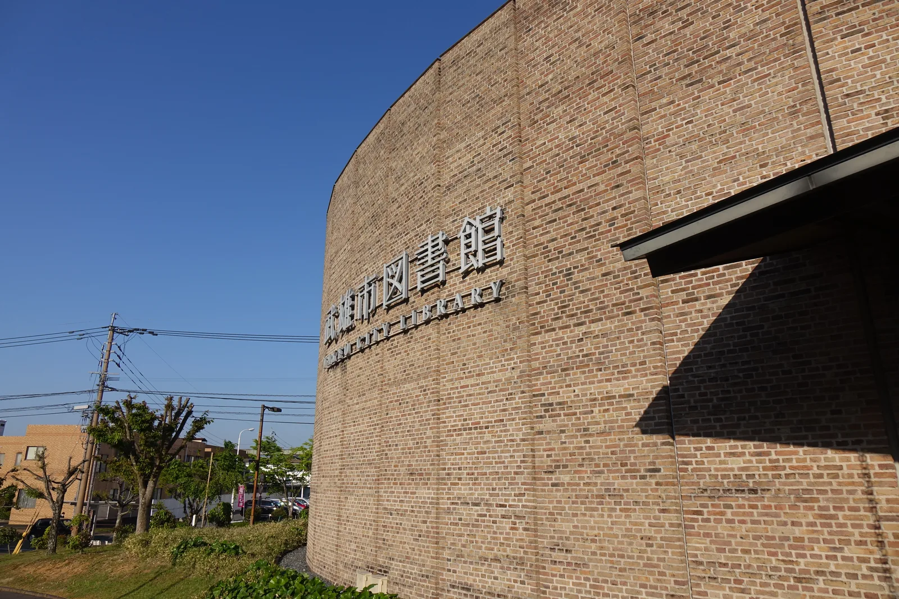

*圖書館的西側外牆。磚砌的弧面，金屬字直接釘在磚縫上。這是二〇〇〇年落成時的立面，二〇一三年的改修主要動的是室內。*

站在二樓的環形迴廊往下看，會看到這件事的規模：
一整道兩層樓高的書牆順著弧線繞過去，下面是書店的平台書架與咖啡座，
屋頂是外露的木構斜梁，中間穿插鋼製的拉桿，
天花上開了幾個橢圓形的天窗，工業型的吊燈一盞盞垂下來。
營業時間是早上九點到晚上九點，年中無休。

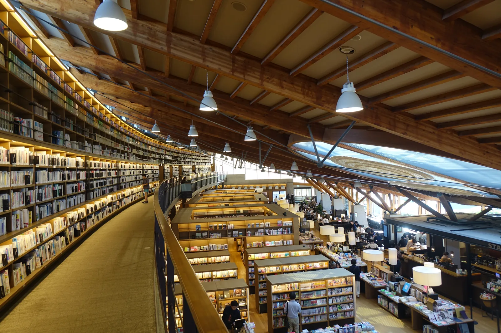

*從二樓迴廊往下看。左側是兩層樓高的弧形書牆，屋頂是外露的木構斜梁配鋼拉桿，天花開橢圓形天窗。下方是書店的平台與咖啡座。*

這棟建築在二〇一三年度拿下 Good Design 賞金賞。
二〇一九年又在旁邊增設了武雄市こども（kodomo，兒童）圖書館。
把它放進武雄市觀光協會的官方路線裡看，位置更清楚：
「觀光黃金路線」的七個必看之中，圖書館是第三個，神社是第四個；
而觀光協會另外那條專為早晨設計的「パワースポットコース」，
七個節點的第一個就是圖書館，第三、第四才是神社與大楠。

**官方把一棟二〇一三年的圖書館，和一棵三千歲的樹，寫進了同一條路線。**
這種並置在別的城鎮通常是尷尬的，在武雄卻不會——
因為兩者之間真的只有三分鐘，而且中間那段路，
一邊是神社的樹林，一邊是圖書館的停車場，沒有任何過渡。

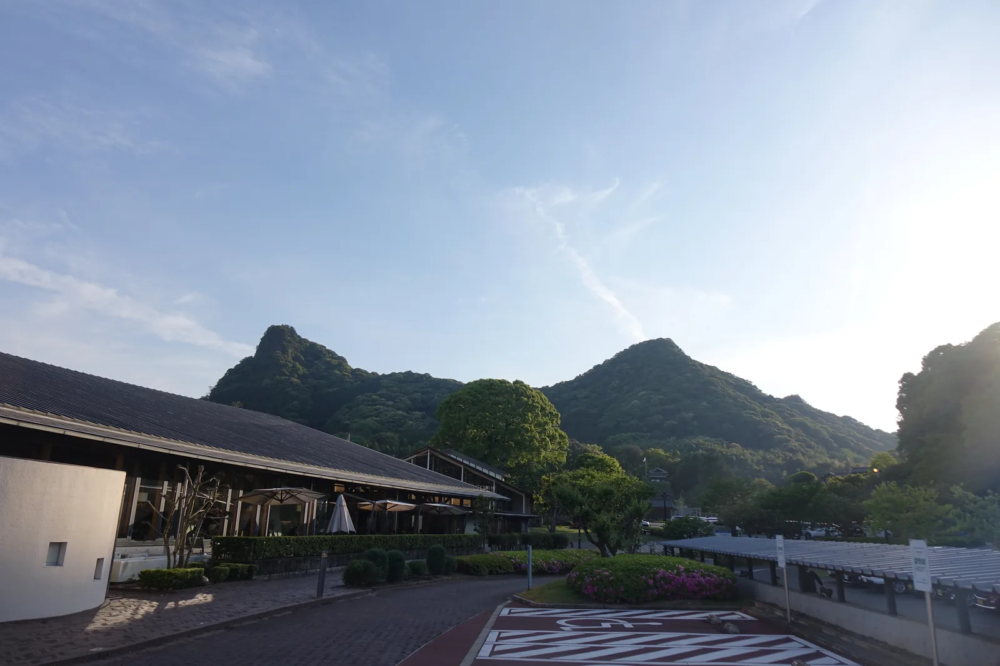

*傍晚六點多的圖書館南側。長而低的屋簷一路延伸出去，屋簷上方是御船山。神社就在照片右外一點的位置。*

## 祭儀與授与品

武雄神社的例祭在十月二十三日，通稱武雄くんち（Takeo Kunchi，武雄秋祭），當天奉納流鏑馬。

流鏑馬的來歷接在源賴朝身上。壇之浦之戰之際，賴朝派密使到武雄神社祈求追討平家；
平家滅亡後，他認定勝利出於這座神社的神德，
派出後鳥羽天皇的勅使與御家人的名代，奉上御教書向神致謝。
就在那時，武雄第四代領主後藤宗明奉納了流鏑馬——
神社說，這件事此後由氏子接手，**延續了八百年以上**。

武雄市觀光協會補了一段更具體的傳承：賴朝之所以能勝，
是因為受到武雄神社的使者——一隻白鷺——的鼓舞。
同一個頁面還記了流鏑馬道旁邊那座**射手塚**的來歷：
戰國時代，射手若在馬上落馬，視為武門之恥而必須切腹，
所以馬場的角落慎重地祀著他們。一項節慶活動的規則，
曾經以人命為抵押——這件事現在寫在一塊觀光看板上。

祭典當天的流程仍然完整：流鏑馬神事之後有「堂廻りの儀」（dōmawari no gi，繞堂之儀），
接著由武雄町下西山區的人抬神輿御神幸渡御到下宮，下午兩點才是奉射。
神社發行的御朱印有三種——「武雄神社」「武雄の大楠」「夫婦檜」，
例祭另有以流鏑馬為圖案、配金箔的特別版。

授與品裡最能代表這座神社的是「**大楠守**」。
現地的木牌寫得很直白：這批守是**在楠木裡面祈願過**的，
祈的是延命長壽、身體健康、商賣繁昌，初穗料一千五百圓。
——那棵樹底部的洞不只是一個洞，它是一個實際使用中的祭祀空間。

## 晨間路線之擬定及其限制

武雄的散步路線不必自己設計，因為武雄市觀光協會已經設計了兩條，
而且其中一條的標題就叫「**たけおで朝活**」（在武雄晨間活動）。

錨點站是 JR 與西九州新幹線的武雄溫泉驛。觀光協會的
「觀光黃金路線　絕不能錯過的七個看點」明記「徒步 OK」，
從驛出發、繞一圈、回到驛，順序是：
武雄市役所 → 鍋島茂義公紀念像 → 圖書館 → 武雄神社與大楠 → 武雄競輪場 →
武雄溫泉通り → 武雄溫泉樓門（兩層而只有下層通行的門）。官方在每一段都標了分鐘數，加起來約四十五分鐘，
全程四公里出頭；把停下來看東西的時間算進去，兩個小時上下。
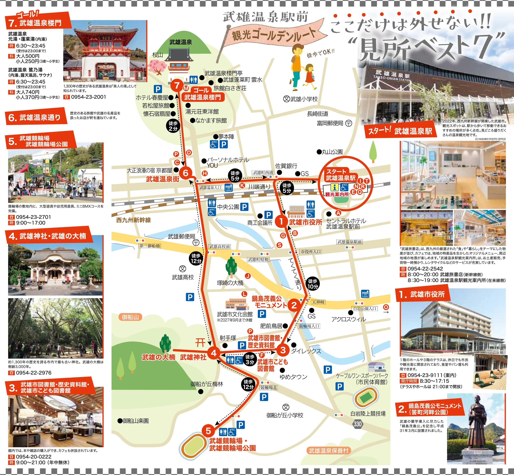

*出典：《武雄まち歩きマップ TAKEO》（武雄市觀光協會發行）。紅線就是路線本身，黑色圓圈是各段的徒步分鐘數。`4` 武雄神社與武雄の大楠在左下、`3` 圖書館緊貼在它右邊，兩者之間標著「徒步 3 分」；`7` 武雄溫泉樓門在左上角。*

我會把它倒過來走。理由是**樓門有一個硬性時段**。

武雄溫泉樓門是辰野金吾設計的，大正四年（1915）四月十二日竣工，
平成十七年（2005）與新館兩棟一起被指定為國之重要文化財。
它的二樓天井四個角落，各有一幅干支的雕繪——子、卯、午、酉，
十二支之中的四支，按方位對應東西南北。

而平成二十四年復原的東京車站南北圓頂天井上，有巳、辰等**八支**的浮雕。
為什麼只有八支，長年是個謎。
直到有人把武雄的四支和東京的八支加起來——十二支剛好齊了。
辰野金吾設計了兩端，中間隔了一千公里與一百年。

武雄市為此開了一場**只在早上開一小時**的限定公開，
名字叫「樓門四干支見學會」，九點到十點，每場二十分鐘，週二除外，
大人五百圓，附一張入浴券。
**要看到那四隻動物，就只能把樓門排在九點多，路線的其他部分都得往前推。**

於是順序變成這樣：七點從驛出發往南，先看圖書館的外觀（它九點才開），
走過鍋島茂義的銅像，八點前後進武雄神社，
拜完往後穿過御神木鳥居去大楠，回頭沿御船山東麓往南繞，
在競輪場那一段抬頭看三個峰，再往西北切進溫泉街，九點整站在樓門底下。
看完干支，樓門旁邊的元湯六點半就開了，
五百圓的入浴券正好用掉——這是路線唯一一次可以坐下來的地方。

**四個限制。**

第一，**大楠不是三分鐘**。從拜殿後方穿過石鳥居還要走一百五十公尺的林間坡道，
路面是石階與木板混合，清晨林子裡暗，雨後會滑。往返請抓十五分鐘。

第二，**圖書館九點才開**，所以它在路線上只能看外觀。
真要進去，順路的做法是走完全程回到驛之前再折回來——
但那是另外三公里。比較實際的安排是把圖書館留到下午。

第三，**競輪場那一段沒有東西可看**。官方標了徒步十二分，
實際上就是繞過御船山東南麓的一段馬路。它留在路線裡的理由是地形：
那是全程離御船山最近、又沒有建物擋住視線的一段。
知道這件事再走，那十二分鐘的性質就完全不同了。

第四，**沿路有兩處是關著的**。武雄市文化會館到二〇二七年九月為止休館——
官方地圖上就印著這一行小字；它旁邊那座黑門是武雄鍋島家別邸僅存的一道門，
只能從外面看。御船山樂園在山的另一側，要另外購票，開園時間隨季節變動，
晨間路線不含它。這條路線看得到御船山，但走不進去。

走完之後回頭想這條路，會發現它從頭到尾都在同一艘船上：
從船首東麓的神社出發，沿著船身往南走到船尾，
再繞回船首另一側去看一道朱紅色的門。
神功皇后停下那艘兵船的時候，大概沒想過一千多年後
會有人為了看四隻雕在天花板上的動物，早上七點在這裡繞一圈。
