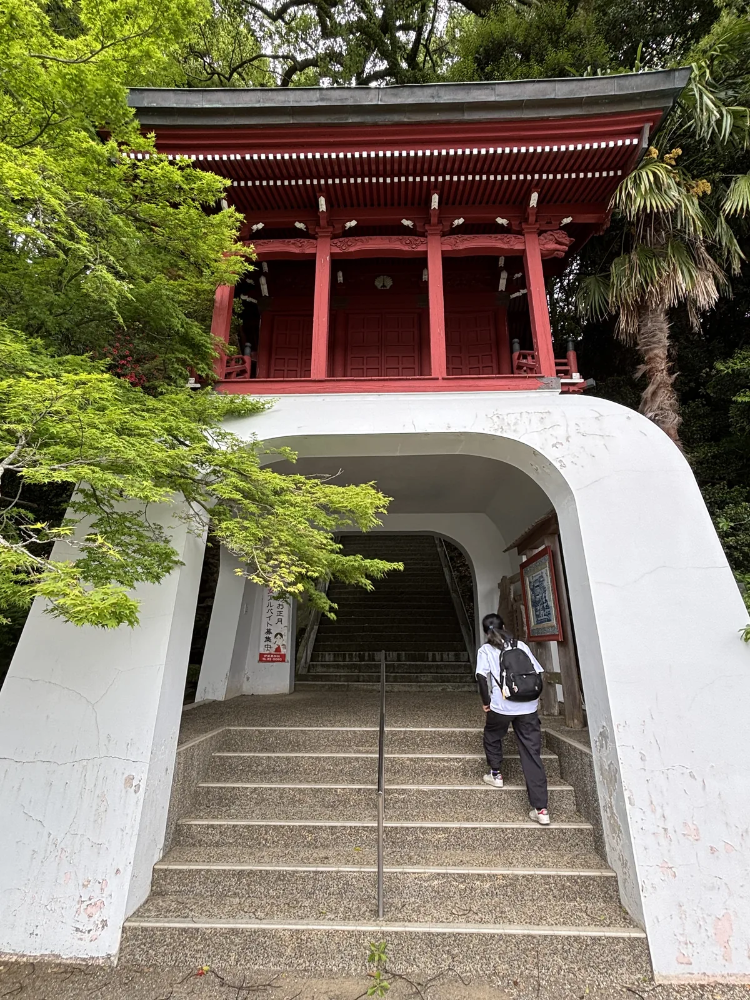
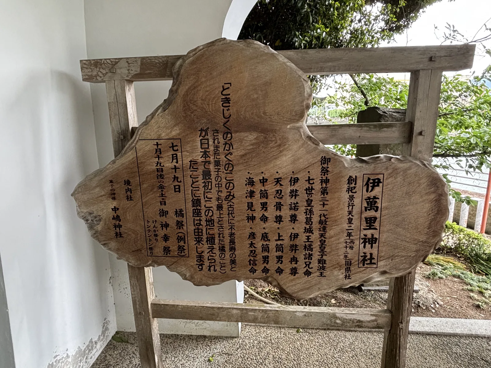
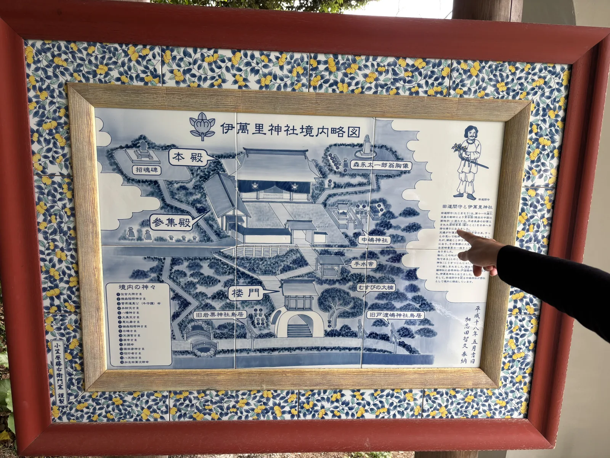
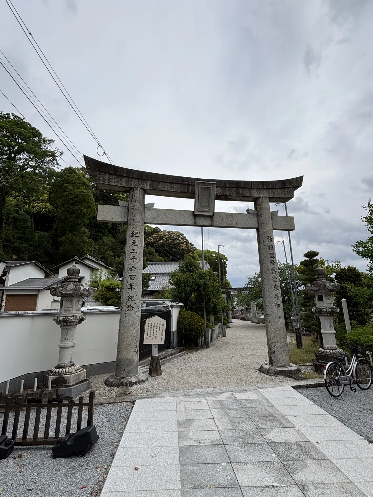
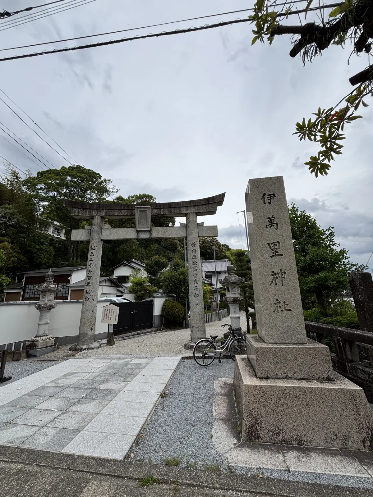
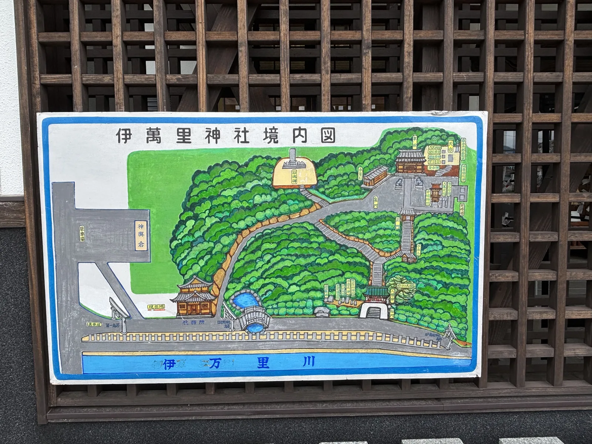
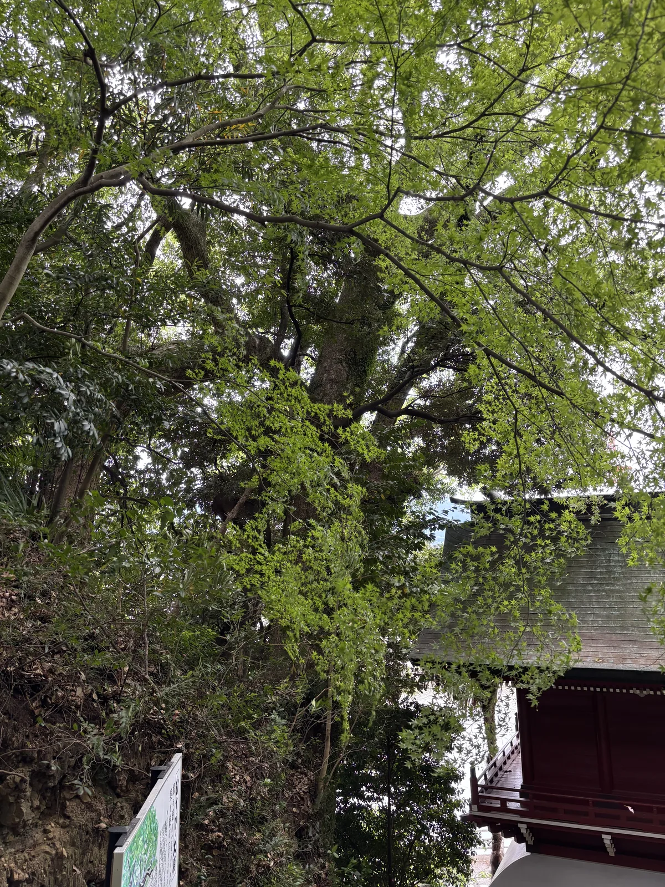
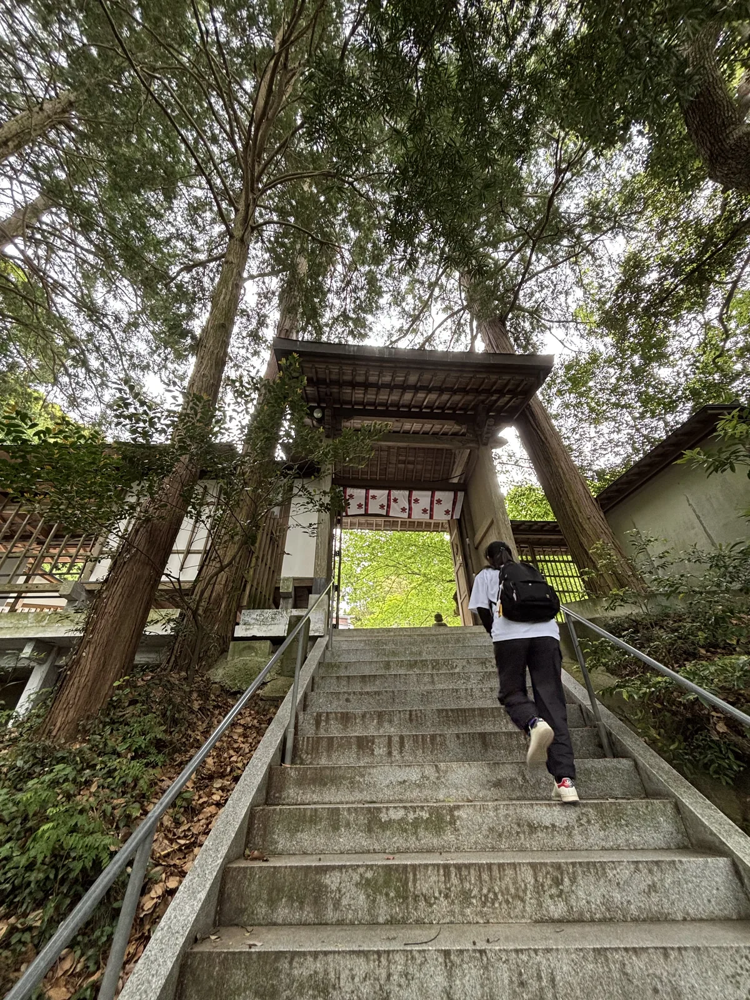
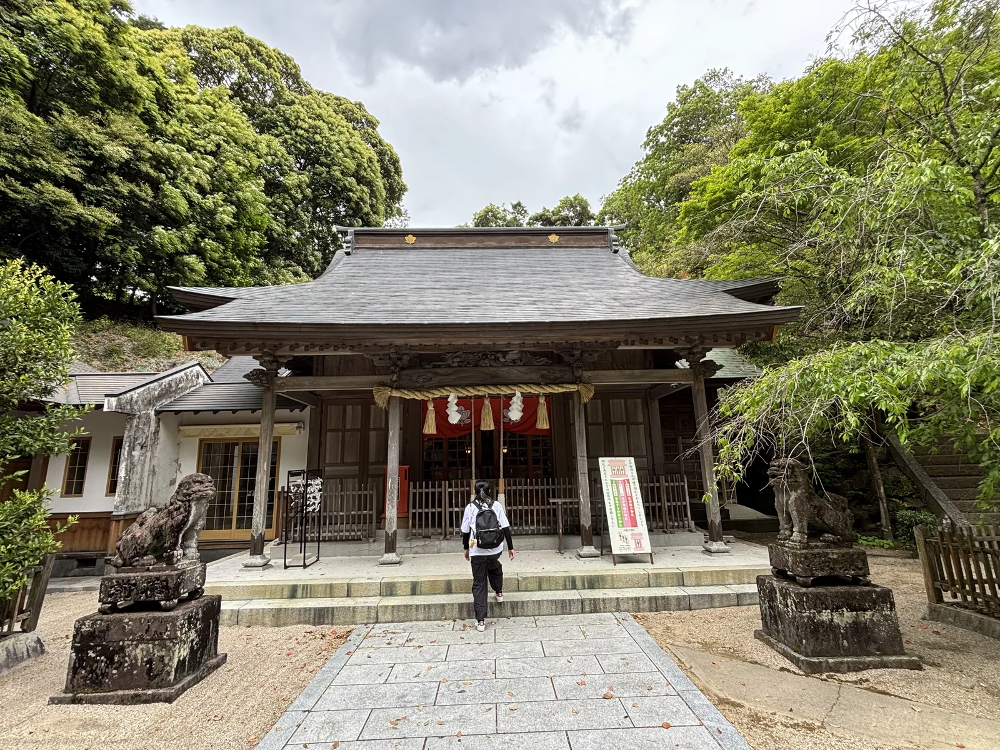
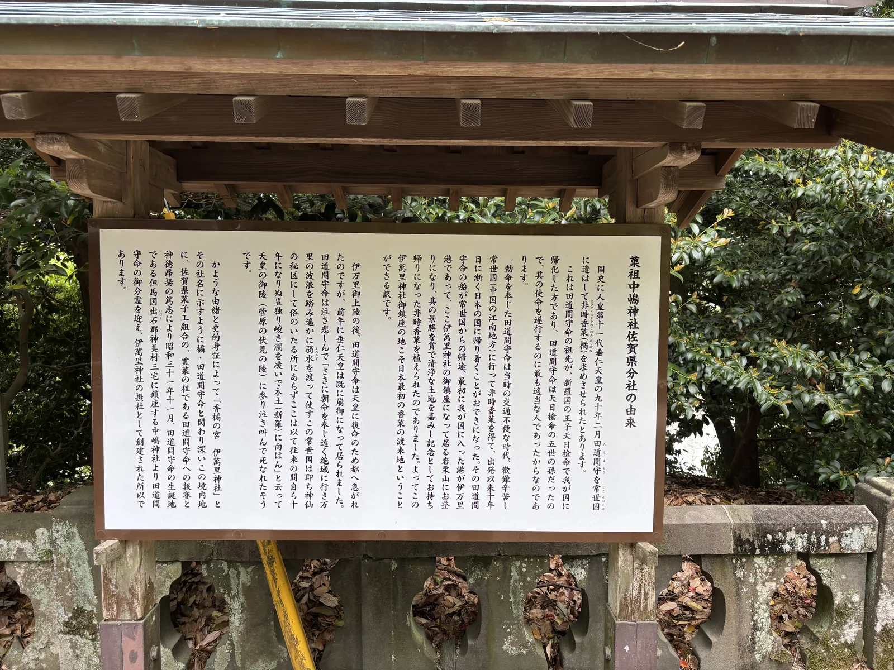

## 我的想法

<!-- 待 Chris 本人填寫，本階段留空 -->

## 導言

從JR伊萬里站出來穿過商店街，第一件事是過橋。伊萬里川橫在市街中間，
佐賀縣的官方散步路線把三座橋串成一條：相生橋、延命橋、幸橋。
官方的說法是，夫婦或戀人一起走過第一座會和睦，一邊祈願健康一邊走過第二座會長壽，
最後走過第三座會得到幸福。三座都過完，這條路線的第九站才是伊萬里神社。

神社在川的北岸，一座叫岩栗山的丘上。全程三點四公里，官方標示的步行時間是四十七分鐘。
我到的時候是下午三點零九分，在境內待了八分鐘。
八分鐘裡看見的第一樣東西，是一座朱漆的樓門（兩層而只有下層通行的門），蓋在一個白色的混凝土拱洞上面。

*樓門與它腳下的拱洞。石階從洞裡穿過去，拱的兩肩抹成圓角，白灰上都是龜裂。洞內右壁掛著一幅裱框的奉納畫，左壁貼著一張紅字的告示——招正月的工讀生。*

## 創祀繫於一株橘之認定

伊萬里神社的起點是一顆水果。境內那塊木製一枚板的看板寫著，
「ときじくのかぐのこのみ」——古代被視為不老長壽之實、
在菓子之中也被列為最上等的橘——最早在日本被種下的地方就是這裡，
「が日本で最初にこの地に植えられたことに鎮座は由来します」。

種樹的人叫田道間守。佐賀縣神社廳的由緒寫得很簡：垂仁天皇命田道間守去常世之國
取橘回來，他取到了，歸途的船靠上伊萬里港，
「現社地の岩栗山の景勝を賞し、橘の実を植えた」——賞了這座丘的景，把橘實種下。
一座神社的創祀由來，是一個人在船靠岸之後爬上一座小丘，種了一株樹。

樹和神社之間還隔著一段。神社廳接著寫，後來橘嶋田麻呂為了尋歌枕來此地遊歷，
聽說了這段由緒，認為與自己的祖父橘諸兄有因緣，於是在這裡祭祀諸兄之靈，
稱為香橘宮。神社官方網站寫的「西暦七七〇年より鎮座」，
對應的正是這個時間點——橘諸兄卒於奈良時代中葉，孫輩的年代與七七〇年相合。

所以這座神社有兩個起點，而它們不是互相矛盾的兩個版本，是兩件事。
境內木札把創祀定在「景行天皇二年（西暦七十二年）」，那是傳承裡田道間守歸國之後
緊接著的年代；官網寫的七七〇年，則是香橘宮開始祭祀的年。前者是傳說，後者是奉祀的開始，
中間隔著七百年——這座神社把「這塊地為什麼特別」與「人什麼時候開始拜」分成了兩層。

之後的沿革就都有年份了。天正年間遭兵火，再建；
現存的本殿是承應三年（1654）建造的。明治五年列為鄉社，昭和十九年升為縣社，
昭和三十七年（1962）改成現在的社號——木札上那三個字「旧県社」，
記的是最後那一次升格。

*木製一枚板的看板。上面刻著「創祀　景行天皇二年（西暦七十二年）旧県社」，御祭神從敏達天皇皇子難波王與橘諸兄命開始，一路列到住吉三神與海津見神。左下角另起一行：「境内社　菓子の神様　中嶋神社」。*

*陶板做的「伊萬里神社境内略図」。染付的藍白畫面，外框是一圈黃綠色的果實紋樣。右側那一欄是「田道間守と伊萬里神社」的說明，配著一幅手持橘枝的田道間守像。落款「小笠原藤右衛門窯　謹製」「平成十八年五月吉日　加志田智久　奉納」。*

## 立地非屬偶然

田道間守的船為什麼會停在這裡，答案寫在這座城市的名字裡。
江戶時代，肥前一帶——有田、鹽田、波佐見、三川內——燒出來的瓷器，
都集中到伊萬里津裝船運走，於是那些瓷器不是用產地的名字，
而是**用港的名字**被叫作伊萬里燒。

伊萬里市的官方說明把規模寫成數字：天保六年（1835）一年之內，
從伊萬里津運出去的就有三十萬俵以上。這些東西經長崎，
由中國商人與荷蘭商人的手送到東南亞、中近東與歐洲，裝飾王侯貴族的宮殿。
一個港的名字，成了一整個時代日本瓷器在世界上的代稱。

港的角色是被鐵路終結的。明治三十年（1897）門司、有田、佐世保之間的九州鐵道開通，
燒物改用火車運，於是名字回到產地——有田燒、志田燒、波佐見燒、三川內燒，
江戶時代那批才被另外叫作「古伊萬里」。
一個地名先是變成商品名，然後又被還原成地名。

神社就在這條水路的上游端。伊萬里川橫貫市街，神社在北岸，坐在岩栗山上；
一之鳥居立在河岸的高度，社號標則直接立在橋頭的路邊，緊貼著欄杆。
從鳥居到社殿要爬兩段石階，一段穿過拱洞，一段在杉木之間——
這是全程三點四公里裡唯一的爬升。

那座石造鳥居本身也是一份文件。左柱刻「紀元二千六百年紀念」，
右柱刻「祈國運隆盛世界平和」。皇紀二千六百年是昭和十五年，西元一九四〇年——
一座在那一年立起來的鳥居，另一根柱子上刻的是「祈國運隆盛世界平和」。

*一之鳥居。左柱刻「紀元二千六百年紀念」，右柱刻「祈國運隆盛世界平和」。額束上的扁額已經風化到看不出字。參道是碎石，兩側各一座石燈籠，再過去就是民家的白牆。*

*社號標立在橋頭路邊，右邊就是橋的欄杆。社名寫作「伊萬里神社」——舊字。市府的公文與地圖寫的是「伊万里市」，同一個地名，神社用的是另一個寫法。*

## 參道形制及其空間效果

這座神社把參道折成兩段，而兩段之間隔著一個很難歸類的東西。
第一段是碎石的平地參道，穿過鳥居往丘腳走；到了丘腳，
路被一座白色的混凝土拱洞接住，石階從洞裡穿過去；
而拱洞的上面，騎著一座朱漆的二層樓門。

那個組合近看更奇怪。拱的兩肩抹成圓角，白灰面上滿是龜裂，
形狀像一段隧道口；樓門則是完整的木造，朱漆，
斗栱的端頭點白，簷下排著細密的垂木，屋頂是灰色的、帶一點翹的瓦，
兩側掛著小小的木造欄杆。上面是傳統，下面是水泥。

穿過拱洞往上，第二段石階才是林中的那一段。杉木夾在兩側，
坡度比第一段陡，扶手是後加的鋼管；石階盡頭是神門——
素木（不上漆的原木）的，屋頂比樓門樸素得多，門洞裡垂著一面白幕，上面印著紅色的紋。
從朱漆到素木，這座神社的兩道門完全不像同一座神社的。

社殿在神門之後。拜殿是入母屋造（歇山頂）帶向拜（本殿正面屋簷向外伸出、供參拜者站立的抱廈），木頭是深褐色的，
和樓門那種新塗的朱形成對比；屋脊兩端各貼一枚金色的神紋，
向拜下垂著注連繩，繩上綁著兩束稻藁與紙垂，殿內是一片紅幕。
本殿藏在後面看不見——那是承應三年（1654）建造的那一棟。

兩側各一座狛犬（成對的守護石獸），蹲在很高的方形台座上。左邊那隻的石面長滿苔，
輪廓被磨得比右邊那隻圓；台座的高度讓牠們的視線落在成人的頭頂上方，
你走過去的時候是從牠們底下穿過去的。左手邊是白牆的參集殿，
右手邊有另一段石階往更高處去。

樓門旁邊那株大樹叫むすびの大楠（musubi no ōkusu，結緣的大楠）。
從石階往上看的時候，它的樹冠幾乎把樓門的屋頂蓋掉一半，
枝條垂到瓦上；陶板略圖上把它標在樓門的正右邊，
和「旧岩栗神社鳥居」「旧戸渡嶋神社鳥居」排在同一列。

那兩座鳥居的來歷，才是這座境內最值得看的東西。伊萬里神社不是一座神社，
是三座——香橘神社的地上，昭和三十年代分兩次合祀了戶渡嶋神社與岩栗神社，
昭和三十七年（1962）改稱伊萬里神社。合祀之後，
兩座被併掉的神社的鳥居留了下來——陶板略圖把它們標在丘腳的兩側，
名字前面都冠著一個「旧」字。

*掛在社務所木格柵牆上的手繪「伊萬里神社境内図」。底邊那一條藍色寫著「伊万里川」，左下角是第一鳥居與神輿倉，右上角是社殿群，中間全是綠色的丘——這張圖用畫的把高低差說完了。*

*むすびの大楠與樓門。從石階下往上看，樹冠壓在瓦頂上，朱漆的欄杆只從葉隙露出一角。左下角那塊立牌就是「境内図」。*

*第二段石階與神門。杉木夾在兩側，扶手是後加的鋼管。門是素木的，屋頂比底下那座朱漆樓門樸素得多，門洞裡垂著印紅紋的白幕。*

*拜殿。深褐色的木頭，屋脊兩端各貼一枚金色神紋，注連繩上綁著兩束稻藁，殿內是紅幕。兩隻狛犬蹲在很高的方形台座上，左邊那隻長滿了苔。本殿在拜殿後面，是承應三年（1654）建的那一棟。*

## 菓子業者蓋的那座攝社

木札的最後一行寫著「境内社　菓子の神様　中嶋神社」。
中嶋神社的本社在但馬國出石郡神美村三宅，祀的是田道間守命，
被奉為菓祖——點心業的祖神。伊萬里這一座是它的佐賀縣分社，
就蓋在田道間守種下橘樹的那座丘上。

蓋它的是同業公會。境內那塊「菓祖中嶋神社佐賀県分社の由来」寫得很清楚：
昭和三十一年十一月（1956），由「佐賀県菓子工組合」出於對靈菓之祖田道間守命的報賽
與神德昂揚之誠，自但馬的中嶋神社迎來御分靈，作為伊萬里神社的攝社創建。
一群做點心的人，替自己這一行在祖神的登陸地蓋了一座神社。

要理解他們為什麼這麼做，得先讀完田道間守的下場。同一塊看板寫：
他歷經艱難辛苦，出發後第十年才回到日本，上陸之後急著趕往京城覆命，
但垂仁天皇已在前一年崩御。他哭著到天皇的陵前，
「参り泣き叫んで死なれたそうです」——在陵前哭喊而死。

一個為了取回不老長壽之果而去了十年的人，回來時要覆命的人已經不在了。
那顆橘後來被算成菓子的源頭，而把橘帶回來的人被奉為菓祖。
點心這一行的祖神，是一個任務完成得太晚的人——
公會替他蓋了一座神社，蓋在他上陸後爬的第一座丘上。

這條線在近代還有一段。森永製菓與森永乳業的創業者森永太一郎
（1865–1937）是伊萬里人，生家在松島町經營陶器與魚的問屋；
父親過世後家產散盡，他跟著叔父山崎文左衛門學做生意，
後來為了賣燒物渡美，在那裡改學西洋菓子，回國開了森永西洋菓子製造所。

他在美國時受洗成了基督徒。而現在，他的胸像立在伊萬里神社的境內——
佐賀縣官方觀光網站的取材記事寫明了理由：
他的兒子太平捐款興建中嶋神社，胸像因此設在這裡。
一位基督徒的胸像，因為兒子捐錢給菓祖的那座神社，而立在樹下。

陶板略圖把它標在本殿的右上方，寫作「森永太一郎翁胸像」。
我那八分鐘沒有走到那裡——那要從本殿右後方再爬一段石階。
另一座森永太一郎像在伊萬里站前的公園裡，是全身像，
由佐賀縣製作、市府受贈設置，手裡握著一條森永牛奶糖。

*「菓祖中嶋神社佐賀県分社の由来」。從垂仁天皇差遣田道間守寫起，寫到他在陵前哭喊而死，最後一段交代這座分社是昭和三十一年十一月由「佐賀県菓子工組合」迎來御分靈所建。下方那道石欄杆的孔洞裡積滿了落葉。*

## 祭儀與授与品

▲ 主な祭典（omo-na saiten，主要祭典）

・**橘祭**（7月19日・例祭）── 社名與創祀由來都繫在橘上，例祭就叫橘祭。
・**御神幸祭**（10月）── 通稱トンテントン（Tontenton，得名自太鼓的聲音），
官方名稱寫作「伊万里トンテントン」。木札寫的日期規則是「十月十九日後の金・土・日」，另有伊萬里供日（くんち）之稱。

▲ 御神幸祭的結構

這場祭典的正式名稱是伊萬里神社御神幸祭，而它的內容是兩座神輿打架。
實行委員會的官方說明寫，祭典源自伊萬里川河畔的**香橘神社**與**戶渡嶋神社**
各自舉行的收穫感謝御神幸祭，後來比附南北朝的故事，
把荒神輿看作楠木方、團車看作足利方，變成一場合戰祭。

比附的根據在祭神。香橘神社祀的是橘氏之祖橘諸兄命，而楠正成是橘氏的末裔，
所以荒神輿是楠木方；戶渡嶋神社祀的是建武年間足利尊氏敗戰後西下筑紫、
在松浦海上遭遇暴風時的救難之神，所以團車是足利方。
這兩座在昭和三十年代被併成同一座神社的舊神社，每年還是要打一次。

神也被分成兩份。官方說明寫，祭典期間**和魂**遷入白神輿與赤神輿——
白神輿是香橘神社、赤神輿是戶渡嶋神社，它們在市街巡幸、清淨街中的邪氣；
**荒魂（神格中剛猛的一面）**則遷入荒神輿與團車，去打那場架。
同一位神的兩面，一面上街祝福，一面下場對撞。

・**打架的樣子**：「トン・テン・トン」（ton-ten-ton）是團車裡的太鼓聲，祭名由此而來。
太鼓在巡幸時有四種打法，合戰時有五種；
荒神輿的吆喝在巡幸時是「チョーサンヤ」（chōsan'ya，意為參詣朝廷），
挑釁時是方言「キーワエンカ」（kīwaenka，過來啊）；
團車巡幸時喊「アラヨーイトナ」（arayoitona），開打時雙方同喊「カーマエロ」（kāmaero）。
・**用具**：本繩長約四十公尺，擔棒縱棒十五尺（約四點五公尺）、橫棒八尺（約二點四三公尺），
荒神輿與團車共通。團車上五段疊起的五色被褥是陰陽五行——
由上而下，青是空、黃是風、赤是火、白是水、黑是土。
・**川落し合戰（kawa-otoshi kassen，落川合戰）**：最後一場在伊萬里川。雙方組合在一起落進川裡，
先被拉上岸的一方獲勝；官方寫「荒神輿が勝つと翌年は豊作、団車が勝てば翌年は豊漁」。
一條河決定明年靠田還是靠海。

▲ 祭典的年表也是一份風險紀錄

實行委員會的官方年表把這場祭典遇過的麻煩一件件列出來：
昭和四十七年（1972）川落的場地從海岸通改到對岸搦町背面的填地；
昭和六十三年（1988）因天皇陛下的病情停辦，這是戰後第一次；
平成二年（1990）因扛的人不足，一部分改用台車。

然後是平成十八年（2006）。那一年出了事故，從此不再舉行原本形式的合戰。
平成二十四年（2012）改以模擬合戰的方式進行，
平成二十五年（2013）起變成「あらかじめ倒れる方向を決めた」——
事先決定倒的方向、反覆驗證過的合戰。一場打架，被拆成可以驗算的動作。

▲ 境内の神々

陶板略圖上列著十六座：住吉大神、樫森稻荷神、菅原道真公（牛守護）命、
弁財天、八幡神、大黑天、惠比壽、楠森稻荷神、日峰、天滿宮、庚申、月讀命、
猿田彥神、役行者、八天狗，以及加志田薰次郎命。
其中的惠比壽，伊萬里市的資料記為文化八年（1811）建立。

▲ 授与品

・**御朱印** ── 神社官方網站設有專門的受付說明。
・**御祈禱** ── 官網列出的祈願項目包括厄除、開運、交通安全、緣結與勝負事，
與那塊石鳥居上「祈國運隆盛世界平和」的句法屬於同一種語氣。

## 晨間路線之擬定及其限制

這條路線我沒有走完，所以先把它的出處說清楚：
佐賀縣的官方網站有一份「20市町ウォーキングコース」（walking course，健走路線）的專頁，
其中的「伊万里街なか散策コース」（伊萬里街區散策路線）全長三點四公里，官方標示的步行時間是四十七分鐘，
起訖點都在JR伊萬里站，而伊萬里神社是第九站。以下是照那份路線重建的。

從站內二樓的伊萬里・鍋島ギャラリー（Nabeshima Gallery，鍋島展示館）出發，經過商店街入口的古伊萬里美人像，
到白牆土藏造的伊萬里市陶器商家資料館「丸駒」——江戶時代陶器商犬塚家的舊宅。
再過去是海のシルクロード館（Umi no Silk Road，海上絲路館），
然後是トンテントンモニュメント（Tontenton Monument，祭典雕像），荒神輿與團車組在一起的那座雕像。

接下來是三座橋。相生橋在下游，因為川岸曾有兩株松像夫婦松一樣並立而得名；
延命橋因橋畔的延命地藏而得名；幸橋是三座裡最後渡的一座。
官方的說明把三座橋寫成一組儀式：和睦、長壽、幸福，順序不能顛倒。
過了幸橋，沿北岸往上游走，就到伊萬里神社。

從車站到神社這一段我查得到實測值：九百三十四公尺，步行約十三分鐘，
經商店街、過相生橋、再沿北岸往東。
神社境內是全程唯一的爬升——鳥居在河岸的高度，社殿在丘上，
中間隔著穿過拱洞的第一段石階與杉木夾道的第二段。

官方的四十七分鐘沒有把這段爬升的停留算進去。
我在境內的八分鐘只夠看完三塊看板與兩道門，本殿右後方那段通往森永胸像的石階沒有上去——
佐賀縣觀光的取材記事寫那條路「ところどころ不安定なところもある」。
要看完這座丘，光是境內就得留三十到四十分鐘。

離開神社之後，路線往回走：伊萬里市民圖書館（館內有森永太一郎的常設展示角）、
前田家住宅——伊萬里鄉的大庄屋舊宅，木造平屋，
建築面積約二百九十平方公尺，是縣內民家建築中最大規模的一棟，
茅葺屋頂，保留了佐賀民家「くど造り」（kudo-zukuri）最發達的形態。

最後是伊萬里站前公園的森永太一郎全身像，回到車站。
選早上走有兩個理由：神社官方公布的參拜時間從早上六點開始，
而商店街與朝市也是早上才有生活感；
另外，伊萬里川的水面在上午最平——那條在祭典最後一天承接兩座神輿的川，
其餘三百六十二天都很安靜。

前一天上午，我在長崎縣大村市的一座神社門前，
看一塊看板主張大村壽司是在它的境內誕生的。那一篇是 [[77-kotengu]]。
